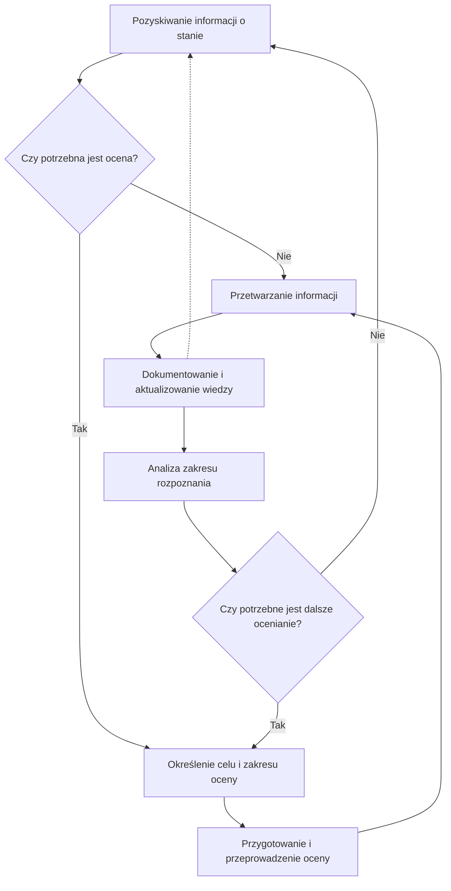

## 1. Cel dokumentu

Dokument przedstawia przykładową procedurę obserwowania i oceniania stanu dostępności i zgodności rozwiązań cyfrowych.

Procedura łączy pozyskiwanie informacji podczas bieżącej działalności organizacji, oceny planowe i doraźne, przetwarzanie uzyskanych informacji, dokumentowanie i aktualizowanie wiedzy o stanie oraz analizowanie zakresu jego rozpoznania i potrzeb dalszego oceniania.

---

## 2. Zastosowanie procedury

Procedurę stosuje się do organizowania obserwowania i oceniania stanu dostępności i zgodności rozwiązania cyfrowego w całym okresie jego użytkowania.

Jej celem jest utrzymywanie aktualnej, wiarygodnej i odpowiednio udokumentowanej wiedzy o stanie rozwiązania i zakresie jego rozpoznania przez:

- wykorzystywanie informacji uzyskiwanych podczas bieżącej działalności organizacji;
- prowadzenie ocen planowych służących uzyskiwaniu, uzupełnianiu i aktualizowaniu wiedzy;
- prowadzenie ocen doraźnych w odpowiedzi na określone zdarzenia i potrzeby informacyjne;
- przetwarzanie uzyskanych informacji i ustalanie ich znaczenia dla wiedzy o stanie;
- dokumentowanie i aktualizowanie wiedzy;
- analizowanie zakresu rozpoznania stanu i ustalanie potrzeb dalszego oceniania.

Procedurę dostosowuje się do charakteru i złożoności rozwiązania, zakresu posiadanej wiedzy, sposobu organizacji jego utrzymania i rozwoju oraz przyjętego przez organizację sposobu systemowego zapewniania dostępności cyfrowej.

---

## 3. Ogólny przebieg procesu

Obserwowanie i ocenianie stanu jest procesem ciągłym i iteracyjnym. Nie oznacza ciągłego wykonywania testów ani ocen.

Informacje o stanie rozwiązania są pozyskiwane podczas bieżącej działalności organizacji oraz w wyniku ocen planowych i doraźnych. Organizacja ustala znaczenie uzyskanych informacji, odnosi je do posiadanej wiedzy i odpowiednio ją aktualizuje.

Udokumentowana wiedza jest następnie wykorzystywana do ustalania zakresu rozpoznania stanu, rozpoznawania luk w wiedzy i określania potrzeb dalszego oceniania. Niezależnie od planowego oceniania określone zdarzenie lub potrzeba informacyjna może spowodować potrzebę przeprowadzenia oceny doraźnej.

Proces obejmuje odpowiednio:

1. pozyskiwanie informacji o stanie rozwiązania;
2. ustalanie potrzeby przeprowadzenia oceny;
3. określanie celu i zakresu oceny;
4. przygotowanie i przeprowadzenie oceny;
5. przetwarzanie uzyskanych informacji;
6. dokumentowanie i aktualizowanie wiedzy o stanie;
7. analizowanie zakresu rozpoznania stanu;
8. ustalanie potrzeb dalszego oceniania.

Poszczególne działania są podejmowane odpowiednio do źródła i znaczenia informacji, posiadanej wiedzy oraz potrzeb dalszego rozpoznania stanu. Nie muszą być każdorazowo wykonywane jako jeden ciąg.

---

## 4. Pozyskiwanie informacji o stanie

Informacje o stanie dostępności i zgodności rozwiązania pochodzą z różnych źródeł.

Organizacja wykorzystuje odpowiednio informacje uzyskiwane między innymi:

- podczas ocen planowych i doraźnych;
- podczas odbiorów, przeglądów i innych ocen rozwiązania;
- podczas automatycznego obserwowania i analizowania rozwiązania;
- podczas rozwiązywania problemów dostępności i sprawdzania skuteczności podjętych działań;
- ze zgłoszeń, skarg i innych informacji od użytkowników;
- z badań z użytkownikami;
- z dokumentacji rozwiązania;
- od wykonawców, dostawców i podmiotów odpowiedzialnych za utrzymanie lub rozwój rozwiązania;
- podczas wprowadzania i obserwowania zmian rozwiązania.

Nie każda uzyskana informacja wymaga przeprowadzenia odrębnej oceny. Informacja może bezpośrednio uzupełniać lub aktualizować wiedzę o stanie, wymagać potwierdzenia albo wskazywać potrzebę wykonania oceny.

Informacje pochodzące z różnych źródeł interpretuje się z uwzględnieniem ich podstawy, zakresu, aktualności i wiarygodności.

---

## 5. Ustalanie potrzeby przeprowadzenia oceny

Potrzeba przeprowadzenia oceny może wynikać z planowego rozpoznawania stanu albo z określonego zdarzenia lub potrzeby informacyjnej.

W zależności od przyczyny przeprowadza się ocenę planową albo doraźną.

### 5.1. Ocena planowa

Ocenę planową przeprowadza się, gdy organizacja potrzebuje uzyskać pierwszy uporządkowany obraz stanu albo planowo uzupełnić, rozszerzyć, pogłębić, zweryfikować lub zaktualizować posiadaną wiedzę.

Potrzebę kolejnej oceny planowej ustala się na podstawie aktualnej wiedzy o stanie i zakresie jego rozpoznania, w szczególności rozpoznanych luk w wiedzy oraz informacji wymagających aktualizacji lub weryfikacji.

Profil i zakres oceny dobiera się odpowiednio do celu oceny i potrzeb informacyjnych organizacji.

### 5.2. Ocena doraźna

Ocenę doraźną przeprowadza się w odpowiedzi na określone zdarzenie albo potrzebę uzyskania, potwierdzenia, uzupełnienia lub zweryfikowania informacji.

Przyczyną oceny doraźnej może być w szczególności:

- zgłoszenie lub skarga użytkownika;
- zmiana mogąca wpływać na dostępność rozwiązania;
- informacja wskazująca możliwość występowania problemu;
- potrzeba sprawdzenia skuteczności działania naprawczego;
- odbiór rozwiązania albo jego części;
- rozbieżność między posiadanymi informacjami;
- potrzeba zweryfikowania wcześniejszego ustalenia;
- potrzeba uzyskania informacji niezbędnej do podjęcia decyzji.

Zakres oceny doraźnej określa się odpowiednio do zdarzenia lub potrzeby, która spowodowała jej przeprowadzenie.

---

## 6. Określanie celu i zakresu oceny

Przed przeprowadzeniem oceny określa się, czego organizacja potrzebuje się dowiedzieć oraz jaki zakres oceny jest potrzebny do uzyskania odpowiednich informacji.

Zakres oceny rozpatruje się w pięciu wzajemnie uzupełniających się wymiarach:

1. **zakresie wymagań**;
2. **zakresie funkcjonalnym**;
3. **zakresie strukturalnym**;
4. **zakresie użytkowym**;
5. **zakresie środowisk użytkowania**.

Zakres w poszczególnych wymiarach dostosowuje się do celu oceny. Ocena nie musi mieć jednakowego zakresu we wszystkich wymiarach.

W przypadku oceny planowej określa się również jej profil: wstępny, rozszerzony albo pogłębiony.

Przy ustalaniu celu, profilu i zakresu wykorzystuje się aktualną i wiarygodną wiedzę o stanie rozwiązania i zakresie jego rozpoznania, niezależnie od źródła tej wiedzy.

Szczegółowe zasady określania celu, zakresu i profilu ocen przedstawia załącznik **Profile i zakres ocen stanu dostępności i zgodności**.

---

## 7. Przygotowanie i przeprowadzenie oceny

Na podstawie ustalonego celu i zakresu oceny:

- dobiera się scenariusze testów i inne metody odpowiednie do informacji, które mają zostać uzyskane;
- dobiera się funkcje, procesy, obiekty, sposoby korzystania i środowiska użytkowania objęte oceną;
- ustala się sposób przeprowadzenia oceny i dokumentowania jej wyników;
- zapewnia się potrzebne kompetencje, narzędzia i środowiska testowe.

Dobór metod uwzględnia ich możliwości i ograniczenia oraz poziom wiarygodności potrzebny do osiągnięcia celu oceny.

Ocenę przeprowadza się zgodnie z ustalonym celem i zakresem, dokumentując wyniki oraz odpowiednie materiały dowodowe.

Jeżeli podczas oceny pojawią się informacje uzasadniające zmianę jej zakresu lub zastosowanych metod, można je odpowiednio zmodyfikować. Zmianę dokumentuje się w sposób umożliwiający prawidłową interpretację wyników.

---

## 8. Przetwarzanie uzyskanych informacji

Informacje uzyskane podczas obserwowania i oceniania przetwarza się w celu ustalenia, co wynika z nich dla wiedzy o stanie rozwiązania.

Przetwarzanie obejmuje odpowiednio:

- ustalenie, czego dotyczy uzyskana informacja;
- ocenę jej podstawy, zakresu, aktualności i wiarygodności;
- interpretację wyniku badania, testu lub innej czynności;
- ustalenie znaczenia informacji dla oceny dostępności lub zgodności;
- odniesienie nowej informacji do wcześniejszych ustaleń;
- rozpoznanie zgodności, niezgodności, problemu, braku wystarczających informacji albo potrzeby dalszej oceny.

Wyniku pojedynczego testu, badania lub obserwacji nie uogólnia się poza zakres, którego rzeczywiście dotyczy.

Szczegółowe zasady przedstawia załącznik **Przetwarzanie wyników obserwowania i oceniania stanu dostępności i zgodności**.

---

## 9. Dokumentowanie i aktualizowanie wiedzy o stanie

Uzyskane i przetworzone informacje wykorzystuje się do utrzymywania aktualnej i udokumentowanej wiedzy o stanie dostępności i zgodności rozwiązania.

Dokumentowana wiedza umożliwia odpowiednio ustalenie:

- czego dotyczą posiadane informacje;
- co na ich podstawie wiadomo o stanie rozwiązania;
- jaka jest podstawa poszczególnych ustaleń;
- jakiego zakresu rozwiązania dotyczą;
- kiedy zostały uzyskane i czy pozostają aktualne;
- w jakim zakresie można na ich podstawie wnioskować o dostępności lub zgodności rozwiązania;
- gdzie brakuje wystarczających informacji.

Organizacja może dokumentować tę wiedzę w rejestrze, dokumentacji rozwiązania, systemie informatycznym albo w inny uporządkowany sposób pozwalający ją aktualizować, łączyć i wykorzystywać.

Nowa informacja może potwierdzać wcześniejsze ustalenie, aktualizować je, uzupełniać, ograniczać możliwość jego dalszego wykorzystania albo wskazywać potrzebę dalszego oceniania.

Szczegółowe zasady określa załącznik **Dokumentowanie wiedzy o stanie dostępności i zgodności**.

---

## 10. Analizowanie zakresu rozpoznania stanu

Organizacja analizuje udokumentowaną wiedzę w celu ustalenia, w jakim zakresie stan rozwiązania został rozpoznany i gdzie występują istotne luki w wiedzy.

Zakres rozpoznania analizuje się w pięciu wymiarach:

1. zakresie wymagań;
2. zakresie funkcjonalnym;
3. zakresie strukturalnym;
4. zakresie użytkowym;
5. zakresie środowisk użytkowania.

Wymiary rozpatruje się łącznie. Szerokie rozpoznanie jednego wymiaru nie oznacza szerokiego rozpoznania całego stanu rozwiązania.

Analiza pozwala w szczególności ustalić:

- które obszary są rozpoznane w stopniu wystarczającym do podejmowania określonych decyzji;
- gdzie występują luki w wiedzy;
- które informacje utraciły aktualność lub wymagają weryfikacji;
- jakie informacje są potrzebne do dalszego rozpoznania stanu.

Szczegółowe zasady przedstawia załącznik **Analiza zakresu rozpoznania stanu dostępności i zgodności**.

---

## 11. Ustalanie potrzeb dalszego oceniania

Na podstawie analizy zakresu rozpoznania organizacja ustala, czy potrzebne są dalsze oceny oraz czemu mają służyć.

Dalsza ocena może być potrzebna w szczególności do:

- uzyskania pierwszej wiedzy o nierozpoznanym obszarze;
- uzupełnienia częściowo rozpoznanego obszaru;
- rozszerzenia zakresu rozpoznania;
- zweryfikowania wcześniejszych ustaleń;
- aktualizacji wiedzy po zmianie rozwiązania lub upływie czasu;
- wyjaśnienia rozbieżności między posiadanymi informacjami;
- uzyskania informacji potrzebnej do podjęcia określonej decyzji.

Nie każda luka w wiedzy wymaga natychmiastowego przeprowadzenia kolejnej oceny. Potrzebę i zakres dalszego oceniania ustala się z uwzględnieniem znaczenia brakującej informacji dla zapewniania dostępności rozwiązania.

Ustalone potrzeby stanowią podstawę planowania kolejnych ocen.

---

## 12. Schemat procesu

Schemat przedstawia podstawową zależność między działaniami. W praktyce nowe informacje i zdarzenia mogą pojawiać się na każdym etapie i powodować aktualizację wiedzy albo potrzebę przeprowadzenia oceny.