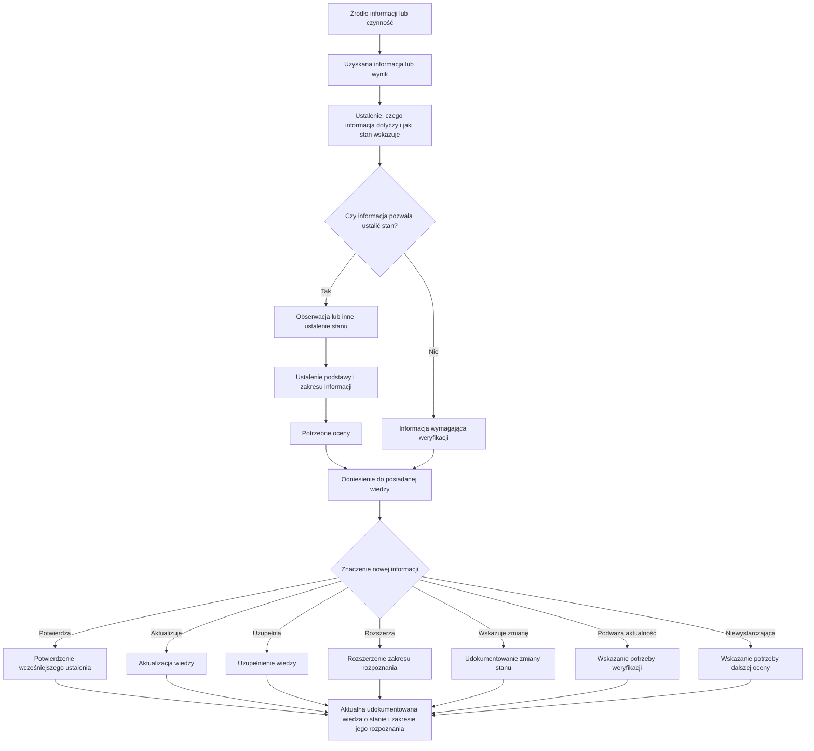

## 1. Cel dokumentu

Dokument określa zasady przetwarzania informacji uzyskanych podczas obserwowania i oceniania w udokumentowaną wiedzę o stanie dostępności i zgodności rozwiązania cyfrowego.

Wyjaśnia różnicę między czynnością służącą uzyskaniu informacji, jej wynikiem, obserwacją i oceną oraz określa zasady odnoszenia nowych informacji do posiadanej wiedzy.

---

## 2. Od informacji do wiedzy o stanie

Informacje o stanie dostępności i zgodności rozwiązania cyfrowego mogą pochodzić z różnych źródeł i być uzyskiwane za pomocą różnych metod.

Samo wykonanie testu, uzyskanie wyniku narzędzia automatycznego, otrzymanie zgłoszenia użytkownika, przeprowadzenie badania albo otrzymanie raportu nie oznacza jeszcze uzyskania wiedzy pozwalającej ocenić stan rozwiązania.

Informacje przetwarza się odpowiednio przez:

1. ustalenie, czego dotyczą i jaki stan wskazują;
2. wyodrębnienie istotnych obserwacji;
3. ustalenie podstawy dokonanych ustaleń;
4. dokonanie odpowiednich ocen;
5. odniesienie nowych informacji do posiadanej wiedzy;
6. ustalenie, w jaki sposób wpływają na wiedzę o stanie rozwiązania.

Sposób przetwarzania informacji zapewnia możliwość ustalenia ich źródła, podstawy dokonanych ustaleń, zakresu, którego dotyczą, oraz związku między stwierdzonym stanem a wynikającymi z niego ocenami.

Stopień szczegółowości dokumentowania dostosowuje się do charakteru informacji i sposobu jej wykorzystania. Nie każda informacja wymaga utworzenia odrębnych zapisów dla wszystkich wymienionych elementów.

---

## 3. Czynność, wynik, obserwacja i ocena

Podczas przetwarzania informacji rozróżnia się odpowiednio:

- **czynność służącą uzyskaniu informacji**;
- **wynik czynności**;
- **obserwację**;
- **ocenę**.

Rozróżnienie to służy prawidłowej interpretacji informacji. Nie oznacza obowiązku dokumentowania każdego z tych elementów jako odrębnej jednostki danych.

### 3.1. Czynność służąca uzyskaniu informacji

Czynnością służącą uzyskaniu informacji może być w szczególności:

- wykonanie scenariusza testu;
- zastosowanie narzędzia automatycznego;
- przeprowadzenie oceny eksperckiej;
- przeprowadzenie badania z użytkownikiem;
- analiza zgłoszenia lub skargi;
- analiza dokumentacji;
- sprawdzenie rezultatu działania naprawczego;
- zastosowanie innej metody pozwalającej uzyskać informacje o stanie.

Czynność określa sposób uzyskania informacji. Sama informacja o wykonaniu czynności nie określa jeszcze stanu rozwiązania ani jego zgodności.

### 3.2. Wynik czynności

Wynik przedstawia rezultat czynności służącej uzyskaniu informacji.

Może nim być w szczególności:

- wynik wykonania scenariusza testu;
- raport narzędzia automatycznego;
- wynik badania z użytkownikiem;
- ustalenie audytu;
- wynik analizy zgłoszenia;
- wynik analizy dokumentacji;
- wynik sprawdzenia działania naprawczego.

Wynik może nie dostarczyć nowej informacji o stanie, potwierdzić wcześniejsze ustalenie albo stanowić podstawę jednej lub wielu obserwacji i ocen.

### 3.3. Obserwacja

Obserwacja opisuje stwierdzony stan określonej cechy rozwiązania.

W zależności od potrzeb umożliwia ustalenie:

- czego dotyczy;
- jaka cecha została zaobserwowana;
- jaki stan stwierdzono;
- kiedy dokonano ustalenia;
- z jakiego źródła pochodzi informacja;
- jaka jest podstawa ustalenia.

Obserwacja opisuje stwierdzony stan, a nie jedynie sposób przeprowadzenia badania lub jego ogólny wynik.

Przykład:

> **Wynik testu:** test etykiet pól formularza — wynik negatywny.
>
> **Obserwacja:** pole „Adres poczty elektronicznej” w formularzu rejestracji nie ma programowo określonej etykiety.

Pierwszy zapis przedstawia wynik wykonanej czynności. Drugi określa, czego dotyczy informacja i jaki stan został stwierdzony, dzięki czemu może stanowić podstawę oceny i aktualizacji wiedzy.

### 3.4. Ocena

Ocena określa znaczenie stwierdzonego stanu z określonego punktu widzenia.

Ta sama obserwacja może stanowić podstawę różnych ocen.

Przykład:

> **Obserwacja:** pole „Adres poczty elektronicznej” nie ma programowo określonej etykiety.
>
> **Ocena zgodności:** niespełnione kryterium sukcesu WCAG 2.2 4.1.2 Nazwa, rola, wartość.
>
> **Ocena wpływu:** stan utrudnia korzystanie z pola użytkownikom czytników ekranu.

Obserwacja i ocena nie są tym samym. Obserwacja określa stwierdzony stan, natomiast ocena nadaje temu stanowi znaczenie w odniesieniu do określonego kryterium lub sposobu korzystania z rozwiązania.

---

## 4. Wyodrębnianie obserwacji

Informacje uzyskane podczas obserwowania i oceniania analizuje się w stopniu potrzebnym do ustalenia:

- czego dotyczą;
- jaka cecha rozwiązania została zaobserwowana;
- jaki stan stwierdzono;
- kiedy dokonano ustalenia;
- skąd pochodzi informacja;
- jaka jest podstawa ustalenia.

Obserwację formułuje się na tyle precyzyjnie, aby można było prawidłowo zrozumieć stwierdzony stan i wykorzystać informację niezależnie od ogólnego wyniku czynności, podczas której została uzyskana.

Nie sprowadza się obserwacji wyłącznie do ogólnego wyniku testu, nazwy niespełnionego wymagania ani informacji o występowaniu błędu.

Przedmiot obserwacji określa się odpowiednio do charakteru stwierdzonego stanu. Może nim być pojedynczy element, komponent, dokument, strona, ekran, proces użytkownika, obszar funkcjonalny albo jednoznacznie określona grupa obiektów.

Nie każda informacja wymaga jednak formalnego wyodrębnienia odrębnej obserwacji. Jest ono potrzebne przede wszystkim wtedy, gdy umożliwia prawidłową ocenę, aktualizowanie wiedzy albo późniejsze wykorzystanie ustalenia.

---

## 5. Jedna czynność a wiele obserwacji

Jedna czynność służąca uzyskaniu informacji może prowadzić do stwierdzenia wielu odrębnych stanów.

Przykładowo ocena formularza może wykazać:

- brak programowo określonej etykiety pola;
- nieprawidłową kolejność fokusu;
- brak identyfikacji błędu;
- brak programowego powiązania komunikatu o błędzie z polem.

Stany rozpatruje się odrębnie, jeżeli różnią się przedmiotem, cechą, znaczeniem lub mogą wymagać odrębnego aktualizowania wiedzy.

Nie jest natomiast konieczne tworzenie odrębnych zapisów, jeżeli nie zwiększa to precyzji wiedzy ani możliwości jej późniejszego wykorzystania.

---

## 6. Stan występujący w wielu obiektach

Ten sam stan może występować w wielu miejscach rozwiązania.

W zależności od jego charakteru, przyczyny i zakresu można:

- udokumentować odrębne obserwacje dotyczące poszczególnych obiektów;
- udokumentować obserwację dotyczącą jednoznacznie określonej grupy obiektów;
- opisać wspólny stan wynikający z zastosowania tego samego komponentu, szablonu, mechanizmu albo sposobu tworzenia treści.

Sposób dokumentowania umożliwia ustalenie rzeczywistego lub rozpoznanego zakresu występowania stanu.

Nie tworzy się wielu identycznych zapisów, jeżeli nie zwiększa to wiedzy o stanie ani możliwości jej wykorzystania. Nie łączy się również informacji w sposób utrudniający ustalenie, gdzie określony stan rzeczywiście występuje.

---

## 7. Podstawa ustaleń i materiały dowodowe

Ustalenia dotyczące stanu rozwiązania mają możliwą do wskazania podstawę.

Podstawą może być w szczególności:

- wynik lub zapis wykonania testu;
- zrzut ekranu;
- nagranie;
- fragment kodu;
- raport;
- protokół;
- wynik narzędzia automatycznego;
- dokumentacja techniczna;
- zgłoszenie lub skarga użytkownika;
- wynik badania z użytkownikami;
- dokumentacja lub informacja przekazana przez wykonawcę albo dostawcę.

Rodzaj i zakres zachowywanych materiałów dowodowych dostosowuje się do charakteru ustalenia, jego znaczenia oraz sposobu wykorzystania wynikającej z niego wiedzy.

Nie każda obserwacja wymaga tworzenia odrębnego materiału dowodowego. Organizacja zachowuje jednak możliwość ustalenia podstawy istotnych wniosków dotyczących stanu i zgodności rozwiązania.

Materiały pochodzące z zewnętrznych źródeł wykorzystuje się z uwzględnieniem ich zakresu, aktualności i wiarygodności.

---

## 8. Ocena zgodności

Ocena zgodności określa relację stwierdzonego stanu do mającego zastosowanie wymagania dostępności.

Przed dokonaniem oceny ustala się:

- jakie wymaganie ma zastosowanie;
- jakiego zakresu rozwiązania dotyczy ocena;
- czy posiadane informacje stanowią wystarczającą podstawę do dokonania oceny.

Wynik oceny zgodności może wskazywać odpowiednio:

- wymaganie spełnione;
- wymaganie niespełnione;
- wymaganie nie ma zastosowania;
- brak wystarczających informacji do dokonania oceny.

Ocena zgodności odnosi się wyłącznie do zakresu, dla którego uzyskano wystarczające informacje.

Wyniku nie uogólnia się na inne obiekty, funkcje, procesy, sposoby korzystania lub środowiska użytkowania bez podstawy pozwalającej na takie uogólnienie.

Jedna obserwacja może stanowić podstawę oceny zgodności z więcej niż jednym wymaganiem. Ocena jednego wymagania może natomiast opierać się na wielu obserwacjach.

---

## 9. Ocena wpływu na użytkowników

Ocena wpływu określa znaczenie stwierdzonego stanu dla możliwości korzystania z rozwiązania przez użytkowników.

Przy ocenie można uwzględniać w szczególności:

- sposoby korzystania z rozwiązania;
- użytkowników, których może dotyczyć stwierdzony stan;
- znaczenie funkcji lub procesu;
- zakres i częstotliwość występowania problemu;
- możliwość wykonania zadania;
- konsekwencje niewykonania zadania;
- możliwość skorzystania z innego dostępnego sposobu wykonania zadania.

Sposób dokumentowania oceny wpływu organizacja dostosowuje do potrzeb jej wykorzystania. Może stosować przyjętą skalę wpływu, jeżeli pomaga ona porównywać problemy i podejmować decyzje.

Ocena wpływu jest odrębna od oceny zgodności.

Niezgodności z tym samym wymaganiem mogą mieć różny wpływ zależnie od miejsca, funkcji i kontekstu ich występowania. Również stan zgodny z obowiązkowymi wymaganiami może ujawniać problem istotny dla użytkowników, który organizacja uwzględnia w dalszych działaniach.

---

## 10. Odnoszenie nowych informacji do posiadanej wiedzy

Nowe informacje odnosi się do aktualnej, udokumentowanej wiedzy o stanie rozwiązania.

Organizacja ustala odpowiednio, czy nowa informacja:

- potwierdza wcześniejsze ustalenie;
- aktualizuje wiedzę o stanie;
- uzupełnia brakujące informacje;
- rozszerza zakres rozpoznania stanu;
- wskazuje zmianę stanu;
- wskazuje, że wcześniejsze ustalenie mogło utracić aktualność;
- jest sprzeczna z wcześniejszym ustaleniem;
- wskazuje potrzebę dodatkowej lub ponownej oceny.

Odnoszenie nowych informacji do posiadanej wiedzy zapobiega tworzeniu kolejnych niezależnych zbiorów wyników i umożliwia utrzymywanie aktualnego obrazu stanu rozwiązania.

Rozbieżności między nowymi i wcześniejszymi informacjami nie rozstrzyga się automatycznie na korzyść informacji nowszej. Uwzględnia się ich zakres, podstawę, aktualność, wiarygodność oraz zmiany rozwiązania, które mogły nastąpić między poszczególnymi ustaleniami.

---

## 11. Dokumentowanie zmiany stanu

Jeżeli nowe informacje wskazują zmianę wcześniej rozpoznanego stanu, organizacja:

1. ustala, czego dotyczy zmiana;
2. wskazuje podstawę stwierdzenia nowego stanu;
3. dokonuje potrzebnych ocen;
4. aktualizuje wiedzę o obecnym stanie;
5. zachowuje wcześniejsze informacje w zakresie potrzebnym do odtworzenia podstaw i historii istotnych ustaleń.

Sposób dokumentowania zmiany nie wymaga tworzenia odrębnej obserwacji dla każdego kolejnego stanu, jeżeli zastosowany sposób utrzymywania wiedzy pozwala ustalić stan obecny oraz — gdy jest to potrzebne — wcześniejsze istotne ustalenia.

Nie nadpisuje się informacji w sposób powodujący utratę wiedzy potrzebnej do ustalenia podstaw wcześniejszych ocen, przebiegu istotnej zmiany albo skuteczności podjętych działań.

---

## 12. Potwierdzanie wcześniejszych ustaleń

Ponowne wykonanie testu albo zastosowanie innej metody może potwierdzić wcześniejsze ustalenie.

W takim przypadku zachowuje się odpowiednio możliwość ustalenia:

- czego dotyczyło ponowne sprawdzenie;
- za pomocą jakiej metody zostało wykonane;
- na jakiej podstawie potwierdzono wcześniejsze ustalenie;
- kiedy dokonano potwierdzenia.

Potwierdzenie wcześniejszego stanu nie wymaga tworzenia kolejnej identycznej obserwacji, jeżeli wynik ponownej oceny i jego podstawa mogą zostać jednoznacznie odniesione do posiadanej wiedzy.

Potwierdzenie może natomiast wpływać na ocenę aktualności i wiarygodności wcześniejszych informacji.

---

## 13. Informacje niewystarczające do dokonania oceny

Nie każda uzyskana informacja umożliwia jednoznaczne ustalenie stanu albo dokonanie oceny.

Informacja może w szczególności:

- wskazywać możliwość występowania problemu;
- być niepełna;
- pochodzić ze źródła wymagającego weryfikacji;
- nie pozwalać na jednoznaczne ustalenie stanu;
- nie dostarczać wystarczającej podstawy do oceny zgodności lub wpływu.

Taką informację zachowuje się, jeżeli może mieć znaczenie dla wiedzy o stanie, oraz odpowiednio oznacza potrzebę jej weryfikacji lub przeprowadzenia dalszej oceny.

Brak wystarczających informacji nie stanowi podstawy ani do uznania wymagania za spełnione, ani za niespełnione.

Informacja, której nie można jeszcze przekształcić w jednoznaczną obserwację lub ocenę, może stanowić istotny element wiedzy o zakresie rozpoznania stanu.

---

## 14. Aktualizowanie wiedzy o stanie

Po przetworzeniu nowych informacji ustala się, w jaki sposób wpływają one na posiadaną wiedzę o stanie rozwiązania i zakresie jego rozpoznania.

W zależności od uzyskanych informacji może być potrzebne:

- udokumentowanie nowego ustalenia;
- powiązanie nowej informacji z wcześniejszym ustaleniem;
- dokonanie lub aktualizacja oceny zgodności;
- dokonanie oceny wpływu;
- powiązanie ustaleń z ich podstawą i materiałami dowodowymi;
- potwierdzenie aktualności wcześniejszej wiedzy;
- oznaczenie wcześniejszego ustalenia jako wymagającego weryfikacji;
- stwierdzenie utraty aktualności wcześniejszego ustalenia;
- zaktualizowanie wiedzy o obecnym stanie;
- uzupełnienie wiedzy o zakresie rozpoznania;
- wskazanie potrzeby dalszej oceny.

Rezultatem przetwarzania jest ustalenie, co na podstawie dostępnych informacji można wiarygodnie powiedzieć o obecnym stanie dostępności i zgodności rozwiązania oraz jakiego zakresu rozwiązania to ustalenie dotyczy.

Szczegółowe zasady organizowania, dokumentowania i aktualizowania wiedzy określa załącznik **Dokumentowanie wiedzy o stanie dostępności i zgodności**.

---

## 15. Schemat przetwarzania informacji

