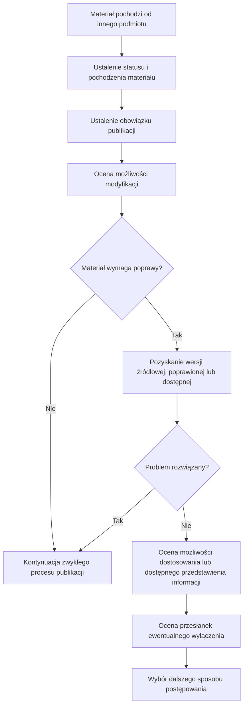

Procedura dotyczy wyłącznie dodatkowych działań wynikających z faktu, że materiał przeznaczony do publikacji pochodzi od innego podmiotu. Nie zastępuje ogólnych zasad publikacji ani kontroli dostępności cyfrowej właściwej dla danego rodzaju treści.

## 1. Ustalenie statusu i pochodzenia materiału

Na tym etapie ustala się:

- kto wytworzył materiał;
- kto przekazał go do publikacji;
- czy został wytworzony przez podmiot publikujący albo na jego rzecz;
- czy został sfinansowany przez podmiot publikujący;
- czy został nabyty przez podmiot publikujący.

Informacje te są potrzebne do dalszej oceny materiału, w szczególności do oceny przesłanek wyłączenia określonych w przepisach o dostępności cyfrowej.

## 2. Ustalenie obowiązku publikacji

Ustala się, czy publikacja materiału wynika z przepisu prawa albo innego wiążącego obowiązku.

Obowiązek publikacji i obowiązek zapewnienia dostępności cyfrowej ocenia się niezależnie. Sam fakt, że materiał musi zostać opublikowany, nie stanowi podstawy zastosowania wyłączenia z wymagań dostępności cyfrowej.

## 3. Ocena możliwości modyfikacji

Ocena obejmuje ustalenie:

- czy podmiot publikujący jest uprawniony do zmiany materiału;
- czy istnieją ograniczenia prawne lub faktyczne dotyczące modyfikacji;
- czy dostępna jest wersja źródłowa albo edytowalna.

Samo zewnętrzne pochodzenie materiału ani brak pliku edytowalnego nie przesądzają o braku możliwości jego dostosowania.

## 4. Pozyskanie odpowiedniej wersji materiału

Jeżeli materiał wymaga poprawy, w pierwszej kolejności podejmuje się działania zmierzające do pozyskania:

- poprawionej wersji materiału;
- wersji dostępnej cyfrowo;
- wersji źródłowej lub edytowalnej, jeżeli może być potrzebna do zgodnego z prawem dostosowania materiału;
- informacji lub elementów potrzebnych do zapewnienia dostępności odpowiednich do rodzaju materiału.

Informacja o brakach powinna wskazywać, czego brakuje, co wymaga poprawy oraz jakie materiały lub informacje są potrzebne.

Jeżeli podmiot przekazujący odmawia przekazania wersji dostępnej cyfrowo albo nie odpowiada na prośbę o jej przekazanie, okoliczność tę dokumentuje się i uwzględnia przy wyborze dalszego sposobu postępowania. Sama odmowa, brak odpowiedzi ani ponowne przekazanie niedostępnej wersji nie stanowią samodzielnej podstawy zastosowania wyłączenia.

Można zastosować wzór:

> W materiale „[tytuł]” stwierdziliśmy następujące braki:
>
> - [brak lub bariera];
> - [brak lub bariera].
>
> Prosimy o przekazanie [lista potrzebnych elementów lub poprawek] do [termin]. Do czasu wyjaśnienia sposobu dalszego postępowania materiał nie zostanie opublikowany w przekazanej postaci.

## 5. Ocena możliwości dostosowania lub przygotowania dostępnego przedstawienia informacji

Jeżeli podmiot przekazujący nie może dostarczyć odpowiedniej wersji, odmawia jej przekazania albo nie odpowiada na prośbę, ocena obejmuje ustalenie:

- czy podmiot publikujący może sam dostosować materiał;
- czy możliwe jest przygotowanie dostępnej wersji;
- czy możliwe jest przygotowanie dostępnego przedstawienia zawartych w materiale informacji.

Zakres działań dostosowuje się do rodzaju materiału i ustalonego obowiązku publikacji.

## 6. Ocena przesłanek wyłączenia

Jeżeli nadal rozważane jest zastosowanie wyłączenia, ustalony stan faktyczny odnosi się do konkretnego przepisu.

Przy ocenie art. 3 ust. 2 pkt 5 ustawy o dostępności cyfrowej uwzględnia się w szczególności:

- sposób wytworzenia materiału;
- sposób jego sfinansowania lub nabycia;
- konieczność dokonania modyfikacji w celu zapewnienia dostępności;
- uprawnienie podmiotu publicznego do dokonania takiej modyfikacji.

Pochodzenie materiału od innego podmiotu nie jest samoistną podstawą zastosowania wyłączenia.

Ocena powinna pokazywać, jak ustalony stan faktyczny odnosi się do przesłanek art. 3 ust. 2 pkt 5. Pomocniczo można stosować następującą macierz:

| Element oceny | Ustalenie | Dowód / źródło informacji | Wniosek |
|---|---|---|---|
| Czy treść jest w posiadaniu podmiotu publicznego? | TAK / NIE | | |
| Czy sposób wytworzenia, sfinansowania lub nabycia treści spełnia przesłanki lit. a? | TAK / NIE / NIE DOTYCZY | | |
| Czy zapewnienie dostępności wymaga modyfikacji, do której podmiot nie jest uprawniony, zgodnie z lit. b? | TAK / NIE / NIE DOTYCZY | | |
| Czy istnieje konkretna podstawa zastosowania wyłączenia? | TAK / NIE | | wskazanie litery przepisu albo brak podstawy |

Macierz nie zastępuje oceny prawnej konkretnego przypadku. Ma jedynie zapewnić, że zastosowanie wyłączenia wynika z konkretnej przesłanki ustawowej, a nie z samego zewnętrznego pochodzenia materiału.

## 7. Wybór dalszego sposobu postępowania

W zależności od wyników oceny dalszy sposób postępowania może obejmować w szczególności:

- pozyskanie poprawionej lub dostępnej wersji;
- pozyskanie wersji źródłowej albo edytowalnej;
- dostosowanie materiału przez podmiot publikujący;
- przygotowanie dostępnego przedstawienia informacji;
- publikację materiału w zakresie dopuszczonym przez przepisy;
- wstrzymanie publikacji materiału, jeżeli publikacja nie jest obowiązkowa i nie zostały spełnione warunki pozwalające na jego prawidłowe udostępnienie.

Po ustaleniu sposobu postępowania materiał wraca do zwykłego procesu publikacji obowiązującego w podmiocie.
