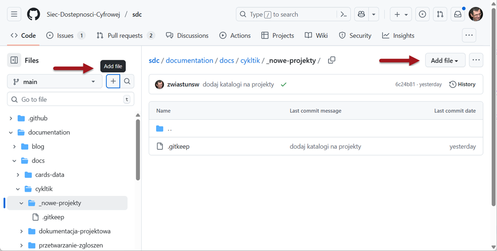
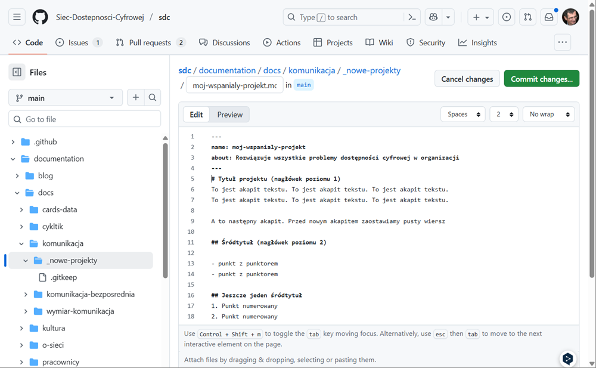
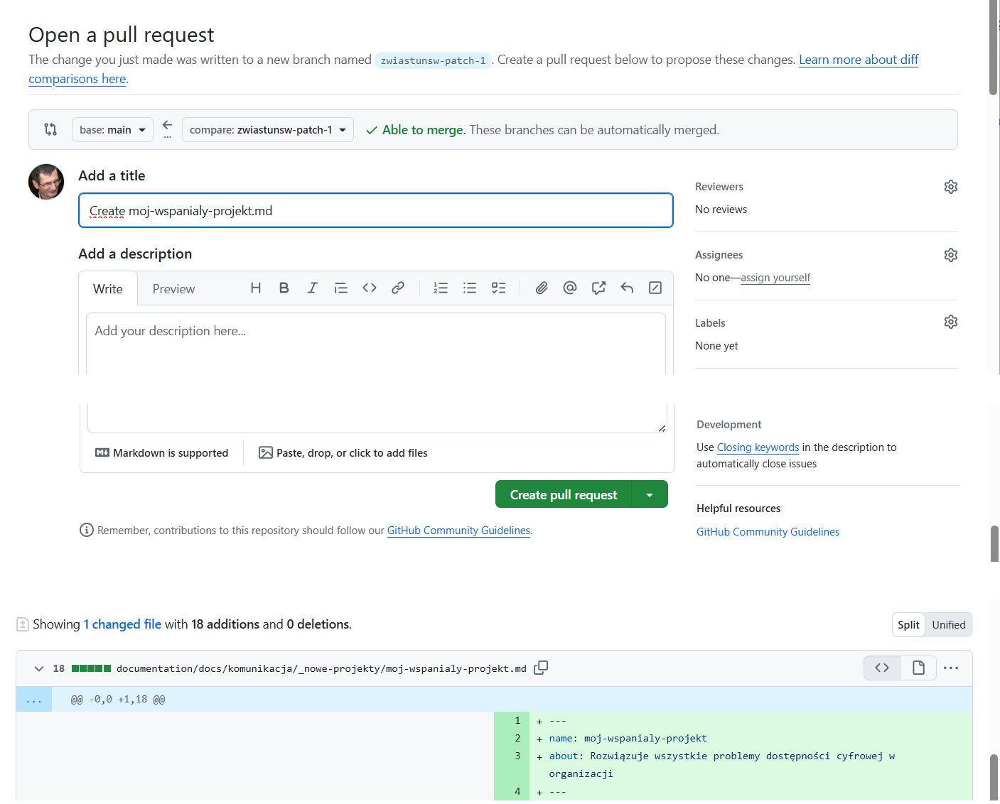

# Dodaj dokument

Dodanie nowej propozycji zalecenia, rozwiązania lub opisu praktyki polega na zgłoszeniu <q>żądania scalenia</q> (po angielsku: *<span lang="en">pull request</span>*. Dla osób obytych z Github to proste działanie.

Ale nowicjuszom i osobom mniej doświadoczonym w pracy na Github może nowicjuszom przysporzyć trochę stresu i niespodziewanych sytuacji. Ale to normalne, gdy poznajemy rzeczy nowe.

Ten poradnik pomoże Ci krok po kroku dodać nowy dokument. 

## Krok 1. Wybierz miejsce, w którym chcesz dodać dokument

Aby rozpocząć, możesz po prostu skorzystać z odpowiedniego łącza spośród poniższych.

### Na skróty

- [Dodaj dokument w wymiarze **Cykl życia TIK**](https://github.com/Siec-Dostepnosci-Cyfrowej/sdc/new/main/documentation/docs/cykltik/_nowe-projekty)
- [Dodaj dokument w wymiarze **Komunikacja**](https://github.com/Siec-Dostepnosci-Cyfrowej/sdc/new/main/documentation/docs/komunikacja/_nowe-projekty)
- [Dodaj dokument w wymiarze **Zarządzanie i kultura**](https://github.com/Siec-Dostepnosci-Cyfrowej/sdc/new/main/documentation/docs/kultura/_nowe-projekty)
- [Dodaj dokument w wymiarze **Pracownicy**](https://github.com/Siec-Dostepnosci-Cyfrowej/sdc/new/main/documentation/docs/pracownicy/_nowe-projekty)
- [Dodaj dokument w wymiarze **Wiedza i umiejętności**](https://github.com/Siec-Dostepnosci-Cyfrowej/sdc/new/main/documentation/docs/wiedza/_nowe-projekty)
- [Dodaj dokument w wymiarze **Wsparcie**](https://github.com/Siec-Dostepnosci-Cyfrowej/sdc/new/main/documentation/docs/wsparcie/_nowe-projekty)
- [Dodaj dokument w wymiarze **Zaopatrzenie**](https://github.com/Siec-Dostepnosci-Cyfrowej/sdc/new/main/documentation/docs/zaopatrzenie/_nowe-projekty)

### Standardowo
1. [Przejdź na główną stronę repozytorium Sieci](https://github.com/Siec-Dostepnosci-Cyfrowej/sdc).  
2. Na liście plików wybierz kolejno:
   - katalog ***documentation***
   - katalog ***docs***
   - katalog wymiaru, np. ***komunikacja***
   - i katalog ***_nowy-projekt***.

   Znajdziesz się w miejscu, w którym możesz dodać dokumenty sojego projektu:

   
2. Przejdź do obszaru treści głównej. 
3. Użyj opcji **<span lang="en">Add file</span>** (Dodaj plik). Łącza znajdują się w dwóch miejscach. Na początku bocznego paska nawigacyjnego. To najszybszy dostęp za pomocą czytnika ekranu. Albo w prawym narożniku ekranu, za ścieżką powrotu.

   
   
   Druga opcja pozwala przesłać dokument ze swojego komputera. My utworzymy nowy dokument. 
 
4. Dodaj nazwę dokumentu

   Wybór łącza **<span lang="en">Add file</span>** w pasku nawigacyjnym przeniesie Cię od razu do ścieżki powrotu, na końcu której trzeba dodać nazwę pliku. Nazwa nie może zawierać spacji, wyrazy oddzielaj łącznikami. Używaj w nazwach tylko małych liter z zestawu alfabetu łacińskiego (polskie zastąp odpowiednikami np. wpisuj <q>a</q> zamiast <q>ą</q>, np. **moj-wspanialy-projekt.md**. Nazwę pliku uzupełniamy po kropce rozszerzeniem **.md** wskazującym na format Makdown. 

  
  
5. Dodaj treść dokumentu

     
   
   Treść dokumentu możesz wspiać bezpośrednio w edytorze lub wkleić do edytora.
   
   Treść dokumentu zapisujemy za pomocą bardzo prostego [formatu Markdown](poradnik-do-markdown.mdx). Na ilustracji widać kilka przykładowych typowych elementów:
   
   Dokument rozpoczyna się od sekcji metadanych, zwanej **<span lang="en">FrontMater</span>**. Rozpoczyna ją i kończy wiersz z trzema myślnikami.
   Między myślnikami umieszczamy dane o dokumencie, zachowując format: **nazwa_danej: treść danej**. Po nazwie danej stawiamy dwukropek i pozostawiamy jedną spację. Następnie zapisujemy treść danej. Jeśli chcemy użyć w treści dwukropka albo znaków cala, to całą treść musimy objąć znakami cala, a znaki cala wewnętrz treści musimy poprzedzić znakiem ucieczki, np.

```md
---
name: moj-wspanialy-projekt
about: "Rozwiązuje \"wszystkie problemy\" dostępności cyfrowej w organizacji"
--- 
``` 
  
  Aby utworzyć nagłówek 1 stopnia, rozpoczynamy wiersz od znaku **<q>#</q>**, drugiego stopnia - od dwóch znaków **<q>##</q>**. Aby utwoorzyć **nowy akapit**, rozpocznamy tekst od nowej linii poprzedzonej pustym wierszem. Aby utwórzyć **punkt listy z punktorem**, rozpoczynamy wiersz od  myślnika albo gwiazdki. Na dobry początek niech wystarczy tych kilka przykładów.

6. Prześlij zmiany

   Gdy mamy gotowy dokument, musimy go wysłać. Angielskie **<span lang="en">commit</span>** już nawet spolonizowaliśmy i mówimy <q>skomitować</q>.
   
   1. Wybierz przycisk **<span lang="en">Commit changes</span>**.
   2. W oknie modalnym możesz (2) zmienić tytuł i (3) dodać opis albo zrobić to później.
   3. Koniecznie (4) zaznacz opcję **<span lang="en">Create na new branch for this commit...</span>**.
   4. Możesz (5) zmienić nazwę gałęzi, np. zamiast członu *path1* dodaj nazwę twojego dokumentu.
   5. Wybierz przycisk **<span lang="en">Propose chanes</span>**.

     

7. Otwórzyć **pull request**

   

   Masz tu jeszcze raz okazję, by poprawić nazwę i dodać lub zmienić opis. Najważniejsze jest jednak, by utworzyć **pull request**
   
    
	