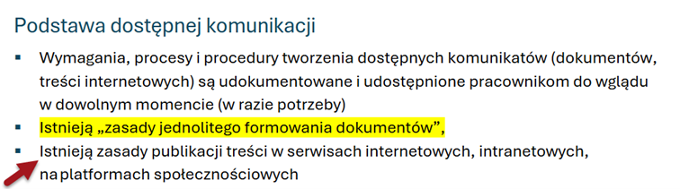

# Ja w Sieci. Wkład uczestnika

:::info O tym dokumencie

Transkrypcja prezentacji wygłoszonej podczas podczas VI spotkania Sieci dostępności cyfrowej przez p. Stefana Wajdę, II Wiceprzewodniczącego Sieci.  

:::

* [Pobierz prezentację, PowerPoint, 1,06MB](./img/SDC-6-spotkanie-wklad-uczestnika.pptx)

## 🎓Slajd 1: Ja w Sieci. Wkład uczestnika

Forma - wzorce opracowania, organizacja pracy nad własnym wkładem

Stefan Wajda

Prezentacja wygłoszona na VI spotkaniu Sieci Dostępności Cyfrowej

## 🧩Slajd 2: Cel prezentacji

Pomóc każdemu uczestnikowi odkryć swoje miejsce w pracach Sieci i wnosić swój wkład w realizację celu Sieci.

## 🧩Slajd 3: „Ja” w Sieci

- Udział w pracy nad co najmniej jednym z wymiarów dostępności
- Udział w spotkaniach wybranego zespołu(-ów)
- Opracowanie i zgłoszenie pod rozwagę zespołu kilku propozycji zaleceń, rozwiązań, przykładów dobrych praktyk
- Zgłaszanie bezpośrednio propozycji zaleceń, rozwiązań, przykładów dobrych praktyk
- Wsparcie innych członków zespołu w dopracowaniu ich projektów
- Udział w spotkaniach Sieci

Wnoszenie wkładu w realizację celu to 3 wyróżnione na slajdzie aktywności. Bez dwóch z tych trzech aktywności trudno by mówić, że jest się uczestnikiem Sieci:

- Opracowanie i przedłożenie do akceptacji sieci kilku propozycji zaleceń, rozwiązań, przykładów dobrych praktyk
  - ze wsparciem zespołu Sieci
  - bezpośrednio
- Wsparcie innych członków zespołu w dopracowaniu ich projektów

### Praktyki (dobre) w organizacjach – podstawą propozycji rozwiązań

Kładziemy nacisk na indywidualny wkład każdego uczestnika Sieci nie tylko dlatego, że innej skutecznej drogi do osiągnięcia celu Sieci nie ma. **Wprawdzie nie wprost, ale zobowiązuje nas do tego Regulamin Sieci**. Drugie z głównych zadań Sieci brzmi tak:

**2\. Wypracowanie propozycji rozwiązań systemowych w obszarze dostępności cyfrowej na podstawie dobrych praktyk** wdrażanych w zakresie dostępności cyfrowej, w szczególności przez podmioty publiczne.

To dlatego w Sieci zdecydowaną przewagę mają nie niezależni eksperci, ale przedstawiciele podmiotów publicznych. Regulamin wymaga, by było ich w Sieci nie mniej niż 30% wobec nie mniej niż 10% uczestników/uczestniczek będących przedstawicielami innych podmiotów i niezależnych specjalistów/specjalistek.

Teoretycznie możliwe jest, że w 70-osobowym składzie Sieci będą 63 osoby będące przedstawicielami podmiotów publicznych i tylko 7 osób będących przedstawicielami innych podmiotów i niezależnych specjalistów/specjalistek.

Możemy sięgnąć po doświadczenia innych podmiotów niż podmioty publiczne i po pomysły niezależnych ekspertów, ale podstawą mają być **dobre praktyki wdrażane w zakresie dostępności cyfrowej, w szczególności przez podmioty publiczne**.

Niekoniecznie muszą to być jednak rozwiązania, które już funkcjonują w organizacjach. Mogą to być także rozwiązania, które podmiot publiczny zamierza właśnie wdrożyć, albo nawet nad którymi dopiero pracuje.

Nie traktujmy sieci jako grupy ludzi, która ma wspólnymi siłami stworzyć jeden zwarty dokument. Nie jesteśmy zbiorowym autorem jednej ani mniejszej, ani większej książki czy księgi.

Potraktujmy Sieć jako środowisko, w którym możemy pracować nad swoimi projektami, jako środowisko, które pomoże nam, każdemu z nas, dopracować albo wypracować w oparciu o doświadczenia własne i instytucji w których pracujemy albo z którymi współpracujemy projekty zaleceń i rozwiązań, które poprzez Sieć upowszechnimy w Polsce, by wesprzeć podmioty publiczne w systemowym zapewnianiu dostępności.

Jeśli już użyć porównania do księgi, to będzie to raczej antologia czy dostępnościowa cookbook z przepisami na różne okazje opracowanymi przez elitarne grono kucharzy dostępności. Te różne okazje to różne problemy, wobec których stają podmioty publiczne i potrzebują na nie skutecznych rozwiązań. I podkreślmy jeszcze raz, że to „przepisy”, które zostały opracowane głównie na podstawie praktyk w podmiotach publicznych, z których pochodzi znacząca większość uczestników Sieci.

Można by powiedzieć, że ani Sieć jako całość, ani zespoły Sieci nie są powołane do tego, aby w toku pracy zespołowej opracować projekty rozwiązań systemowych dla organizacji, w których pracujemy. Nie chodzi o to, że 5-10 uczestników Sieci z lekkim piórem usiądzie i napisze kolejne poradniki, które sobie przeczytamy, pooceniamy i oddamy publiczności jako dorobek Sieci.

Ale Sieć jest, może być dla Ciebie, każdego uczestnika i uczestniczki Sieci doradcą, zespołem eksperckim, który pomoże Ci dopracować Twój projekt, jaki wdrażasz albo zamierzasz wdrożyć w swojej organizacji. Pomoże Ci odkryć jego powiązania z innymi czynnikami. Doceni jego mocne i słabe strony. Pomoże Ci, a poprzez Ciebie Twojej organizacji dogłębnie przeanalizować wszystkie aspekty zamierzonego lub już realizowanego działania i nadać mu najlepszy kształt.

### Wnoś swój wkład w projekty innych uczestników i uczestniczek

To nie jest jednak transakcja oparta na świadczeniach wzajemnych. Sieć, zespół Sieci pomoże Tobie i Twojej organizacji, jeśli Ty równie aktywnie będziesz wnosić wkład w projekty innych uczestników i uczestniczek.

### Przedstaw propozycję w swoim zespole

**Kwestie techniczne**. Swoje propozycje rozwiązań zgłoś na listę zaleceń i rozwiązań prowadzoną w Twoim zespole nawet, jeśli nie masz jej jeszcze opracowanej.

Znajdź czas w najbliższym miesiącu i opracuj przynajmniej jedną ze swoich propozycji. Może to być opis już realizowanej w Twojej organizacji praktyki, nawet jeśli nie jest jeszcze godna miana dobrej. Może to być projekt rozwiązania, które jest aktualnie wdrażane w Twojej organizacji, usprawniającego aktualną praktykę lub zastępującego dobrą praktykę. Może to być wreszcie projekt rozwiązania, nad którym właśnie pracujesz w swojej organizacji.

To bardzo ważne, aby źródłem propozycji, projektu rozwiązania, opisu dobrej praktyki było konkretne doświadczenie, konkretnego podmiotu.

### Przedstaw propozycję bezpośrednio Sieci

Możesz też przedstawić bezpośrednio pod obrady i osąd Sieci projekt gotowy, wypracowany i dopracowany w Twojej organizacji. Poza wartością, jaką wniesiesz w ten sposób w pracę Sieci, wnosisz pewną wartość dla swojej organizacji. Bo jeśli ten projekt zostanie zaakceptowany, będzie promować także Twoją organizację.

Rozwiązanie wypracowane i dopracowane w organizacji lub z organizacją, z którą współpracujesz, może być przedłożone jako rozwiązanie systemowe lub jako dobra praktyka. Forma przedłożenia zależy od zgłaszającego.

**Technicznie**: Wpisz go na listę zgłoszeń zaleceń i rozwiązań w arkuszu kalkulacyjnym, który najdziesz w Plikach w kanale wspólnym Sieci, albo wyślij mejlem do prezydium Sieci.

## 🧩Slajd 4: Jak wygenerować pomysł na swój wkład

- **AI**: Aby generować pomysły, można użyć różnych technik, takich jak burza mózgów, mapy myśli, metoda SCAMPER, czy bionika.
- [5 sposobów na skuteczne generowanie pomysłów](https://wenet.pl/blog/5-sposobow-na-skuteczne-generowanie-pomyslow)
- Znajdź pomysł w opisie swojego wymiaru dostępności
  - Alternatywnie – w zakresie tematycznym wypracowanym przez Zespół

Można skorzystać z jednej ze znanych technik generowania pomysłów. Ich opisy można łatwo znaleźć w Sieci, np. na stronie 5 sposobów na skuteczne generowanie pomysłów.

Ja proponuję bardziej tradycyjną metodę, choć można ją poprzedzić np. metodą _silent brainstorm_ – cichej burzy mózgów zorganizowanej tylko ze swoim mózgiem, albo w jakimś zespole, np. u siebie w pracy.

**Dygresja**. Przy okazji – dodatkowy argument za tym, aby zespoły pracowały nad doprecyzowaniem opisu swoich wymiarów, definicji punktów dowodowych i przykładowych dowodów. Bo to może, a nawet powinno być podstawowe narzędzie wspomagające zespół i członków zespołów w definiowaniu problemów i projektów rozwiązań dotyczących wymiaru, a także weryfikacji, czy zgłoszone projekty pokrywają całą mapę potrzeb.

Posłużmy się przykładem.

## 🧩Slajd 5: Pomysł z wymiaru Komunikacja

- Znajdź pomysł w opisie wymiar (dowodach, punktach dowodowych)

- Włącz myślenie systemowe
  - Zbadaj najbliższe „otoczenie” – pozostałe punkty dowodowe i przykłady dowodów
  - Zbadaj doświadczenia Twojej organizacji
  - Rozeznaj otoczenie zewnętrzne – przepisy prawne, opracowania, poradniki

### Znajdź pomysł w opisie wymiar (dowodach, punktach dowodowych)

Zobaczmy na przykładzie wymiaru Komunikacja. Najkrótsza droga, jaką mogę pójść, to przegląd opisu i punktów dowodowych tego wymiaru. Sięgam do zaktualizowanego opisu i już w podstawach dostępnej komunikacji znajduję na początku przykład dowodu, który wskazuje mi na istotny warunek i zarazem działanie, jakie podmiot publiczny powinien zrealizować, aby systemowo zapewniać dostępność cyfrową dokumentów: „**Istnieją „zasady jednolitego formowania dokumentów**”. Może to być przedmiot zalecenia, w zaleceniu można określić pewne rekomendacje, a do tego być może uda się poprzeć zalecenie i rekomendacje przykładami z praktyki, np. doświadczenia mojego podmiotu albo z doświadczeń innych podmiotów.

Mam już kandydata na pomysł, choć nie wiem, czy się nim zajmę.

### Włącz myślenie systemowe

**Zbadaj najbliższe „otoczenie”.** Najpierw rozglądam się po „najbliższym otoczeniu” – jeszcze nie w rzeczywistym systemie, tylko w zarysowanym modelu systemu, bo takim modelem są punkty dowodowe i przykłady dowodów. W tym samym punkcie dowodowym znajduję podobny warunek: „Istnieją zasady publikacji treści w serwisach internetowych, intranetowych, na platformach społecznościowych”.

Pojawiają mi się w głowie pytania: Może raczej tym bym się chciał zająć? A może te zasady powinny się znaleźć w jednym wspólnym dokumencie?  Jeśli jeden wspólny dokument, to może powinien obejmować także następną z kwestii „Istnieją udokumentowane procedury konwersji dokumentów do formatów HTML lub PDF zapewniające zachowanie cech dostępności.”  Do rozważenia.

**Zbadaj doświadczenia Twojej organizacji**. Pracuję w podmiocie publicznym, a że najbliższa ciału koszula, to badam, czy i jak to jest rozwiązane u nas. Czy wdrożono jakieś zasady formowania dokumentów zgodnie z wymogami dostępności? Jeśli tak, gdzie zostały sformułowane, zarządzone, co obejmują? Jeśli nie, czy mimo tego funkcjonują jakieś reguły formatowania pism? Jak to się dzieje, że funkcjonują? Czy są takie same w całej organizacji, czy tylko podobne? Jak są egzekwowane?

W miarę rozeznawania problemu, pytań jest więcej. Kto te zasady opracowywał, jeśli istnieją? Czy się przyjęły? Czy ich wprowadzenie wywoływało opory i jakie? **Czy ten dokument z zasadami nie mógłby być przykładem dobrej praktyki?** A może opis procesu tworzenia zasad w mojej instytucji mógłby być przykładem dobrej praktyki?

Czy istnieją jakiekolwiek inne ustalenia dotyczące formowania dokumentów, np. Księga znaku albo zasady określone przez dział promocji. A jeśli takie są, to czy zasady dostępnego formowania dokumentów nie powinny być częścią już tych istniejących

**Rozeznaj otoczenie zewnętrzne**. Skoro mam myśleć systemowo, to musze sięgnąć myślą także do otoczenia zewnętrznego. Może na przykład istnieją jakieś przepisy prawne, w których opisano reguły formatowania dokumentów biurowych? Słyszałem, że przepisy dość precyzyjnie regulują sposoby formowania aktów prawnych, nie tylko ustaw, ale aktów prawa miejscowego. Czy wewnętrzne zasady formowania dokumentów mają się odwoływać do tych przepisów albo je transponować?

Orientuję się, czego uczą w szkołach na zajęciach techniki biurowej. A czy uczą tam o wymaganiach dostępności? Jeśli nie uczą, może oprócz zaleceń warto by sformułować jakiś dezyderat pod adresem Ministerstwa Edukacji?

## 🧩Slajd 6: Międzyinstytucjonalny przewodnik…

Sięgam jeszcze dalej. A jak to jest w Unii Europejskiej. To już wykracza poza rozważania systemowe, to tylko element pogłębienia rozeznania. Wrzucam w przeglądarkę internetową hasło: „zasady tworzenia dokumentów w Unii Europejskiej”. Nie dziwię się już, że AI daje mi pół metra informacji. Ale osobiście dziwię się, że w wyszukiwarce nie mam odesłania do Międzyinstytucjonalnego przewodnika redakcyjnego, bo akurat znam ten przewodnik, polecałem w kilku instytucjach, wykorzystywałem w pracy nad jednolitymi zasadami formowania dokumentów. A tu przywołuję go jako dodatkowy bonus dla kogoś z zespołu Komunikacja, kto być może problem ustanowienia jednolitych zasad formowania dokumentów w organizacjach publicznych uczyni przedmiotem swoich propozycji.

### Podsumowując

- Tylko w oparciu o opis wymiaru dostępności w Modelu Dojrzałości Dostępności można wygenerować wiele pomysłów na swój wkład do realizacji celu Sieci
- Jeden przykładowy dowód może stać się źródłem pomysłów na zestaw projektów – zalecenie i rekomendacje, opis konkretnego rozwiązania, opis dobrej praktyki
- Posłużenie się przy generowaniu pomysłów punktami dowodowymi i przykładami dowodów od razu wprowadza nas na ścieżkę myślenia systemowego, bo widzimy problem w kontekście innych z zakresu naszego wymiaru.

Ze względu na czas, nie wnikam już głębiej, np. w kwestie powiązań z innymi wymiarami.

## 🧩Slajd 7: Opracuj swoją propozycję

- Zdefiniuj problem
- Zdiagnozuj problem
- Zbierz materiały
- Zdecyduj o formie
- Opracuj propozycję

Masz pomysł na propozycję, którą chcesz przedłożyć w zespole lub od razu całej Sieci, opracuj ją tak kompletnie, jak tylko potrafisz.

W omówieniu skupię się tylko na kilku kluczowych kwestiach.

### Zdefiniuj problem

Każde zalecenie, każdy przykład dobrej praktyki, każda propozycja rozwiązania systemowego musi się odnosić do konkretnego problemu organizacji pracy w instytucji publicznej. To zrozumiałe: musi być po coś.

### Zdiagnozuj problem

Diagnoza to rozpoznanie stanu rzeczy, opis – jak jest i analiza – dlaczego, na podstawie objawów, danych i informacji.

Jeśli chcesz np. pracować nad propozycją procesu aktualizacji deklaracji dostępności cyfrowej, to potrzebujesz zbadać:

- Jak ten proces przebiegał do tej pory. Opisz, z jakich kroków/etapów się składał, kto i kiedy je wykonywał, z jakim skutkiem.
- Czy, w jakim stopniu i dlaczego efekty dotychczasowej praktyki były zadowalające i niezadowalające? Potrzebujesz do tego pewnego wyobrażenia, jakie te efekty powinny być, by cel aktualizacji został zrealizowany i by proces był zorganizowany efektywnie. W naszym przypadku powinniśmy mieć na przykład: aktualny raport z przeglądu dostępności, listę istniejących problemów z dostępnością opisanych nietechnicznym językiem, ogólną ocenę zgodności (w pełni, częściowo, niezgodna), ewentualnie aktualna listę treści niedostępnych wyłączonych ustawowo z obowiązku zapewnienia dostępności, listę wyjątków uzasadnionych nieproporcjonalnymi kosztami oraz ocenę „nieproporcjonalności kosztów”).

Im bardziej będzie to pogłębiona diagnoza, tym lepiej. Pomoże Ci określać sposoby lepszej czy po prostu odpowiedniej realizacji. Ale nie ograniczaj się tylko do własnej wiedzy, obserwacji, wyobrażeń.

### Zbierz materiały

Poszukaj informacji o tym, jak powinno wyglądać przygotowanie deklaracji dostępności. Dość szybko się przekonasz, że doradcy albo chcą na Tobie zarobić i oferują, że tę deklarację Ci zrobią, albo ograniczają się do opisania własnym językiem tego, co już jest opisane w dokumencie Warunki techniczne i struktura deklaracji dostępności. Niemniej, przeszukaj Internet, znajdź co się da znaleźć.

Zbierz także materiały, jakie są używane w procesie aktualizowania deklaracji w Twojej organizacji. Może istnieje jakaś wewnętrzna instrukcja lub opis procedury. Może istnieją scenariusze testów, itd.

Następnie przeanalizuj znalezione materiały pod dwoma względami:

- Co z nich możesz wykorzystać w swoim opracowaniu
- Czego w nich brakuje?

Ja na przykład nie spotkałem się z sensowną podpowiedzią, jak dokonać tego tajemniczego „przeglądu” – bo przecież nie chodzi tu o przejrzenie istniejącej deklaracji, czy nie ma tam błędów, ale o dokonanie przeglądu aktualnego stanu dostępności witryny. Dane do przeglądu mogą pochodzić z kilku źródeł: z monitoringu, jeśli jest prowadzony, z audytu, jeśli był wykonany, ze zgłoszeń użytkowników.

Na koniec rozważ, jakie jeszcze warunki muszą być spełnione, aby cały proces przyniósł oczekiwane efekty, zwłaszcza jeśli zmienią się okoliczności.

### Zdecyduj o formie przedstawienia

Jeśli w Twojej organizacji proces aktualizowania deklaracji dostępności przebiega wzorcowo, możesz się zdecydować na opisanie przebiegu jako dobrej praktyki.

Możesz też na tej podstawie opracować projekt wzorcowej procedury.

Jeśli nie przebiega ani wzorcowo, ani skutecznie, zdecyduj się na przedstawienie projektu, który zamierzasz wdrożyć u siebie w organizacji.

### Opracuj propozycję

Zredaguj dokument. Przygotuj załączniki.

## 🧩Slajd 8: Formy opracowań

- Zalecenia
- Dezyderat
- Dobra praktyka
- Prezentacje rozwiązań
  - Przewodnik
  - Instrukcja
  - Procedura
  - Wzór dokumentu

Nie mamy na ten moment zbyt wielu przykładów opracowań.

Ale kilka podpowiedzi możemy dziś przedstawić.

### Zalecenie

Dzięki Jackowi Zadrożnemu, który przygotował pierwszą propozycję zalecenia, mamy już szablon zalecenia. Na strukturę zalecenia składa się:

- **Metryczka**
  - **Roboczy tytuł**. Używamy stylu Tytuł. Na tekst tytułu składają się:
    - **słowo „Zalecenie”**
    - **nazwa wymiaru,**
    - **numer porządkowy trzycyfrowy z zerami prowadzącymi w przypadku liczb do 100**
  - **Przedmiot zalecenia: Używamy stylu Normalny. Po pogrubionej etykiecie „Przedmiot zalecenia” określamy zwięźle, czego zalecenie dotyczy**
  - **Wymiar dostępności**: **Używamy stylu Normalny. Po pogrubionej etykiecie Wymiar i dwukropku wypisujemy nazwy wszystkich wymiarów, których dotyczy zalecenie**
  - **Autor**: Wpisujemy imię i nazwisko autora i imiona i nazwiska współautorów
  - **Data**: Wpisujemy datę zgłoszenia
- **Zalecenie**: Wpisujemy tytuł części „Zalecenie” formatowany nagłówkiem 1, a pod nim wpisujemy treść zalecenia. Stosujemy styl Normalny.
- **Rekomendacje**: wpisujemy tytuł części „Rekomendacje” formatowany nagłówkiem 1, a pod nim wpisujemy rekomendacje. Stosujemy listę punktowaną.
- **Uzasadnienie**: Wpisujemy tytuł części „Uzasadnienie” formatowany nagłówkiem 1, a pod nim wpisujemy krótkie uzasadnienie. Stosujemy styl Normalny.
- **Podstawy prawne**: wpisujemy tytuł części „Podstawy prawne” formatowany nagłówkiem 1, a pod nim wpisujemy odpowiednie akty prawne. Stosujemy listę punktowaną. Jeśli nie istnieje konkretny przepis prawny, z którego można wyprowadzić zalecenie, przywołujemy przepis lub przepisy ogólne z odpowiednim komentarzem

### Dezyderat

Nie mamy jeszcze wzorca. Tymczasem można skorzystać z szablonu zalecenia. Gdy pojawi się dezyderat do konkretnego organu państwa, dopracujemy szablon.

Dezyderat to propozycja oficjalnego wystąpienia z postulatem lub postulatami do organu państwa władnego zrealizować postulaty.

### Dobra praktyka

Szablon opisu dobrej praktyki już przedstawialiśmy. Jest zamieszczony w Plikach w kanale wspólnym Sieci, w katalogu 07_wzory-i-przyklady-dokumentow

Do tego katalogu dodamy w tym tygodniu szablony zalecenia i ewentualnie inne.

### Prezentacje rozwiązań

Mogą przybrać różną formę, np.

- - przewodnika
    - instrukcja
    - procedura
    - wzór dokumentu

## 🧩Slajd 10: Zaproś innych do współpracy nad Twoim projektem

- Umieść projekt w repozytorium plików w kanale swojego zespołu
- Zaproś członków zespołu do komentowania
- Umów się z 1-2 osobami zespole na współpracę nad projektem

Aby członkowie Zespołu mogli pracować nad Twoją propozycją, umieść pliki z opracowaniem w katalogu pliki w kanale zespołu. Zespoły mogą swobodnie kształtować strukturę katalogów. Zachęcamy do tego, aby była to taka sama struktura, jak na kanale wspólnym Sieci.

### Zaproś członków zespołu do komentowania

Nie czekaj, aż ktoś zobaczy, że dodałeś swoją propozycję. Zaproś we wpisie na kanale zespołu do komentowania. Poinformuj o dodaniu swojego projektu na najbliższym spotkaniu zespołu.

### Umów się z 1-2 osobami zespole na współpracę nad projektem

Niezależnie od zaproszenia – umów się z 1-2 osobami w zespole, że przyjrzą się Twojej propozycji, że ją przemyślą, skomentują, pomogą dopracować.

Znajdź w zespole kogoś, kto będzie „promotorem” Twojej propozycji, przygotuje recenzję, opinię na spotkanie zespołu, a potem na spotkanie Sieci.

## 🧩Slajd 11: Przygotuj prezentację projektu

Na spotkanie zespołu przygotuj prezentację swojego projektu. Będzie potrzebna także później podczas przedstawienia na spotkaniu Sieci.

## 🧩Slajd 12: Wnieś swój wkład w projekty innych uczestników

Tak, jak Ty potrzebujesz komentarzy, opinii, recenzji, wsparcia w zredagowaniu swoich propozycji, tak Twojego wkładu potrzebują inni członkowie Zespołu.

Traktuj ten wkład jako dzielenie się swoją wiedzą i doświadczeniem, ale także jako okazję do pogłębienia swojej wiedzy, do lepszego rozumienia związków między różnymi punktami dowodowymi Twojego wymiaru i innych wymiarów.

