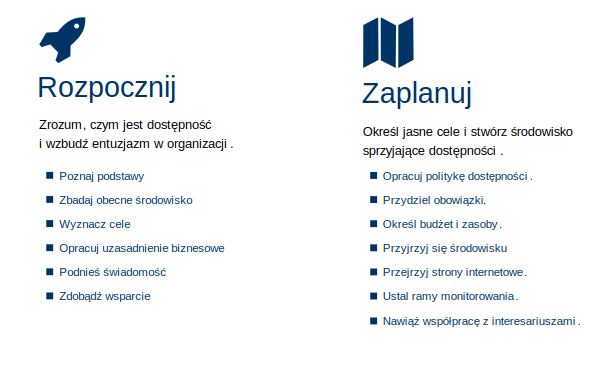
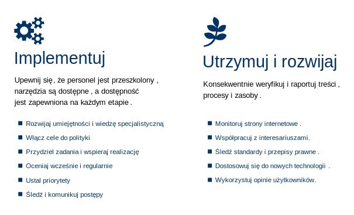

# Rola uczestnika Sieci, zespołów i całej Sieci w realizacji celu Sieci

:::info O tym dokumencie

Transkrypcja prezentacji wygłoszonej podczas podczas VI spotkania Sieci dostępności cyfrowej przez p. Stefana Wajdę, II Wiceprzewodniczącego Sieci.  

:::

* [Pobierz prezentację, PowerPoint, 1,052MB](./img/SDC-6-spotkanie-Ja-zespol-i-Siec.pptx)

## 🎓Slajd 1: Organizacja pracy Sieci. Ja, zespół i Sieć

Rola uczestnika Sieci, zespołów i całej Sieci w realizacji celu Sieci

## 🧩Slajd 2: Kontekst i cel prezentacji

- Aktywność uczestników Sieci w pracy zespołów
- Śladowa liczba zgłoszonych i rozpatrywanych przez zespoły projektów rozwiązań
- Brak propozycji gotowych do prezentacji na spotkaniu Sieci

Prezydium Sieci po każdym spotkaniu ocenia postęp i stan pracy. Nie tylko dlatego, że takie jest zadanie Prezydium, ale także dlatego, że – jak Państwo pamiętacie – Sieć została powołana o rok później, niż przewidywał projekt, a to oznacza – jeśli nie uda się uzyskać przedłużenia terminu zakończenia prac – że mamy na zrealizowanie celu Sieci o cały rok mniej czasu.

Duży niepokój Prezydium już od pierwszych spotkań zespołów wzbudza obserwowana przez nas niewielka aktywność uczestników Sieci w pracy zespołów. Ze zgłoszeniami do pracy zespołów poszło świetnie, ale z uczestnictwem w spotkaniach dobrze nie jest.

W spotkaniach zespołów uczestniczy 25-30% ogółu członków. Wyjątkowo mogło się zdarzyć, że na którymś spotkaniu liczba uczestniczących zbliżała się do połowy.

Gdy przeglądamy ustalenia w protokołach ze spotkań zespołów i dokumenty, które zespoły tworzą, to zaskakuje liczba osób, które włączają się w ich tworzenie. Aktywność wyrażającą się w tworzeniu tych dokumentów przejawia jeszcze mniej uczestników, niż uczestniczy w spotkaniach. Wysiłek twórców tych dokumentów nie znajduje takiego wsparcia ze strony członków zespołów, jakiego można by oczekiwać i jakie jest niezbędne, aby prace posuwały się do przodu. Może to zabrzmi zbyt boleśnie, ale wygląda, jakby większość i to znaczna większość uczestników Sieci nie miała nic do powiedzenia. Albo – zrównoważmy to – po prostu nie odnalazła się jeszcze w pracy Sieci i w pracy swojego czy swoich zespołów.

Drugi motyw opisałem oznajmieniem: „śladowa liczba zgłoszonych i rozpatrywanych przez zespoły projektów rozwiązań”. Aktualnie w repozytorium plików mamy ogółem 17 takich projektów, z czego w wersji dopracowanej na tyle, by można je poddać ocenie Sieci może 2, może 3. Nad 14 z tych projektów toczy się praca w 2 zespołach, nad kolejnymi 3 w dwóch innych zespołach.

Trzeci motyw to konsekwencja dwóch poprzednich. Nie byliśmy w stanie, jak to zamierzaliśmy, ustalić programu dzisiejszego spotkania Sieci, na który złożyłyby się prezentacje 4-6 rozwiązań, które Sieć mogłaby przedyskutować.

## 🧩Slajd 3: Jesteśmy w fazie „forming”

„Czy wiadomo o czym będzie mowa w kwestii organizacji prac? To już 6 spotkanie, a mam wrażenie, że wciąż jesteśmy w fazie „forming”.

**Formowanie**: Początkowa faza, charakteryzująca się niepewnością, ostrożnością i oczekiwaniem na instrukcje. Członkowie zespołu poznają się, ustalają cele i role.

Cytat na slajdzie, to fragment komentarza jednej z uczestniczek Sieci, który opisuje zwięźle moment, w którym jesteśmy, i wyjaśnia po części, dlaczego jest tak jak jest.

Rzeczywiście. Mimo że mija pół roku od pierwszego spotkania Sieci, jesteśmy póki co w fazie początkowej, w fazie formowania. Skonstatujmy:

- **Luty 2025, I spotkanie Sieci**. Przedstawiliśmy się, wybraliśmy wiceprzewodniczącego. Cel zrealizowany w 100%.
- **Marzec 2025, II spotkanie Sieci**. Propozycja organizacji pracy Sieci. Prezydium przedstawiło pod dyskusję propozycję, by jako fundamentu prac Sieci użyć Modelu Dojrzałości Dostępności proponowanego przez W3C, zorganizować się w zespoły, które zajmą się poszczególnymi wymiarami dostępności. Wstępnie przedyskutowaliśmy te propozycje. Uzgodniliśmy, że każdy zgłosi swój akces do pracy w wybranym zespole lub zespołach oraz że osoby, które czują w sobie takie możliwości, zgłosiły gotowość do współkierowania zespołem. Cel został zrealizowany.
- **Kwiecień 2025, III spotkanie Sieci**. Przedstawienie propozycji zakresów tematycznych poszczególnych wymiarów. Przedstawienie propozycji trybu pracy. Uzgodniliśmy, że przed kolejnym spotkaniem odbędą się spotkania zespołów, na których zespoły się ukonstytuują (wybiorą swoich liderów) oraz przedyskutują i dopracują zakres tematyczny swojego wymiar. Umówiliśmy się, że na spotkaniu w maju zespoły przedstawią efekty swoich spotkań. Program spotkania został zrealizowany.
- **Maj 2025, IV spotkanie Sieci**. Zakresy tematyczne wymiarów dostępności. Zespoły przedstawiły efekty swoich prac, opowiedziały, czym się chcą zająć. Przedstawiona została „ramowa” propozycja trybu pracy. Zaproponowaliśmy, by zanim propozycje zaleceń, rekomendacji, rozwiązań systemowych, opisy dobrych praktyk trafią pod obrady Sieci, powinny być przeprocedowane w zespołach. Aby tak się działo, projekty powinny być zgłoszone, opisane, udokumentowane i przedyskutowane w zespole. Ponadto zaproponowaliśmy szablon opisu dobrej praktyki i propozycje rozumienia terminów „zalecenie”, „rekomendacja”, „rozwiązanie (systemowe)”, „dobra praktyka”. Umówiliśmy, że na spotkaniu czerwcowym rozpatrzymy pierwsze przygotowane w takim trybie projekty.
- **Czerwiec 2025, V spotkanie Sieci**. Prezentacje efektów pracy zespołów. Przedstawiono 4 propozycje konkretnych rozwiązań
  - **zalecenia dot.** opracowania polityki dostępności cyfrowej
  - **zalecenia dot.** utworzenie repozytorium wiedzy o cyfrowej dostępności,
  - **zalecenia dot.** wymagań związanych z dostępnością w zapytaniach ofertowych i **propozycji rozwiązania** Zasady oceny jakości ofert pod względem dostępności cyfrowej.

Pozostałe zespoły poinformowały, że rozważały koncepcje swojej pracy i omówiły, co udało im się zrobić. Dodatkowym efektem są przykłady dokumentów – zalecenia, opisu rozwiązania systemowego

**Podsumowując**: Przeszliśmy, jak się wydaje dość efektywnie pierwszy etap fazy początkowej, fazy formowania. Mamy sprecyzowane cele, mamy zorganizowane zespoły, mamy określone zakresy tematyczne prac zespołów, mamy określony tryb pracy, zostały zgłoszone pierwsze projekty, mamy przykłady dokumentów z zaleceniami, szablonu dobrej praktyki, opis rozwiązania systemowego.

**Ale jest to nadal faza formowania**! A my chcielibyśmy już najlepiej być w fazie „działania” albo przynajmniej „normowania”, bo fazy „burzy” to pewno w ogóle nie dopuszczamy do swoich myśli.

## 🧩Slajd 4: Przejdźmy do fazy normowania

- **Stadium burzy**: W tym stadium pojawiają się konflikty i różnice zdań. Członkowie kwestionują autorytet lidera i próbują ustalić swoje miejsce w grupie. Ważne jest, aby lider potrafił zarządzać konfliktami i pomóc zespołowi przejść przez ten trudny etap.
- **Stadium normowania**: Po burzy następuje okres, w którym zespół zaczyna ustalać zasady i normy współpracy. Członkowie zaczynają akceptować siebie nawzajem i budować zaufanie. Lider powinien wspierać budowanie pozytywnej atmosfery i wzajemnego szacunku.

Jeśli do tego wszystkiego uzmysłowimy sobie, że jesteśmy grupą ludzi, którzy spotkali się ze sobą zaledwie kilka razy i to częściej „awatarem w awatar” niż „twarzą w twarz”, a twarzą w twarz nie spotkaliśmy się jeszcze w ogóle, to nie powinniśmy się dziwić, że aktywność uczestników jest jaka jest i że dorobek w postaci konkretnych projektów nie jest imponujący.

Przyjmijmy, że weszliśmy na chwilę w stadium burzy, na szczęście bez jakichś konfliktów, które przecież też mogły nam się zdarzyć. Że jest to jeszcze czas, w którym uczestnicy próbują ustalić swoje miejsce w Sieci. Ważne jest, abyśmy potrafili tym momentem zarządzić, przejść szybko przez ten trudny i nieunikniony etap do stadium działania.

Pewno w trakcie jednego dzisiejszego spotkania nie przejdziemy przez fazę normowania, ale spróbujmy przejść przez nią jak najszybciej. A przejdziemy, **gdy każdy uczestnik Sieci odnajdzie swoje miejsce w Sieci i będzie aktywny** co najmniej na takim poziomie, że sam będzie z siebie zadowolony i inni uczestnicy będą dostrzegać, jaki wnosi wkład w dorobek Sieci. Zadaniem i Prezydium i liderów zespołów będzie w razie potrzeby **pomóc każdemu to swoje miejsce odnaleźć i stać się użytecznym**.

Dla osiągnięcia celu Sieci potrzebna jest rzeczywista aktywność i użyteczność wszystkich, każdego z nas.

## 🧩Slajd 5: „Ja” w Sieci

- Udział w pracy nad co najmniej jednym z wymiarów dostępności
- Udział w spotkaniach wybranego zespołu(-ów)
- Opracowanie i zgłoszenie pod rozwagę zespołu kilku propozycji zaleceń, rozwiązań, przykładów dobrych praktyk
- Wsparcie innego/innych członków zespołu w dopracowaniu ich projektów
- Zgłaszanie bezpośrednio propozycji zaleceń, rozwiązań, przykładów dobrych praktyk
- Udział w spotkaniach Sieci

Ogólnie rzecz ujmując, miejsce uczestnika w Sieci opisuje 6 punktów widocznych na slajdzie.

### Udział w pracy nad co najmniej jednym z wymiarów dostępności

Aktualnie są wśród uczestników osoby, które zgłosiły swój akces do 2, 3 a nawet 4 zespołów. Każdy zespół potrzebuje aktywności wszystkich, którzy się do niego zgłosili. Ale też prawdopodobnie nie każdy zespół będzie w stanie skonsumować aktywność wszystkich. Zwłaszcza, gdy zespół liczy 33, 27 a nawet 22 osoby.

Prezydium Sieci proponuje, aby każdy z Państwa rozważył jeszcze raz swój akces do pracy w zespołach i zdecydował się na udział w pracach jednego, maksymalnie dwóch zespołów. Jeśli ktoś będzie chciał wnieść wkład do prac innego niż macierzysty zespołu, zawsze może zgłosić swój akces do takiego zespołu okresowo, na czas procedowania jego projektu.

### Udział w spotkaniach wybranego zespołu(-ów)

Jeśli ktoś zdecydował się na udział w pracach zespołów, to konsekwencją jest obowiązek udziału w spotkaniach zespołu. Oczywiście, usprawiedliwiona nieobecność zawsze może się zdarzyć. Ale w takich przypadkach standardem powinno być powiadomienie zespołu lub lidera, że nie będzie się obecnym albo – gdy nieobecność nie byłą planowana, powiadomienie o przyczynie nieobecności po fakcie, najszybciej jak to możliwe. Na pewno standardem nie powinno być traktowanie swojej nieobecności jako czego normalnego. I na pewno standardem nie powinny być częste nieobecności.

Udział w spotkaniu to nie tylko obecność, to także aktywność. Zachęcamy do aktywności przygotowanych. Wypowiedzi ad hoc, ad vocem, itd. są jak najbardziej w porządku, ale jeśli zespoły mają być skuteczne, to powinny to być głównie wnioski i ich uzasadnienie w sprawach, które są przedmiotem spotkania.

Zalecamy tutaj dobrą praktykę, by przygotować podsumowanie swoich wypowiedzi i umieszczać to podsumowanie np. na czacie zespołu czy wprost w protokole. Wpisanie podsumowania swojej wypowiedzi do projektu protokołu, to bardzo dobry sposób na udział w spotkaniach osób nieobecnych. Nie możesz być obecny fizycznie albo nie było Cię – przekaż swoje zdanie zespołowi.

### Opracowanie i zgłoszenie pod rozwagę zespołu kilku propozycji zaleceń, rozwiązań, przykładów dobrych praktyk

Szczegółowo o tym zadaniu będę mówić w kolejnej części spotkania. Tutaj tylko kwestie ogólne.

Osobisty wkład każdego uczestnika Sieci w osiągnięcie celu Sieci jest podstawą, fundamentem, warunkiem koniecznym. Bez realnego osobistego wkładu każdego uczestnika Sieć swojego zadania nie wykona.

Każdy z nas przyszedł do Sieci, by coś konkretnego do niej wnieść. I na pewno każdy z nas ma w swoim dorobku, w pracy swoich organizacji takie doświadczenia, które może przekuć w propozycje zaleceń, rozwiązań czy opisy dobrych praktyk.

Jeśli każdy z nas opracuje i zgłosi w ciągu roku/półtora kilka propozycji, na przykład 5, to ze statystyki wynika, że będziemy mogli rozważyć na spotkaniach zespołów i Sieci około **350 propozycji**. Jeśli każdy zgłosi tylko 4 propozycje, to będziemy mieli ich około **280**. Statystyki kłamią, ale też swoje mówią. 280 propozycji / 7 wymiarów, to jest przeciętnie 40 propozycji na wymiar. Jeśli pracę nad nimi rozłożyć na około 20 miesięcy, to oznacza, że każdy zespół na każdym spotkaniu miałby do przeprocedowania średnio 2 propozycje. Ale te propozycje trzeba zacząć procedować jak najszybciej, najlepiej od zaraz**. Z dwóch względów**.

**Pierwszego**, żebyśmy wszyscy mieli poczucie sprawczości, że coś konkretnego robimy, że posuwamy się do przodu. **I drugiego** – nie przeprocedujemy w żadnym zespole 40 propozycji w 2-3 miesiące kiedyś, gdy się wreszcie te propozycje pojawią. A nawet gdyby, to Sieć ich nie będzie w stanie w takim trybie rozważyć.

Co to powinno oznaczać w praktyce?

Proponujemy, aby bez zbędnej zwłoki, np. do końca lipca albo najpóźniej do końca pierwszego tygodnia sierpnia **opracował i zgłosił swojemu zespołowi co najmniej jedną konkretną propozycję.**

Zgłoszenie kolejnej opracowanej propozycji powinno mieć miejsce w przypadku każdego uczestnika w ciągu najbliższych 2-3 miesięcy, np. do październikowego spotkania Sieci.

To pomoże po pierwsze, każdemu uczestnikowi określić swoje miejsce w Sieci i w zespole, mieć zadanie i być odpowiedzialnym za jego wykonanie. A bez tego nie ma mowy o aktywności. I po drugie, pozwoli to zespołom i liderom zespołów organizować pracę, planować spotkania.

### Wsparcie innego/innych członków zespołu w dopracowaniu ich projektów

Każda zgłoszona propozycja wymaga recenzji – analizy i oceny, uzupełnień, korekt. Czasem będzie też wymagała podredagowania czy nawet zupełnego przeredagowania.

Recenzowanie i procedowanie można organizacyjnie różnie rozwiązać. Naszym zdaniem nie ma na to zbytnio czasu podczas spotkań zespołów. Praca nad zgłoszonymi propozycjami ma szansę powodzenia, jeśli będzie się działa między spotkaniami.

Idealnie byłoby, gdyby w miarę pojawiania się dokumentów z opracowanymi propozycjami, każdy w Zespole zapoznał się z projektem i w komentarzach zgłaszał autorowi i zespołowi zarazem swoje uwagi, sugestie, propozycje zmian.

**Oznacza to zadanie dla każdego**: między spotkaniami zapoznaję się ze zgłoszonymi projektami i komentuję je, w tym pomagam dopracować przynajmniej jeden projekt.

**Dobrą praktyką może być**, że zespoły (liderzy zespołów) do każdego zgłoszonego projektu wyznaczają „koreferenta”, tak aby zaopiekować ze strony zespołu każdy projekt.

Najlepiej byłoby, gdyby koreferenci zgłaszali się sami. Tworzenie par „ja pomagam tobie w pracy, ty pomagasz mnie” to kolejny przykład dobrej i skutecznej praktyki.

### Zgłaszanie bezpośrednio propozycji zaleceń, rozwiązań, przykładów dobrych praktyk

Oprócz tej opisanej przed chwilą drogi, każdy z uczestników Sieci może zgłaszać swoje propozycje bezpośrednio do Prezydium Sieci. Prezydium rozstrzygnie w takich przypadkach, czy dopuścić propozycję do procedowania od razu na spotkaniu Sieci, czy poddać je najpierw do oceny odpowiedniego zespołu, czy nadać sprawie inny bieg.

### Udział w spotkaniach Sieci

Zależy nam również na tym, żeby każdy aktywnie uczestniczył w spotkaniach Sieci. To oczywiste. Ale chodzi nam też o to, aby był to udział jak najczęściej dobrze przygotowany.

Podstawowy warunek musi najpierw spełnić Sieć. Przed planowanym spotkaniem Sieci muszą się w repozytorium plików na kanale wspólnym pojawić dokumenty z projektami, które będą dyskutowane na spotkaniu Sieci. Na etapie „rozruchowym” – powiedzmy przez najbliższe 2 miesiące, wystarczy, aby te projekty pojawiły się wraz z ogłoszeniem przez Prezydium programu kolejnego spotkania. W dalszej perspektywie może uda się wydłużyć to wyprzedzenie o kolejny tydzień lub nawet dwa. A może uda się na końcu każdego spotkania ogłosić, jakie projekty będą dyskutowane na następnym spotkaniu.

**Dla uczestnika Sieci oznacza to zadanie**: zapoznać się z dokumentacją projektu przed spotkaniem Sieci, na którym będzie dyskutowany i przygotować swój głos w dyskusji.

**Dwie proponowane dobre praktyki**:

- Dobrze byłoby, gdyby prezydium otrzymało zgłoszenia do dyskusji nad projektami przed spotkaniem Sieci albo najpóźniej na początku spotkania.
- Dobrze byłoby, gdyby przynajmniej podsumowanie wypowiedzi miało formę pisemną i było zgłaszane do protokołu (np. przez wklejenie na czata).

## 🧩Slajd 6: Zespół w Sieci

- przedkładanie Sieci propozycji zaleceń, rozwiązań, dobrych praktyk
- recenzowanie projektów zgłoszonych przez uczestników Sieci
- inicjowanie i opracowywanie propozycji rozwiązań problemów niepodjętych w zgłoszonych propozycjach uczestników Sieci
- doprecyzowanie opisu wymiaru i punktów dowodowych w Modelu Dojrzałości Dostępności
- przygotowanie koncepcji praktycznej weryfikacji proponowanych zaleceń, rekomendacji i rozwiązań systemowych.

Miejsce zespołu w Sieci, tak jak to się rysuje na dziś, opisuje skrótowo 5 punktów widocznych na slajdzie.

### Przedkładanie Sieci propozycji zaleceń, rozwiązań, dobrych praktyk

Krótkoterminowym, pragmatycznym zadaniem każdego zespołu jest przygotowanie na każde kolejne spotkanie „przedłożenia” propozycji swoistej uchwały Sieci, która zawiera projekt zalecenia, rekomendacji, rozwiązań systemowych, opisy dobrych praktyk.

Nie trzeba udowadniać, że jeśli na każdym spotkaniu Sieci przez najbliższy rok/półtora zespoły nie przedstawią do oceny Sieci 3-7 projektów, to Sieć swojego zadania nie zrealizuje.

Optymalnie przygotowanie „przedłożenie” powinno oznaczać:

- przeniesienie (przekopiowanie) do repozytorium we wspólnym kanale Sieci dokumentacji projektu: treści zalecenia i rekomendacji, opisu rozwiązania systemowego z załącznikami, opisu/opisów dobrych praktyk (aby mogli się z nimi zapoznać wszyscy uczestnicy Sieci)
- przygotowanie prezentacji projektu
- dobrą praktyką byłoby także przygotowanie oprócz prezentacji – drugiego wystąpienia w imieniu zespołu – rekomendującego projekt, pokazującego jego walory i ewentualne ryzyka, słabsze strony, wątpliwości.

Oznacza to, że każde spotkanie Zespołu powinno służyć w znacznej części przedyskutowaniu propozycji, która zostanie przedłożona pod rozwagę Sieci.

**Narzędzia wspomagające**:

**Rejestr projektów**. W repozytorium plików we wspólnym kanale od ponad miesiąca jest arkusz kalkulacyjny: rejestr-propozycji-zalecen-rekomendacji-rozwiazan. Gdy zespół, czy ktokolwiek z uczestników Sieci chce przedłożyć Sieci gotowy projekt, powinien go wpisać na tę listę.

**Katalog _001-SDC-zalecenia-rekomendacje_**: w repozytorium plików w kanale wspólnym w katalogu _001-SDC-zalecenia-rekomendacje_ tworzymy podkatalog w którym umieszczamy dokumenty projektu. Nazwą podkatalogu jest kolejny numer porządkowy z zerami początkowymi w przypadku numerów poniżej 100, skrót SDC i nazwa zalecenia/rozwiązania. Tu umieszczamy również prezentację projektu.

### Recenzowanie projektów zgłoszonych przez uczestników Sieci

Recenzowanie projektów zgłoszonych przez uczestników Sieci to podstawowe stałe zadanie zespołu, przynajmniej do czasu II etapu, który nastąpi nie wcześniej niż za półtora roku.

**To najtrudniejsze zadanie**. Recenzowanie musi polegać na poddaniu każdego projektu krytycznej analizie i ocenie pod wieloma względami, nie tylko merytorycznym. Przydałaby nam się być może jakaś **lista kontrolna** pomagająca w analizie i ocenie. Niewielka jest szansa, by każdy projekt poddać takiej dogłębnej analizie i ocenie na spotkaniach zespołu. Musiałoby tych spotkań być wiele i musiałyby trwać dłużej niż godzinę czy dwie. Rozwiązaniem jest praca na dokumentach. Ale jej powodzenie zależy od aktywności każdego członka zespołu. Dlatego warto, aby każdy zespół wypracował sobie jakieś mechanizmy mobilizacji uczestników do czytania, komentowania, recenzowania zgłoszonych propozycji.

Pamiętać przy tym trzeba, i to jest dodatkowa trudność, że chodzi tu o projekty, które opracują i zgłoszą uczestnicy Sieci, z czego mają prawo być zadowoleni, a nawet dumni. Krytyczne uwagi (a te są niezbędne do racjonalnej oceny) niekoniecznie mogą eufemistycznie mówiąc atrakcją. Mogą wpływać deprymująco i na autorów, i na wszystkich pozostałych uczestników. Ale bez analitycznego, krytycznego podejścia się nie obędzie i trzeba sobie z nim po prostu radzić.

### Inicjowanie i opracowywanie propozycji rozwiązań problemów niepodjętych w zgłoszonych propozycjach uczestników Sieci

Długoterminowym celem każdego zespołu jest zapewnienie, że komplet zgłoszonych przez uczestników Sieci propozycji rozwiązań obejmie cały zakres tematyczny zespołu. Innymi słowy, że w odniesieniu do każdego punktu dowodowego w modelu dojrzałości albo inaczej określonej mapie zdolności organizacji w danym wymiarze zostały zaproponowane zalecenia i powiązane z nimi propozycje rozwiązań lub przykłady dobrych praktyk i rekomendacje.

Zespoły powinny podczas swoich spotkań znaleźć czas, by analizować i oceniać, w jakich obszarach tematycznych nie zgłoszono jeszcze żadnych propozycji, a nawet nie zgłoszono zamiaru przygotowania propozycji. W efekcie takiego „monitoringu” zespół powinien zainicjować i doprowadzić do opracowania potrzebnych propozycji.

Nie zakładamy, choć będziemy do tego dążyć, że uda nam się wypracować komplet zaleceń i propozycji rozwiązań lub zebrać przykłady rozwiązań (dobrych praktyk). Celem minimum powinno jednak być, że wypracujemy taki katalog, w którym w zakresie każdego wymiaru do każdego punktu dowodowego będzie można odnieść co najmniej jedną propozycję rozwiązania.

Generalnie, namawiamy zwłaszcza te zespoły, które aktualnie koncentrują swoją uwagę na – określmy to nieco eufemistycznie – szczegółowym opisie wymiaru, którym się zajmują, aby najpierw skupić się na przeprocedowaniu kilku konkretnych projektów. Gromadzenie czasem bardzo szczegółowych wskazówek, zaleceń, porad, reguł precyzujących sposób nadania produktom cech dostępności wynikających z norm i dobrych praktyk może być bardzo potrzebnym i użytecznym działaniem, które porządkuje wiedzę zespołu, może być pomocne w pracach nad propozycjami konkretnych rozwiązań, ale nie prowadzi nas prostą drogą do celu. A nawet jeśli przyjąć, że prowadzi do uzyskania konkretnych efektów, to angażuje tylko kilka osób, a nie wszystkich członków zespołów.

Narzędziami wspierającymi dwa poprzednie zadania są:

- Listy zgłoszeń propozycji zaleceń i rozwiązań: powinien to być arkusz kalkulacyjny przygotowany na wzór wspomnianego wcześniej arkusza zgłoszeń w kanale wspólnym.
- **Opis wymiaru oraz punkty dowodowe i przykłady dowodów**.

Ponadto pomocnymi mogą być:

- **Ramy strategii dostępności opracowane przez WebAIM**
- podręcznik Planowanie i zarządzanie dostępnością cyfrową autorstwa WAI W3C

Omówię te narzędzia w dalszej części.

### Doprecyzowanie opisu wymiaru i punktów dowodowych w Modelu Dojrzałości Dostępności

Przypomnę, że zdecydowaliśmy się użyć Modelu Dojrzałości Dostępności W3C jako ram, które pomogą nam zorganizować pracę Sieci. Umówiliśmy, że

- propozycje będziemy opracowywać w kategoriach odpowiadających wymiarom dostępności zdefiniowanym w modelu,
- wykorzystamy zdefiniowane w Modelu Dojrzałości punkty dowodowe i przykłady dowodów jako tematy zaleceń i rekomendacji i wskazówki do opracowania propozycji rozwiązań systemowych i dobrych praktyk.

Nad Modelem Dojrzałości Dostępności nadal trwa pracę. Dokument opublikowany przez W3C ma status „draft”, a więc dokumentu roboczego, nieukończonego. W maju została udostępniona nowsza o wiele bardziej dopracowana wersja arkusza kalkulacyjnego, w którym punkty dowodowe i przykłady dowodów zostały uaktualnione, w przypadku niektórych wymiarów zmiany są znaczne.

26 czerwca zamieściłem w kanale wspólnym w katalogu pliki zarówno uaktualnione tłumaczenie notatki W3C, jak i arkusza kalkulacyjnego. Żeby nie powodować zamieszania, w tłumaczeniu dokumentu W3C umieściłem punkty dowodowe i przykłady dowodów w brzmieniu, jakie znajduje się w arkuszu kalkulacyjnym.

Opisy wymiarów, punkty dowodowe i przykłady dowodów wzbogacone o wyniki dyskusji w zespołach przeprowadzonych po III spotkaniu Sieci powinny służyć każdemu zespołowi jako opis zakresu tematycznego. Ale nie tylko.

Będą także wykorzystanie w dokumencie końcowym Sieci, we wprowadzeniach do poszczególnych wymiarów dostępności. Ponadto prawdopodobnie wśród zaleceń Sieci znajdzie się również zalecenie dotyczące oceny dojrzałości organizacji do dostępności i korzystanie w tym celu z Modelu Dojrzałości Dostępności.

Stąd 4 z zadań. Prosimy, aby każdy zespół podszedł do tych opisów, punktów dowodowych i przykładów krytycznie i twórczo. Formułą Modelu jest taka, że i punkty dowodowe i przykłady dowodów mogą być modyfikowane i wzbogacane. Powinniśmy je dopracować tak, aby jak najlepiej wskazywały organizacjom cele i wyniki w drodze do osiągania pełnej zdolności i dojrzałości do zapewniania dostępności.

### Przygotowanie koncepcji praktycznej weryfikacji proponowanych zaleceń, rekomendacji i rozwiązań systemowych

Wypracowane przez Sieć zalecenia, rekomendacje i propozycje rozwiązać mają być w drugim etapie pracy Sieci poddane weryfikacji praktycznej. Ani wniosek, ani Regulamin Sieci nie określa, jak ta weryfikacja ma wyglądać.

W Regulaminie jest tylko zapis w rozdz. 4 pkt. 5. 10, który mówi, że uczestnicy / uczestniczki Sieci: „Testują wdrożenie rekomendowanych rozwiązań w reprezentowanych przez nich podmiotach (jeżeli podmioty, które reprezentują uczestnicy/uczestniczki Sieci uznają to za możliwe) po czym dzielą się wnioskami w tym zakresie (sposoby prowadzenia testów będą uzależnione od rodzaju wprowadzanych rozwiązań.”

Nikt nam nie określi, jak przetestować rozwiązania, które ostatecznie trafią do dokumentu końcowego. Myślę, że rozstrzygając w zespołach o losie kolejnych projektów, trzeba się zastanowić, jak je można przetestować w praktyce. Może jeszcze w tym roku, na przykład na grudniowym spotkaniu Sieci powinniśmy przedyskutować koncepcję praktycznej weryfikacji proponowanych rozwiązań.

## 🧩Slajd 7: Sieć

- Jeszcze raz o celu i zadaniach Sieci
- Ramy strategii dostępności opracowane przez WebAIM
- Planowanie i zarządzanie dostępnością cyfrową według W3C
- Spotkania Sieci
- Zarządzanie Siecią

W tej części skupimy się jeszcze raz głównie na objaśnieniu celu i zadań Sieci, bo wydaje się, że nie wybrzmiały one na tyle jasno i jednoznacznie, aby zostały dobrze zrozumiane i kierowały naszym działaniem.

### Jeszcze raz o celu i zadaniach Sieci

Cele i zadania Sieci mamy zapisane w Regulaminie Sieci. Zdawałoby się, że choćby tylko dlatego, powinniśmy wszyscy rozumieć je tak samo.

Przypomnijmy najpierw, co mówi Regulamin Sieci w Rozdziale 2 w punkcie 1 i 2. W punkcie 1 czytamy:

Celem działania Sieci jest **umożliwienie systemowego wdrażania dostępności cyfrowej w podmiotach publicznych** działających na terytorium Rzeczypospolitej Polskiej.

W punkcie 2 ten główny cel wyrażony jest w kategorii zadań. Główne zadania Sieci to:

1. Wypracowanie **zaleceń i rekomendacji \[…\], które określą sposób wdrażania dostępności cyfrowej** w podmiotach publicznych.
2. **Wypracowanie propozycji rozwiązań systemowych w obszarze dostępności cyfrowej na podstawie dobrych praktyk** wdrażanych w zakresie dostępności cyfrowej, w szczególności przez podmioty publiczne.
3. Udział w upowszechnianiu zaleceń i rekomendacji w zakresie dostępności cyfrowej, w tym **udział w stworzeniu** i promocji **bazy dobrych praktyk**.

Podkreślmy jeszcze raz to, na co zwróciliśmy już uwagę podczas II spotkania Sieci, proponując wykorzystanie w pracy Sieci Modelu dojrzałości dostępności. W celu Sieci wskazano wyraźnie, że naszym celem jest umożliwienie **systemowego wdrażania dostępności** cyfrowej. I jeszcze raz uwydatniono tę systemowość, określając drugie z zadań Sieci: „Wypracowanie **propozycji rozwiązań systemowych** w obszarze dostępności cyfrowej”.

Najpierw ogólne konstatacje:

- **Mamy wypracować zalecenia i rekomendacje adresowane do podmiotów publicznych**. Zadaniem Sieci nie jest formułowanie zaleceń adresowanych do pracowników podmiotów publicznych, które mówią im, jak tworzyć dostępny dokument, dostępną treść do Internetu czy mediów społecznościowych, czy szerzej, jak stosować standard WCAG. Zadaniem Sieci jest formułowanie zaleceń adresowanych do organizacji, do podmiotów publicznych, zaleceń, które mówią kadrze zarządzającej organizacją (podmiotem publicznym), jak zorganizować pracę tych podmiotów, jakie uruchomić procesy, jakie wprowadzić procedury, jak je opracować, jakie organizować działania, jak je planować, jakie zapewnić zasoby, warunki, aby pracownicy, włącznie z całą kadrą zarządzającą w jak najszerszym zakresie, jak najlepiej potrafią, zapewniali dostępność.
- **Mamy wypracować rozwiązania systemowe**. Dwie kwestie tu są istotne. **Pierwsza – działania systemowe** odnoszą się do organizacji, procesów w organizacji. **Druga** – istotą działań systemowych jest całościowe, kompleksowe podejście do problemów lub zjawisk. Rozpatruje się je jako część większego systemu, a nie jako izolowane zdarzenia czy zjawiska, analizuje się powiązania i interakcje między różnymi elementami systemu, a by zrozumieć jego funkcjonowanie i znaleźć skuteczne rozwiązania. [zobacz Myślenie systemowe](https://www.analizait.pl/2019/myslenie-systemowe/)

Co to oznacza dla naszej pracy? W ogromnym skrócie myślowym, można ująć tak:

- rozpoznawać i definiować problemy/wyzwania/zadania, przed jakimi stają podmioty publiczne, aby zapewniać dostępność cyfrową
- analizować rozpoznane i zdefiniowane problemy w kontekście systemu pracy organizacji i całej organizacji i wypracować dla każdego zdefiniowanego problemu/wyzwania/zadania propozycje praktycznego rozwiązania lub praktycznych rozwiązań, uwzględniając kontekst, w jakim będą stosowane
- ująć wypracowane rozwiązanie w kształt zalecenia / rekomendacji / działania (procesu, procedury) / dobrej praktyki

Model dojrzałości dostępności opiera się na podejściu systemowym i dlatego, między innymi został przeze mnie zaproponowany jako podstawa do pracy Sieci.

Obok modelu dojrzałości dostępności, który reprezentuje moim zdaniem najpełniej podejście systemowe, dużą pomocą w pracy mogą być dla nas dwa przywołane już wcześniej opracowania:

- Ramy strategii dostępności opracowane przez WebAIM
- podręcznik Planowanie i zarządzanie dostępnością cyfrową autorstwa WAI W3C

## 🧩Slajd 8 Ramy strategii dostępności WebAIM

W 2023 roku WebAIM opublikowało w miejsce wcześniej publikowanego [8-punktowego modelu wdrażania dostępności](https://webaim.org/articles/implementation/) **ramy strategii dostępności**.

Ramy te składają się z czterech wskaźników, z których każdy obejmuje szereg punktów odniesienia określających mierzalne cele lub działania służące osiągnięciu określonego wskaźnika.

- Wskaźnik 1: Wizja i zaangażowanie kierownictwa na rzecz dostępności
- Wskaźnik 2: Planowanie i wdrażanie
- Wskaźnik 3: Zasoby i wsparcie
- Wskaźnik 4: Ocena i ciągłe doskonalenie

Pełny opis ram znajduje się na stronie [https://webaim.org/articles/strategicframework].

Zapoznanie się z opisem na pewno dostarczy każdemu uczestnikowi i każdemu zespołowi sporo inspiracji do pracy. Na kolejnych slajdach pokrótce przedstawiamy poszczególne wskaźniki.

Robocze tłumaczenie na język polski znajduje się w repozytorium plików w kanale wspólnym, w głównym katalogu:

[Ramy-strategii-dostepnosci-WebAIM .docx](https://coigovpl.sharepoint.com/:w:/r/sites/Siedostpnocicyfrowej/Shared%20Documents/Kana%C5%82%20wsp%C3%B3lny%20dla%20wszystkich%20uczestnik%C3%B3w%20Sieci/Ramy-strategii-dostepnosci-WebAIM%20.docx?d=w53a220a217d9415a80d5befd29945c5e&csf=1&web=1&e=vpwvZc)

## 🧩Slajd 9 Wskaźnik 1: Wizja i zaangażowanie kierownictwa

4 punkty odniesienia

- 1: Zaangażowanie kierownictwa
- 2: Zaangażowanie i wkład odpowiednich zainteresowanych stron
- 3: Komunikowanie wizji, zaangażowania, kierunku i postępów
- 4: Stworzenie kultury organizacyjnej, która ceni dostępność i integrację

Do każdego punktu odniesienia zarówno w tym wskaźniku, jak i w pozostałych trzech pokazane są przykłady rozwiązań.

## 🧩Slajd 10 Przykład punktów dowodowych

Na przykład dla punktu odniesienia Zaangażowanie kierownictwa ramy wskazują poniższych 7 punktów dowodowych:

1. Deklaracja organizacji o zaangażowaniu w dostępność cyfrową
2. Utworzenie i wsparcie komitetu ds. dostępności cyfrowej, grupy zadaniowej lub grupy roboczej do pracy w całej organizacji
3. Polityka dostępności cyfrowej obejmująca całą organizację
4. Plany działania na rzecz dostępności cyfrowej o zasięgu obejmującym całą organizację
5. Zasoby (np. budżet, nakład personelu) na potrzeby dostępności cyfrowej są dostępne w całej organizacji
6. Działania na rzecz dostępności cyfrowej są widoczne i promowane oraz komunikowane w całej organizacji
7. Prace nad dostępnością cyfrową są widoczne na przestrzeni kilku lat

## 🧩Slajd 11 Przykład dowodów dla punktu dowodowego

„Zawartość” punktów dowodowych zobaczmy na przykładzie pkt 3:

**3\. Polityka dostępności cyfrowej obejmująca całą organizację:**

Sposoby ustalenia, czy jest to obecne

- Polityka jest zgodna z misją organizacji.
- Istnieją dowody na to, że polityka została opublikowana i zatwierdzona przez kierownictwo organizacji i/lub radę zarządzającą?
- Zasady są zawarte w centralnych dokumentach administracyjnych dotyczących polityki, takich jak podręczniki dla pracowników lub wytyczne dla jednostek.
- Jest on publikowany wraz z innymi dokumentami politycznymi i stanowiskiem.
- Zasada ma zastosowanie do całej organizacji.
- Istnieją dowody na to, że polityka ta jest konsekwentnie i odpowiednio egzekwowana.

## 🧩Slajd 12 Wskaźnik 2: Planowanie i wdrażanie

5 punktów odniesienia:

- 1: Włączenie kluczowego personelu i interesariuszy
- 2: Kompleksowa polityka dostępności
- 3: Kompleksowy pisemny plan wdrożenia
- 4: Kompleksowy plan komunikacji
- 5: Realizacja pisemnych planów

## 🧩Slajd 13 Wskaźnik 3: Zasoby i wsparcie

5 punktów odniesienia:

- 1: Koncentracja na personelu
- 2: Wystarczająca ilość czasu i wysiłku przydzielonego personelowi
- 3: Budżet wystarczający na działania całej organizacji
- 4: Szkolenia i wsparcie techniczne
- 5: Nabywanie, tworzenie i wykorzystywanie technologii i treści, które są dostępne

## 🧩Slajd 14 Wskaźnik 4: Ocena i ciągłe doskonalenie

5 punkty odniesienia:

- 1: Ocena wdrożenia
- 2: Ocena wyników funkcjonalnych stron internetowych i dostępności cyfrowej
- 3: Wyniki oceny są wykorzystywane do poprawy dostępności

## 🧩Slajd 15 Planowanie i zarządzanie dostępnością cyfrową – WAI W3C, cz. 1

Drugie opracowanie, to podręcznik [Planowanie i zarządzanie dostępnością cyfrową](https://www.w3.org/WAI/planning-and-managing/) opublikowany na stronie WAI W3C. Znajdziemy go bez trudu w sekcji Planing & Policies, z którą – tak na marginesie - powinniśmy się wszyscy jak najszybciej zaprzyjaźnić w całości.

**„Aby odnieść sukces, działania na rzecz dostępności stron internetowych muszą być dobrze osadzone w kulturze organizacyjnej, procesach i praktyce”** – czytamy

Podręcznik ujmuje wszystkie działania w czterech kategoriach – etapach cyklu życia: Rozpoczęcie, Planowanie, Implementacja, Utrzymanie.

**Rozpocznij. Zrozum, czym jest dostępność i wzbudź entuzjazm w organizacji.**

- Poznaj podstawy
- Zbadaj obecne środowisko
- Wyznacz cele
- Opracuj uzasadnienie biznesowe
- Podnieś świadomość
- Zdobądź wsparcie

**Zaplanuj. Określ jasne cele i stwórz środowisko sprzyjające dostępności.**

- Opracuj politykę dostępności
- Przydziel obowiązki
- Przejrzyj się środowisku
- Przejrzyj strony internetowe
- Ustal ramy monitorowania
- Nawiąż współpracę z interesariuszami

Aby to osiągnąć, należy dostosować dostępność do istniejących podejść organizacyjnych, opracować i zakomunikować jasne, mierzalne cele oraz zaangażować interesariuszy, aby zapewnić zrozumienie i szerokie poparcie w całej organizacji.

Kluczowe znaczenie dla skutecznego wdrożenia wszelkich działań związanych z dostępnością **ma dokładne planowanie**. Zapewnia ono jasną ocenę wymaganych prac, podział zadań i ciągłe monitorowanie postępów.

## 🧩Slajd 16 Planowanie i zarządzanie dostępnością cyfrową – WAI W3C, cz. 2

**Implementuj. Upewnij się, że personel jest przeszkolony, narzędzia są zgromadzone, a dostępność jest zapewniona na każdym etapie**.

- Rozwijaj umiejętności i wiedzę specjalistyczną
- Włącz cele do polityk
- Przydziel zadania i wspieraj realizację
- Oceniaj wcześnie i regularnie
- Ustal priorytety
- Śledź i komunikuj postępu

**Utrzymuj i rozwijaj. Konsekwentnie weryfikuj i raportuj treści, procesy, zasoby.**

- Monitoruj strony internetowe
- Współpracuj z interesariuszami
- Śledź standardy i przepisy prawne
- Dostosowuj się do nowych technologii
- Wykorzystaj opinie użytkowników

Wdrażaj dostępność na każdym etapie procesu, aby zminimalizować koszty ogólne i poprawić ogólną jakość końcowego wyniku. Priorytetowo traktuj szybkie sukcesy i informuj o postępach, aby zwiększyć zaangażowanie i poczucie spełnienia.

Utrzymanie tempa pracy pomaga w utrzymaniu dostępności ukończonych projektów i stanowi podstawę dla nowych projektów. Regularne przeglądy treści, procesów organizacyjnych i zasobów pomogą zapewnić, że dostępność pozostanie priorytetem, a problemy zostaną zidentyfikowane. Opracowanie procesu raportowania zarządczego pomoże zapewnić jasność co do tego, gdzie konieczne są dalsze działania.

## 🧩Slajd 17 Spotkania Sieci

- Spotkania zdalne
- Spotkania stacjonarne
- Konferencje międzynarodowe
- Rola Prezydium w przygotowaniu spotkań Sieci

Telegraficznym skrótem o rzeczach, które się jeszcze na spotkaniach nie przebiły albo mogły nam umknąć.

**Ogólnie**: Spotkania Sieci są nie tylko miejscem prezentacji propozycji rozwiązań. **Spotkania Sieci są organem Sieci**.

To Sieć na swoich spotkaniach decyduje o programie i trybie swojego działania w granicach, jakie nakreśla regulamin. Oznacza to, że wszelkie decyzje dotyczące organizacji naszej wspólnej pracy podejmuje Sieć. Czy to znaczy, że każde istotne ustalenie powinniśmy głosować? Nie wiem. Przykładowo, nie przegłosowaliśmy ani tego, że oprzemy pracę Sieci na Modelu Dojrzałości Dostępności, ani tego, że poprowadzimy ją wokół 7 wymiarów dostępności. Nie zdecydowaliśmy też formalnie o sposobie przedkładania do decyzji Sieci przepracowanych w zespołach projektów.

Jeśliby tego typu „decyzje” zapadające milcząco, bo nie było innych, miały budzić wątpliwości, to może powinniśmy je przegłosowywać.

- **Spotkania zdalne**

**Spotkania zdalne**. Powoli formuje nam się kształt spotkań: wprowadzenie, prezentacje proponowanych rozwiązań, dyskusja, podsumowanie. Pod rozwagę chciałbym poddać trzy kwestie:

- - **To warto wiedzieć**. Rozważmy, czy nie wprowadzić zwyczaju, że na każdym spotkaniu Sieci poświęcamy 15-20 minut na prezentacje uczestników Sieci bądź zaproszonych gości, bo i tak się może zdarzyć, poświęcone tematom związanym z pracą Sieci, wzbogacające nasz warsztat pracy. Przykład badań, o których mówiła Małgosia, wyjaśnia o co chodzi. Na początek nasuwają mi się co najmniej 2-3 tematy, które mogę zaproponować ze swej strony
        - Przedstawienie strategii dostępności IT Jeffa Kleina
        - Przedstawienie koncepcji projektowania włączającego dla organizacji Jonathana Hasella
        - Przedstawienie standardu ISO 30071-1 i Karty wyników dla ISO 30071-1.
    - **Na wniosek uczestników**. Regulamin stanowi, że spotkania Sieci mogą być zwołane także na wniosek 7 uczestników i uczestniczek Sieci. Przewodniczący ma obowiązek zwołać takie spotkanie nie później niż w ciągu 60 dni od dnia zgłoszenia wniosku.
    - **Wnioski uczestniczek/uczestników.  To oczywiste, ale trzeba przypomnieć. Jeśli ktoś z Państwa ma propozycje czy wnioski dotyczące organizacji prac Sieci, może je poddawać pod dyskusję Sieci.**
- **Spotkania stacjonarne**

**Spotkania stacjonarne**. Zgłaszano wnioski o jak najszybsze zorganizowanie spotkania stacjonarnego. Powiem tylko, że będą, ale nie wcześniej niż w następnym roku. W razie potrzeby, Mateusz wyjaśni nam, dlaczego.

- **Konferencje międzynarodowe**

**Konferencje międzynarodowe**. W planie mamy organizację dwóch konferencji międzynarodowych. Myślę, że potrzebna byłaby nam dość szybko pełniejsza informacja na ten temat, bo przygotowania do konferencji na pewno będą mieć poważny wpływ na prace Sieci i od postępu i efektów prac Sieci będzie zależeć powodzenie konferencji.

- **Rola Prezydium w przygotowaniu spotkań Sieci**

Dotychczas ciężar przygotowania programu spotkań Sieci spoczywał na Prezydium. Przed tygodniem zwołaliśmy spotkanie prezydium z liderami zespołów, podczas którego uzgodniliśmy, że programy kolejnych spotkań będą ustalane na spotkaniach prezydium z liderami. Powinno nam to pomóc lepiej przygotować spotkania.

