# Dodaj dokument z Github Destkop

:::info Wskazówka
Ten poradnik objaśnia jak dodać swój projekt zalecenia, rozwiązania lub opis praktyki w środowisku **Github Destkop**.

Aby dodać swój projekt **bezpośrednio w repozytorium Sieci**, zobacz [**Dodaj dokument na Github**](./dodaj-dokument-do-github.md). 

:::

Aby dodawać do repozytorium Sieci dokumenty i zgłaszać poprawki do dokumentów, korzystamy z funkcji **<em lang="en">pull requesty</em>**. 

Funkcja **Pull requesty** jest stworzona do tego, aby proponować, a następnie analizować, testować, rozwijać, korygować, przeglądać, komentować i zatwierdzać zmiany w kodzie. Doskonale sprawdzi się także w przypadku dokumentów z projektami zaleceń, rozwiązań i opisami praktyk.

Proces dodawania do repozytorium nowego dokumentu składa się z kilku etapów:
- utworzenie w repozytorium nowej gałęzi 
- utworzenie w tej gałęzi nowego dokumentu lub poprawki w istniejącym dokumencie
- skomitowanie do repozytorium wprowadzonej zmiany (nowego lub poprawionego dokumentu lub zestawu dokumentów)
- wysłanie gałęzi ze zmianami na Github
- utworzenie i otwarcie pull requesta. 

## Utwórz gałąź 

Gałąź (ang. **<em lang="en">branch</em>** to kopia głównej wersji plików składających się na cały projekt. Dzięki gałęziom wiele osób może równolegle rozwijać projekt - w przypadku oprogramowania dodawać i testować nowe funkcje, a w naszym przypadku dodawać i rozpatrywać dokumenty projektowe, dyskutować nad nimi i korygować je bez wpływu na główne zaakceptowane lub robocze wersje dokumentów projektu. 

Gdy kształt nowych projektów dokumentów albo poprawek do istniejących dokumentów zostanie uzgodniony, zostają one scalone z główną wersją projektu, a gałąź jest usuwana. W przypadku, gdy ktoś uzna za potrzebne wprowadzenie do dokumentu scalonego z główną wersją projektu jakiejkolwiek poprawki, tworzy się nową gałąź.

Github przechowuje wszystkie uzgodnione i poprawione wersje dokuemntów, a także historię dyskusji nad nimi. Dzięki temu można w razie potrzeby przywrócić każdą z wcześiejszych wersji. 

Gałąź może być utworzona w kopii repozytorium na koncie użytkownika Github albo bezpośrednio w głównym repozytorium. Zasady pracy Sieci skonfigurowaliśmy tak, że gałęzie tworzone są z zasady w repozytoriach na kontach uczestników Sieci.

Gdy w Github Destkop utworzysz pierwszą gałąź dla swojego pierwszego projektu, na Twoim koncie GitHub zostanie utworzony tzw. **<em lang="en">fork</em>**, czyli Twoje rozgałęzienie repozytorium, które będzie pośredniczyć w zgłaszaniu Twoich projektów oraz propozycji poprawek do dokumentów scalonych z głównym repozytorium projektu.

Ten poradnik omawia procedurę dodawania nowych dokumentów i propozycji poprawek do scalonych dokumentów za pomocą aplikacji Github Destkop działającej na komputerze lokalnym.   

Domyślnie GitHub Destkop otwiera kopię głównej gałęzi projektu.

**Aby w Github Destkop utworzyć gałąź repozytorium Sieci dla swoich propozycji:** 

1. Rozwiń listę **<em lang="en">Current branch</em>** (bieżąca gałąź):<br /><br />
   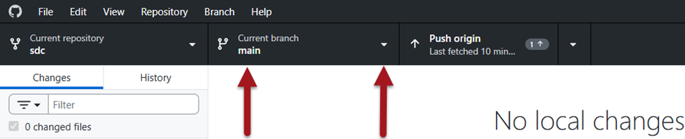<br /><br />
2. Wybierz przycisk **<em lang="en">New branch</em>** (Nowa gałąź):<br /><br />
   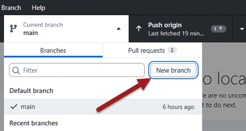
3. Pojawi się formularz **<em lang="en">Create branch</em>** (Utwórz gałąź). Wpisz w polu 
   **<em lang="en">Name</em>** nazwę nowej gałęzi – używaj tylko liter łacińskich i cyfr, nie zostawiaj spacji, wyrazy oddzielaj znakami łącznika, np. _moj-projekt_<br /><br />
   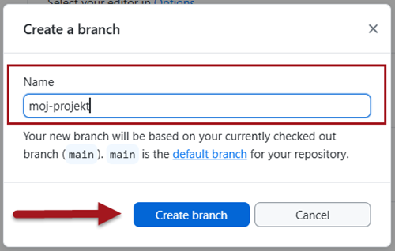<br /><br />
4. Wybierz przycisk **<em lang="en">Create branch</em>**<br /><br />
5. **Forkuj repozytorium**. Gdy po raz pierwszy tworzysz gałąź, pojawi się na kolejnym ekranie pytanie, **<em lang="en">Do you want to fork this repository?</em>** (Czy chcesz utworzyć fork tego repozytorium?). Wybierz przycisk **<em lang="en">Fork this repository</em>**.<br /><br />
   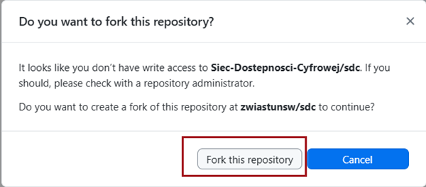<br /><br />
   Na Twoim koncie Github zostanie utworzony fork, czyli rozwidlenie repozytorium Sieci.<br /><br /> 
6. Na ekranie **<em lang="en">How are you planning to use this fork</em>** (Jak planujesz korzystać z rozgałęzienia) pozostaw zaznaczoną opcję **<em lang="en">To contribute to the parent project</em>** (Do współpracy nad macierzystym projektem) i wybierz przycisk **<em lang="en">Continue</em>** (Kontynuuj)<br /><br />
   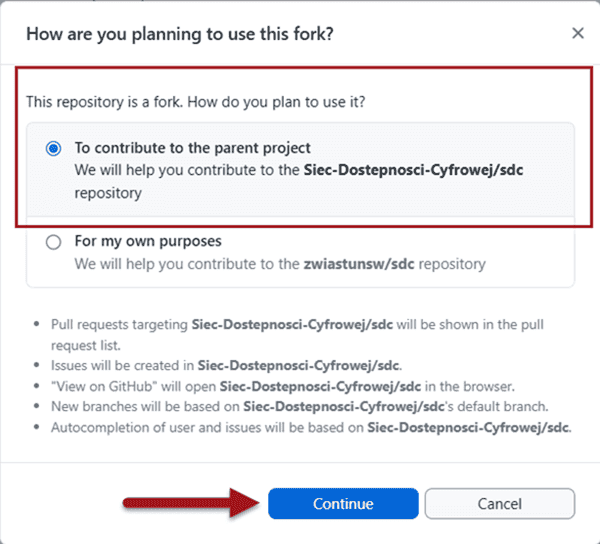<br /><br />
7. Opublikuj rozwidlenie. Na kolejnym ekranie **<em lang="en">Publish your branch</em>** wybierz opcję **<em lang="en">Publish branch</em>** (Opublikuij gałąź):<br /><br />
   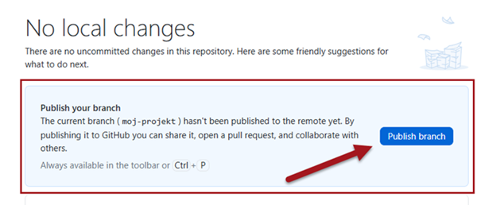<br /><br />

Zauważ, że po opublikowaniu utworzonej gałęzi zostanie ona automatycznie wybrana jako domyślna. Zauważ też, że w bocznym pasku pojawiła się sekcja umożliwiająca przesłanie propozycji zmiany.<br /><br />
   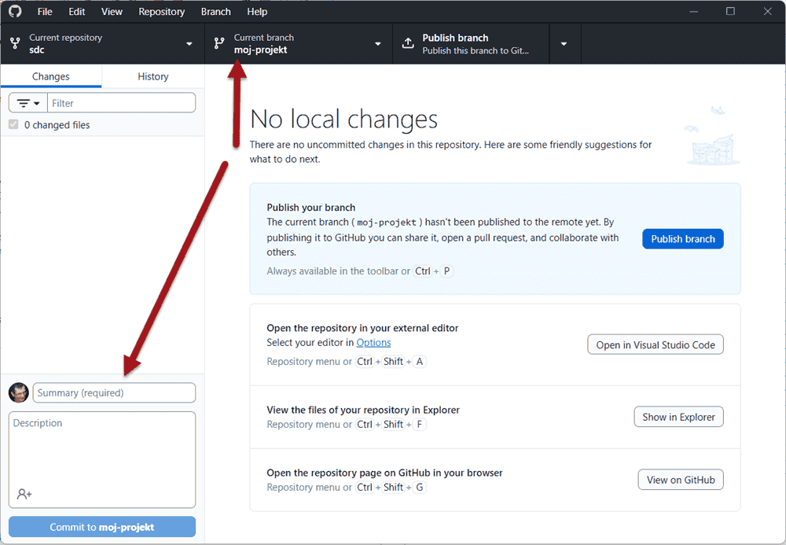

## Dodaj nowy projekt

**Aby dodać nowy projekt**:

1. Wybierz w oknie GitHub Destkop polecenie **<em lang="en">Open in external editor</em>** (Otwórz w zewnętrznym edytorze)<br /><br />
   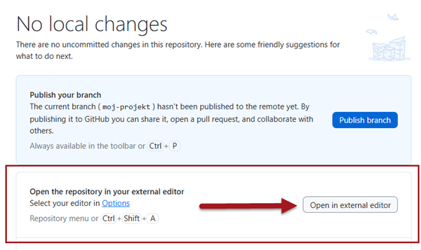<br /><br />
2. W drzewie katalogów rozwiń kolejno foldery _documentation_ i _docs_, następnie folder wymiaru, w którym chcesz dodać projekt, a w nim folder _nowe-projekty_<br /><br />
   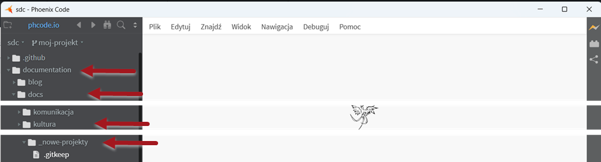<br /><br />
3. Utwórz nowy plik i nadaj mu nazwę, np. **moj-piekny-projekt.md**.<br/>
   Nazwa nie może zawierać spacji, wyrazy oddzielaj łącznikami. Używaj w nazwach tylko małych liter z zestawu alfabetu łacińskiego (polskie znaki zastąp odpowiednikami np. wpisuj **a** zamiast **ą**. Do nazwy pliku dodaj po kropce rozszerzenie **.md** wskazujące na format Makdown:<br /><br />
   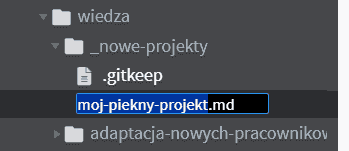
4. Dodaj treść dokumentu.<br />
   Treść zapisujemy za pomocą bardzo prostego [formatu Markdown](
   ../poradniki/poradnik-do-markdown.mdx). Na ilustracji widać kilka typowych elementów:<br />
   Pierwsza sekcja dokumentu to metadane, tzw. **<em lang="en">FrontMater</em>**. Rozpoczyna ją i kończy wiersz z trzema myślnikami. Między myślnikami umieszczamy wiersze z danymi o dokumencie: <br/>
    
   ```md
   ---
   id: moj-piekny-projekt
   description: "Rozwiązuje \"wszystkie problemy\" dostępności cyfrowej w organizacji"
   ---  
   ```
   Obowiązuje tu składnia: **nazwa_danej: treść danej**. Najpierw wpisujemy nazwę danej, po nazwie stawiamy dwukropek i robimy jedną spację, a następnie zapisujemy treść danej.  Jeśli chcemy użyć w treści dwukropka albo znaków cala, to całą treść musimy objąć znakami cala, a znaki cala wewnątrz poprzedzamy znakiem ucieczki (lewym ukośnikiem).<br/>

   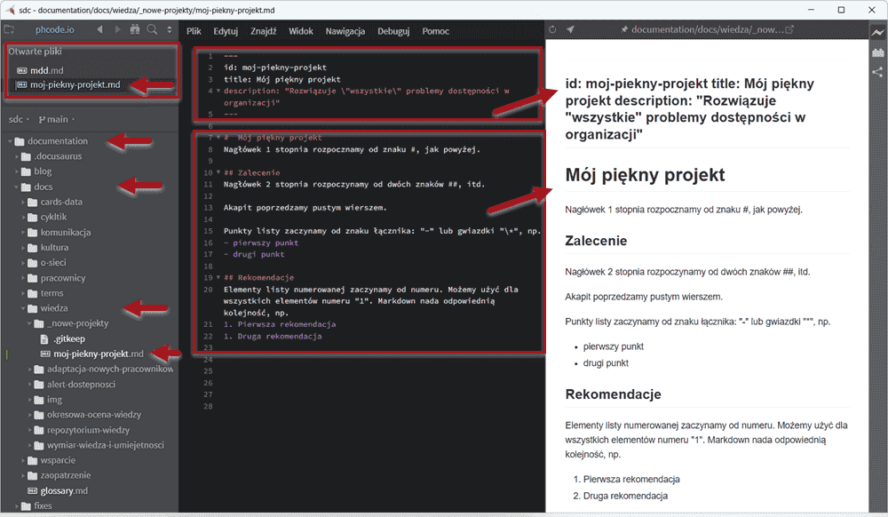<br/><br/>
   Aby utworzyć nagłówek 1 stopnia, zaczynamy wiersz od znaku **#**, nagłówek drugiego stopnia - od dwóch znaków **##**, itd.<br/>
   Aby utworzyć **nowy akapit**, rozpoczynamy tekst od nowej linii poprzedzonej pustym wierszem.<br/>
   Aby utworzyć **punkt listy z punktorem** rozpoczynamy wiersz od myślnika albo gwiazdki.<br/>
   Aby rozpocząć punkt listy numerowanej, rozpoczynamy wiersz od cyfry 1.

## Wykonaj commit

Gotowy dokument musimy wysłać do repozytorium. Informatycy mówią: _skomitować_, bo służy do tego funkcja **<em lang="en">commit</em>**.

1. Wróć z edytora do okna Github Destkop. W głównym obszarze znajduje się zmieniona treść, a w bocznym panelu okno z formularzem do opisu **<em lang="en">commitu</em>**.
2. Wpisz tytuł projektu w nagłówku formularza
3. Wprowadź krótki opis projektu w polu tekstowym.
4. Wybierz przycisk wysyłania **<em lang="en">Commit 1 file to…</em>** Wyślij 1 plik do…. Dokument zostanie przesłany do Twojej kopii repozytorium.<br/><br/>
   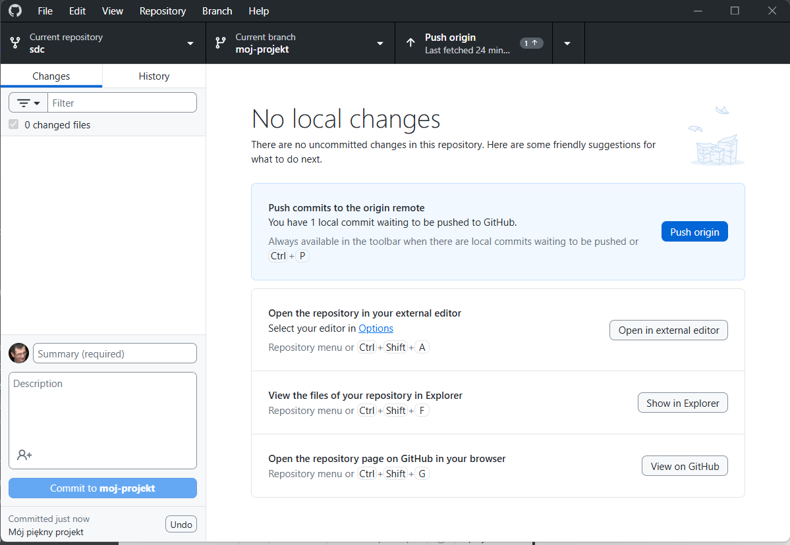

## Przygotuj pull request
1. Wybierz w oknie głównym Github Destkop polecenie **<em lang="en">Preview the Pull Request from your current branch</em>** (Wyświetl podgląd żądania scalenia z bieżącej gałęzi)<br/><br/>
   <br/><br/>
2. W oknie głównym Github Destkop pojawi się podgląd dokumentu gotowego do scalenia (*<em lang="en">Able to merge</em>*). Wybierz przycisk **<em lang="en">Create pull request</em>** (Utwórz żądanie scalenia)<br/><br/>
   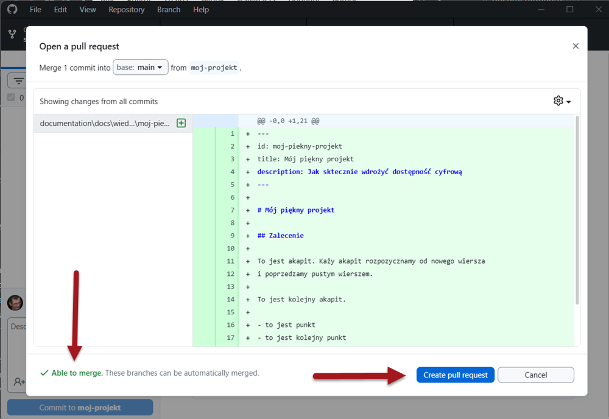<br/><br/>
3. Program przeniesie Cię na stronę **<em lang="en">Open a pull request</em>** w repozytorium Sieci. Możesz tu jeszcze poprawić tytuł i opis. Zwykle wystarczy po prostu wybrać przycisk *<em lang="en">Create pull request</em>* (Utwórz żądanie scalenia)<br/><br/>
   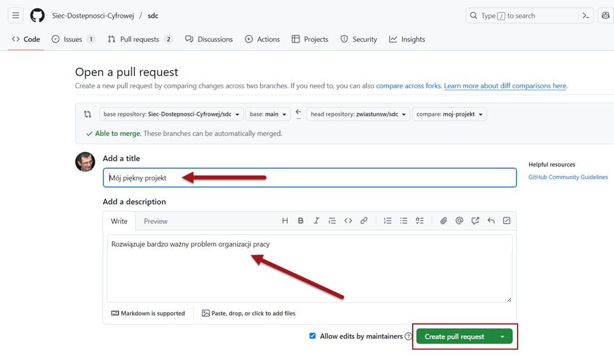

## Sprawdź poprawność
Po otwarciu żądania scalenia (*<em lang="en">pull requesta</em>*) Github uruchomi automatyczne testy poprawności. 

1. Zobacz przebieg testów automatycznych. Przebieg testów jest widoczny na stronie z  *<em lang="en">pull requestem</em>*, poniżej opisu:<br/><br/>
   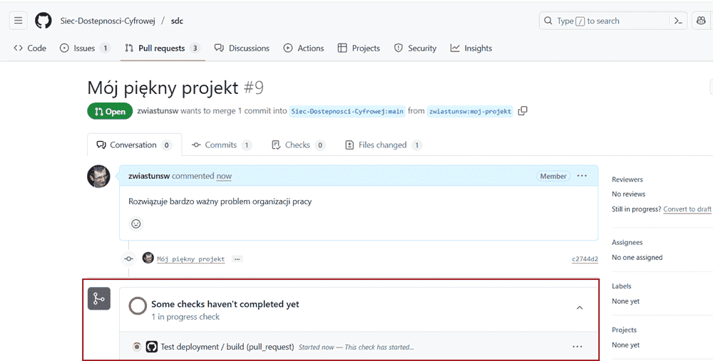
2. Zobacz wynik. O poprawnym wyniku testów informują dwa komunikaty: **<em lang="en">All checks have passed</em>** (Wszystkie testy zakończyły się pomyślnie) oraz **<em lang="en">No conflicts with the base branch</em>** (Brak konfliktów z gałęzią bazową). Dodatkowo poprawny wynik sygnalizują ikony z białą fiszką na zielonym tle. <br/><br/>
   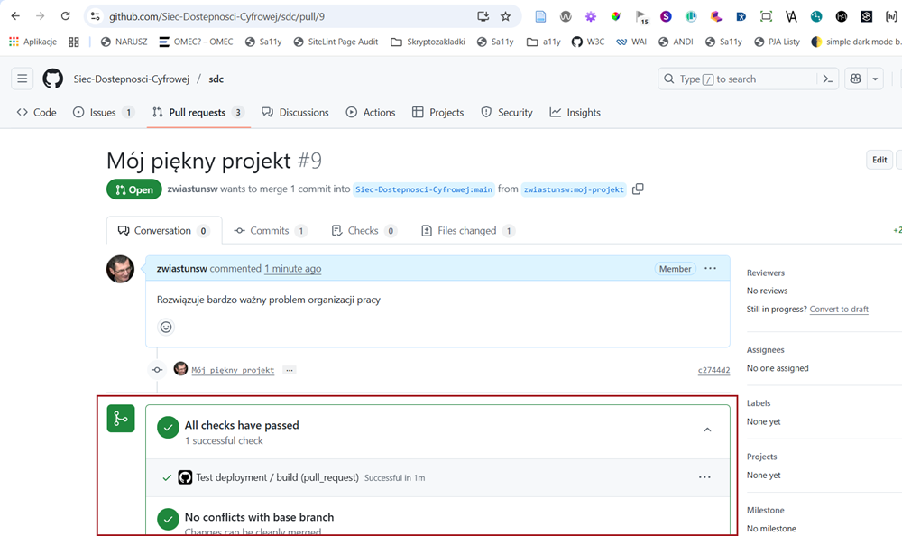
3. Popraw błędy. Jeśli wynik testów nie będzie poprawny, spróbuj znaleźć błędy w dokumencie, np. czy linki są poprawne. Jeśli nie wiesz, co sprawdzać, **nie przejmuj się**! Przejrzymy Twój dokument i poprawimy ewentualne błędy.

## Gotowe!

Możesz sprawdzić na karcie Pull request, że Twoja propozycja została dodana. Administrator przejrzy Twój dokument, poprawi go w razie potrzeby lub zamieści komentarz z informacją, co należy poprawić. Jeśli dokument będzie poprawny, opatrzy go etykietami oraz przypisze Ci odpowiedzialnosć za dokument. Może także zlecić konkretnym współpracownikom dokonanie przeglądu.

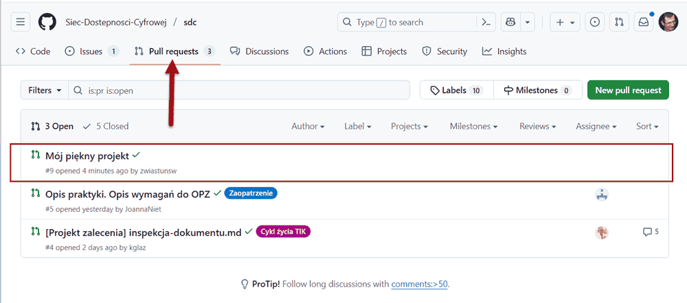

