:::info Wskazówka

Ten poradnik objaśnia, jak dodać swój projekt zalecenia, rozwiązania lub opis praktyki **z kopii repozytorium Sieci na swoim koncie Github**.

Aby dodać swój projekt w środowisku Github Destkop, zobacz [**Dodaj projekt z Github Destkop**](dodaj-dokument-z-github-destkop). 

:::

Aby dodawać do repozytorium Sieci dokumenty i zgłaszać poprawki do dokumentów, korzystamy z funkcji **<em lang="en">pull requesty</em>**. 

Funkcja **Pull requesty** jest stworzona do tego, aby proponować, a następnie analizować, testować, rozwijać, korygować, przeglądać, komentować i zatwierdzać zmiany w kodzie. Doskonale sprawdzi się także w przypadku dokumentów z projektami zaleceń, rozwiązań i opisami praktyk.

Proces dodawania do repozytorium nowego dokumentu składa się z kilku etapów:
- utworzenie w repozytorium nowej gałęzi 
- utworzenie w tej gałęzi nowego dokumentu lub poprawki w istniejącym dokumencie
- skomitowanie do repozytorium wprowadzonej zmiany (nowego lub poprawionego dokumentu lub zestawu dokumentów)
- wysłanie gałęzi ze zmianami na Github
- utworzenie i otwarcie pull requesta. 

Aby dodać do repozytorium Sieci dokument ze swoim projektem, musisz mieć kopię repozytorium na swoim koncie Github. Kopia repozytorium nazywa się forkiem (rozgałęzieniem).

[Dowiedz się, jak utworzyć kopię repozytorium na swoim koncie](./utworz-konto-na-githubie)


## Tworzenie nowej gałęzi

Gałąź (ang. **<em lang="en">branch</em>** to kopia głównej wersji plików składających się na cały projekt. Dzięki gałęziom wiele osób może równolegle rozwijać projekt - w przypadku oprogramowania dodawać i testować nowe funkcje, a w naszym przypadku dodawać i rozpatrywać dokumenty projektowe, dyskutować nad nimi i korygować je bez wpływu na główne zaakceptowane lub robocze wersje dokumentów projektu. 

Gdy kształt nowych projektów dokumentów albo poprawek do istniejących dokumentów zostanie uzgodniony, zostają one scalone z główną wersją projektu, a gałąź jest usuwana. W przypadku, gdy ktoś uzna za potrzebne wprowadzenie do dokumentu scalonego z główną wersją projektu jakiejkolwiek poprawki, tworzy się nową gałąź.

Github przechowuje wszystkie uzgodnione i poprawione wersje dokuemntów, a także historię dyskusji nad nimi. Dzięki temu można w razie potrzeby przywrócić każdą z wcześiejszych wersji. 

Gałąź może być utworzona w kopii repozytorium na koncie użytkownika Github albo bezpośrednio w głównym repozytorium. **Zasady pracy Sieci skonfigurowaliśmy tak, że gałęzie tworzone są z zasady w kopiach repozytoriów na kontach uczestników Sieci**.


### Sprawdź aktualność repozytorium
Twoje repozytorium musi mieć aktualną wersję głównej gałęzi repozytorium Sieci. Sprawdź, czy jest aktualne.

1. Przejdź na swoje konto Github i otwórz kopię repozytorium SDC
2. **Zsynchronizuj swoją kopię**. Zawsze sprawdzaj, czy Twoja kopia głównej gałęzi **<em lang="en">main</em>** jest aktualna. Jeśli nie jest, zsynchronizuj ją. Rozwiń przycisk  **<em lang="en">Sync fork</em>** (Zsynchronizuj fork):<br /><br /> 
   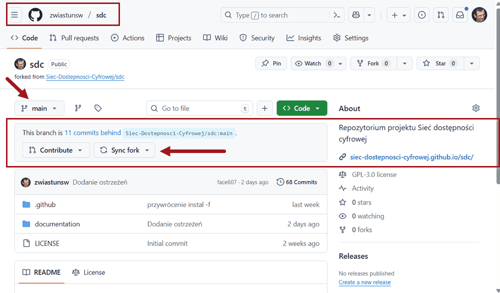<br /><br />
3. Sprawdź, czy Twój fork jest aktualny. Jeśli komuniakt w rozwijanej treści mówi  **<em lang="en">This branch is out-of-date</em>**, to znaczy, że kopia nie jest aktualna i trzeba uaktualnić gałąź. Wybierz przycisk **<em lang="en">Update branch</em>** (Aktualizuj gałąź):<br /><br />
   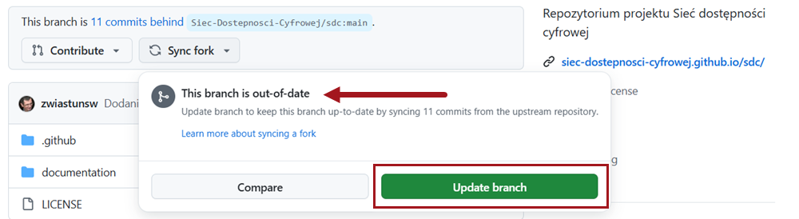<br /><br />
### Utwórz nową gałąź  
**Aby utworzyć nową gałąź na nowy projekt:** 
1. Wybierz przycisk  **<em lang="en">Go to branches page</em>** (Idź na stronę gałęzi)<br /><br />
   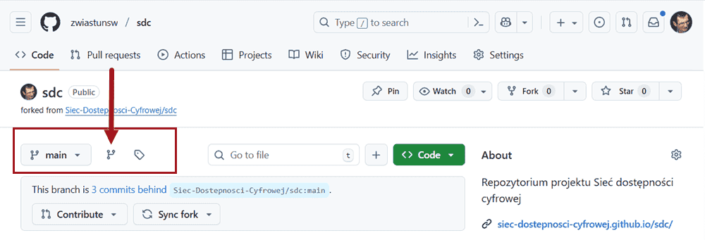
2. Na stronie gałęzi wybierz przycisk **<em lang="en">New branch</em>** (Nowa gałąź):<br /><br />
   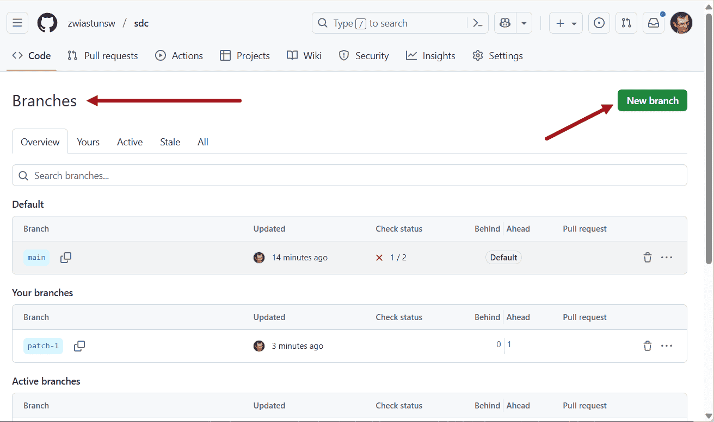
3. Pojawi się formularz **<em lang="en">Create branch</em>** (Utwórz gałąź). Wpisz w polu 
   **<em lang="en">Name</em>** nazwę nowej gałęzi – używaj tylko liter łacińskich i cyfr, nie zostawiaj spacji, wyrazy oddzielaj znakami łącznika, np. _moj-piekny-projekt_<br /><br />
   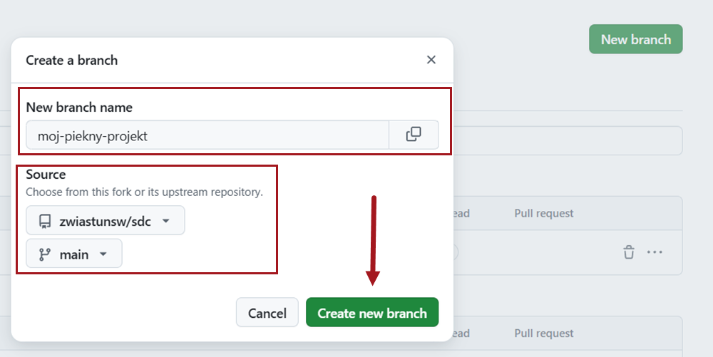<br /><br />
4. Wybierz przycisk **<em lang="en">Create branch</em>** (Utwórz gałąź)<br /><br />

Zostanie utworzona nowa gałąź. Pamiętaj, żeby usunąć tę gałąź, gdy już nie będzie potrzebna.

:::tip Pamiętaj!

Dla każdego nowego projektu musisz utworzyć nową gałąź.

:::

## Tworzenie nowego dokumentu  
Dokumenty dodajemy do przeznaczonego na nie katalogu projektu w gałęzi przeznaczonej na ten projekt. W głównym repozytorium Sieci (i w głównej gałęzi) utworzyliśmy specjalne katalogi nazwane **_nowy projekt** w katalogu projektów dla każdego wymiaru. 

Aby dodać nowy dokument do tego katalogu

1. Wybierz utworzoną wcześniej gałąź przeznaczoną na nowy projekt. W tym celu możesz przejść na stroną **<em lang="en">Branches</em>** (Gałęzie): <br/><br/> 
   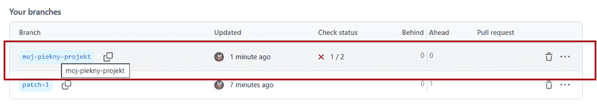<br/><br/> 
   **albo** wybrać gałąź z rozwijanego menu **<em lang="en">Branches</em>** (Gałęzie): <br/><br/> 
   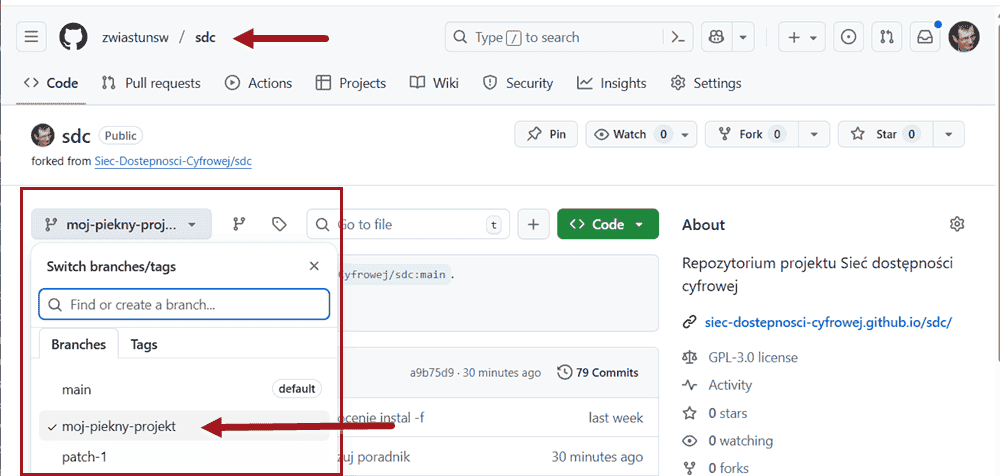 <br/><br/> 
2. Na liście plików wybierz kolejno:
   - katalog ***documentation***
   - katalog ***docs***
   - katalog wymiaru, np. ***komunikacja***
   - i katalog ***_nowy-projekt***. <br/>
   Znajdziesz się w miejscu, w którym możesz dodać dokumenty swojego projektu: <br/><br/> 
   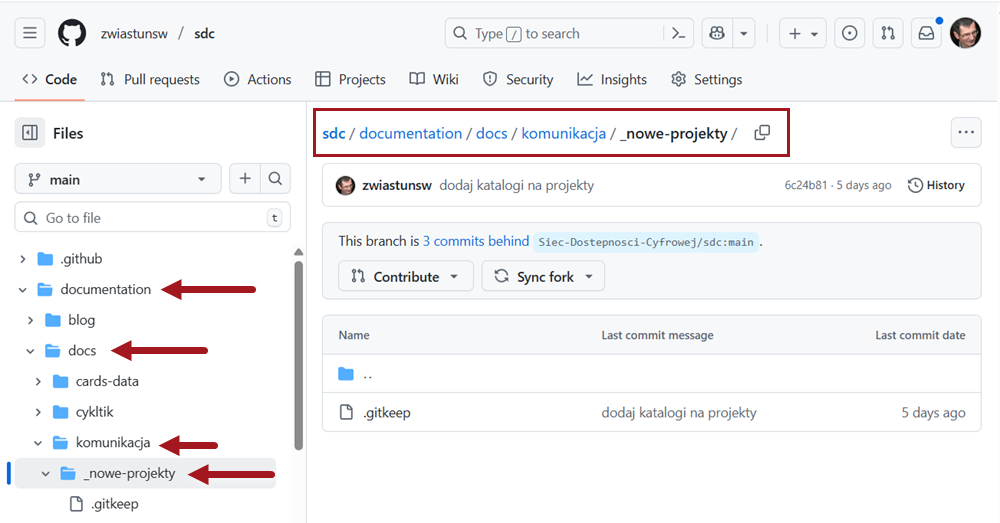 <br/><br/> 
3. Przejdź do obszaru treści głównej. 
4. Użyj opcji **<span lang="en">Add file</span>** (Dodaj plik). Łącza znajdują się w dwóch miejscach. Na początku bocznego paska nawigacyjnego. To najszybszy dostęp za pomocą czytnika ekranu. Albo w prawym narożniku ekranu, za ścieżką powrotu.<br/><br/> 
   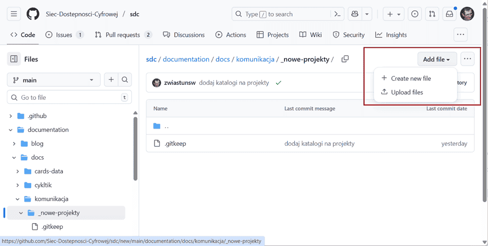<br/><br/> 
   Druga opcja pozwala przesłać dokument ze swojego komputera. My utworzymy nowy dokument. 
5. Dodaj nazwę dokumentu<br/>
   Wybór łącza **<span lang="en">Add file</span>** w pasku nawigacyjnym przeniesie Cię od razu do ścieżki powrotu, na końcu której trzeba dodać nazwę pliku. Nazwa nie może zawierać spacji, wyrazy oddzielaj łącznikami. Używaj w nazwach tylko małych liter z zestawu alfabetu łacińskiego (polskie zastąp odpowiednikami np. wpisuj <q>a</q> zamiast <q>ą</q>, np. **moj-piekny-projekt.md**. Nazwę pliku uzupełnij po kropce rozszerzeniem **.md** wskazującym na format Makdown. <br/><br/> 
  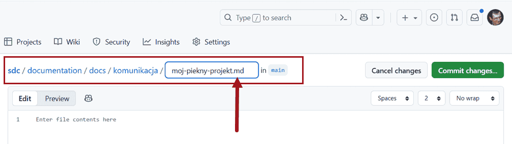<br/><br/> 
6. Dodaj treść dokumentu.<br />
   Treść zapisujemy za pomocą bardzo prostego [formatu Markdown](
   ../poradniki/poradnik-do-markdown.mdx). Na ilustracji widać kilka typowych elementów:<br />
   Pierwsza sekcja dokumentu to metadane, tzw. **<em lang="en">FrontMater</em>**. Rozpoczyna ją i kończy wiersz z trzema myślnikami. Między myślnikami umieszczamy wiersze z danymi o dokumencie: <br/>
    
   ```md
   ---
   id: moj-piekny-projekt
   description: "Rozwiązuje \"wszystkie problemy\" dostępności cyfrowej w organizacji"
   ---  
   ```
   Obowiązuje tu składnia: **nazwa_danej: treść danej**. Najpierw wpisujemy nazwę danej, po nazwie stawiamy dwukropek i robimy jedną spację, a następnie zapisujemy treść danej.  Jeśli chcemy użyć w treści dwukropka albo znaków cala, to całą treść musimy objąć znakami cala, a znaki cala wewnątrz poprzedzamy znakiem ucieczki (lewym ukośnikiem).<br/>

   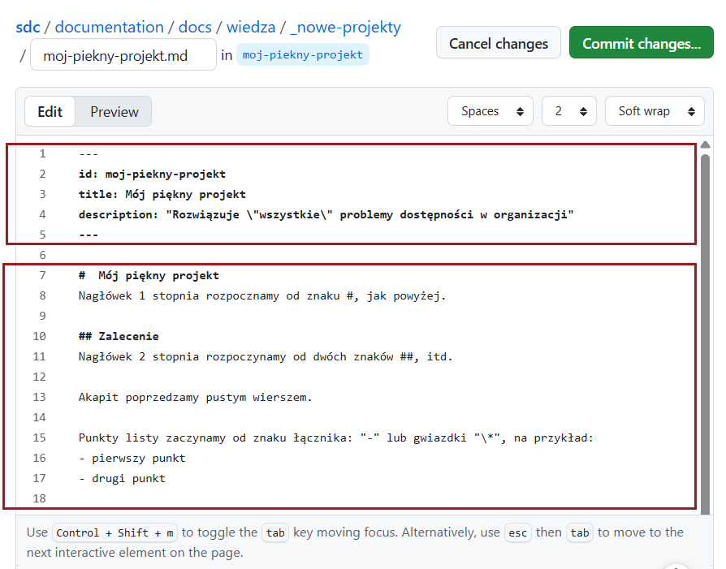<br/><br/>
   Aby utworzyć nagłówek 1 stopnia, zaczynamy wiersz od znaku **#**, nagłówek drugiego stopnia - od dwóch znaków **##**, itd.<br/>
   Aby utworzyć **nowy akapit**, rozpoczynamy tekst od nowej linii poprzedzonej pustym wierszem.<br/>
   Aby utworzyć **punkt listy z punktorem** rozpoczynamy wiersz od myślnika albo gwiazdki.<br/>
   Aby rozpocząć punkt listy numerowanej, rozpoczynamy wiersz od cyfry 1.

## Wykonaj <span lang="en">commit</span>

   Gdy mamy gotowy dokument, musimy go wysłać do repozytorium na naszej gałęzi. Angielskie **<span lang="en">commit</span>** już nawet spolonizowaliśmy i mówimy <q>skomitować</q>. 
 
1. Wróć do nagłówka edyora internetowego. Wybierz przycisk **<span lang="en">Commit changes</span>** (Wyślij zmiany), który znajduje się za ścieżką powrotu.<br/><br/>  
   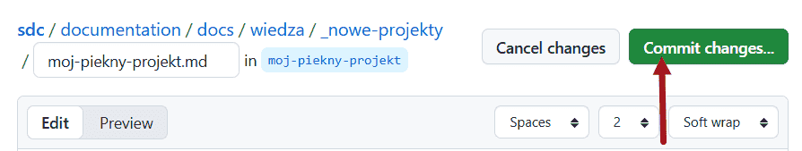<br/><br/>   
2. W oknie **<span lang="en">Commit message</span>** wybierz przycisk **<span lang="en">Commit changes</span>**. <br/>**Uwaga**: Tytuł i opis pozostaw bez zmian, choć możesz je poprawić w razie potrzeby. Najważniejsze, by nie zmienić wybranej opcji:  **<span lang="en">Commit directly to the… [branch name]</span>** (Komituj bezpośrednio do gałęzi nazwa-projektu. <br/><br/> 
   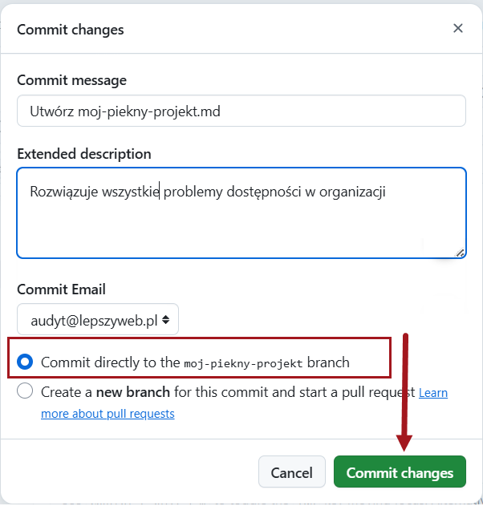  

## Utwórz pull request
System przeniesie Cię na stronę główną repozytorium.

1. W obszarze terści głównej pojawi się komunikat o <q>komicie</q> oraz przycisk  **<span lang="en">Compare &amp; pull request</span>** (Porównaj i wyślij żądanie). Wybierz to polecenie:<br/><br/>  
   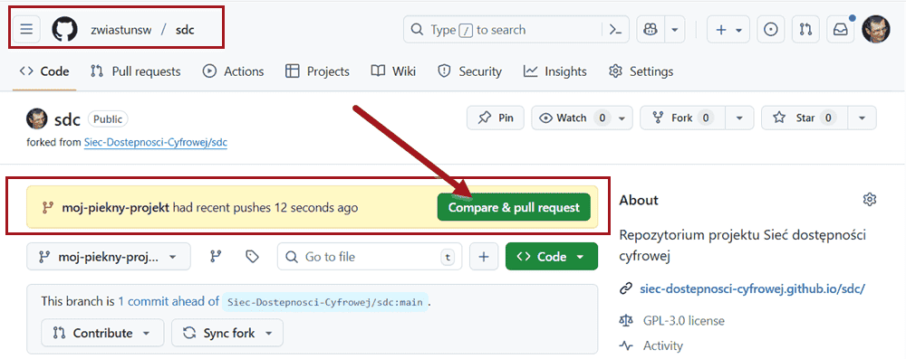<br/><br/> 
   Zostanie otwarta strona **<span lang="en">Open a pull request</span>** (Otwórz żądanie scalenia) w repozytorium Sieci Dostępności cyfrowej.  
2. Masz tu jeszcze raz okazję, by poprawić nazwę i dodać lub zmienić opis. Najważniejsze jest jednak, by utworzyć **pull request**. Wybierz przycisk **<span lang="en">Create pull request</span>** (Utwórz żądanie scalenia):<br/><br/> 
   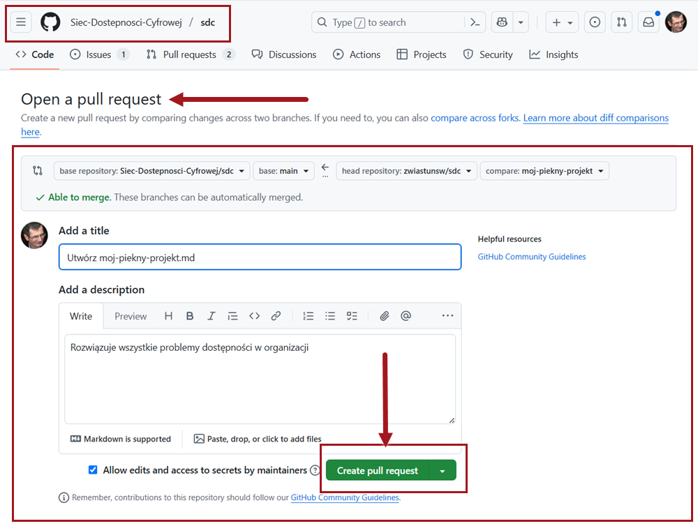

## Sprawdź poprawność
Po otwarciu żądania scalenia (*<em lang="en">pull requesta</em>*) Github uruchomi automatyczne testy poprawności. 

1. Zobacz przebieg testów automatycznych. Przebieg testów jest widoczny na stronie z  *<em lang="en">pull requestem</em>*, poniżej opisu:<br/><br/>
   
2. Zobacz wynik. O poprawnym wyniku testów informują dwa komunikaty: **<em lang="en">All checks have passed</em>** (Wszystkie testy zakończyły się pomyślnie) oraz **<em lang="en">No conflicts with the base branch</em>** (Brak konfliktów z gałęzią bazową). Dodatkowo poprawny wynik sygnalizują ikony z białą fiszką na zielonym tle. <br/><br/>
   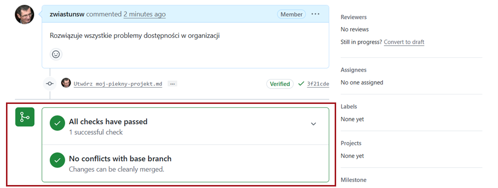
3. Popraw błędy. Jeśli wynik testów nie będzie poprawny, spróbuj znaleźć błędy w dokumencie, np. czy linki są poprawne. Jeśli nie wiesz, co sprawdzać, **nie przejmuj się**! Przejrzymy Twój dokument i poprawimy ewentualne błędy.

## Gotowe!

Możesz sprawdzić na karcie Pull request, że Twoja propozycja została dodana. Administrator przejrzy Twój dokument, poprawi go w razie potrzeby lub zamieści komentarz z informacją, co należy poprawić. Jeśli dokument będzie poprawny, opatrzy go etykietami oraz przypisze Ci odpowiedzialnosć za dokument. Może także zlecić konkretnym współpracownikom dokonanie przeglądu.

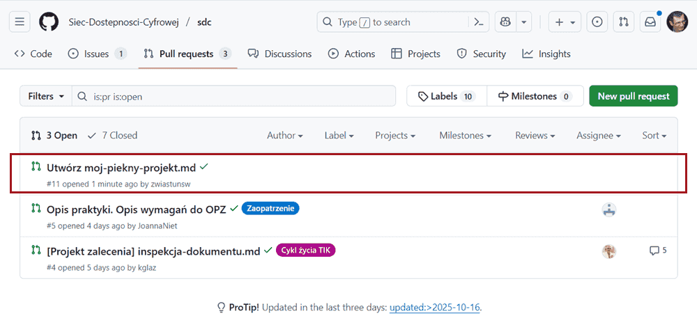

