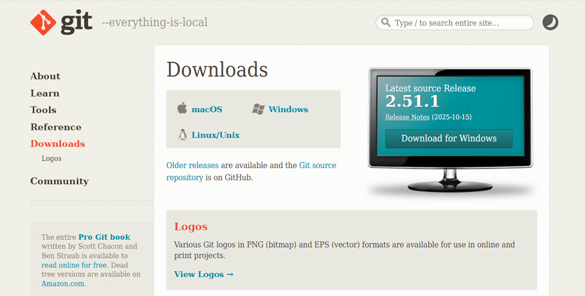
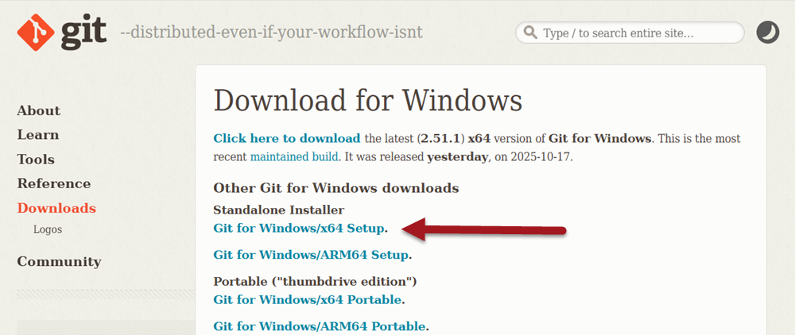

# Zainstaluj i skonfiguruj Git

Aby korzystać z Githuba na swoim komputerze, potrzebujewsz programu **Git**. Git to system kontroli wersji - oprogramowanie, które pozwala programistom śledzić zmiany w kodzie źródłowym, zachowawać wcześniejsze wersje, a w razie potrzeby przywracać je. 

:::warning Uwaga 

**Git** zostanie zapewne zainstalowany na Twoim komputerze podczas instalacji Github Destkop. 
Jeśli nie otrzymasz powiadomienia, że trzeba zainstalować **Git**, a Github Destkop będzie działał, możesz śmiało pominąć ten krok.
:::

Instalacja Gita różni się nieco zależnie od systemu operacyjnego, którego używasz.

## Instalacja w systemie Windows

1. [Przejdź na oficjalną stronę Gita](https://git-scm.com/downloads/win):  
     
2. Pobierz standardowy plik instalacyjny do swojego systemu, np. Git for Windows/x64 Setup.  
     
3. Uruchom instalator
4. W kreatorze instalacji 
   - zaakceptuj warunki licencyjne
   - wybierz preferowane opcje instalacji
5. Wybierz przycisk Dalej, aż proces się zakończy.

## Instalacja w innych systemach

[Zobacz w poradniku programisty](https://programistajava.pl/2025/03/15/podstawy-pracy-z-wersjonowaniem-kodu-w-github/)

