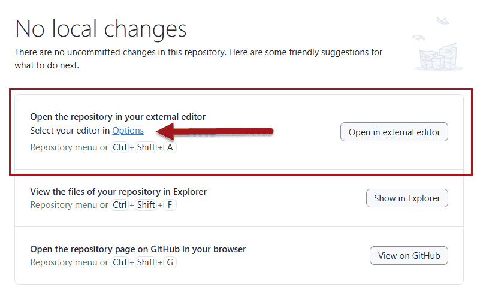
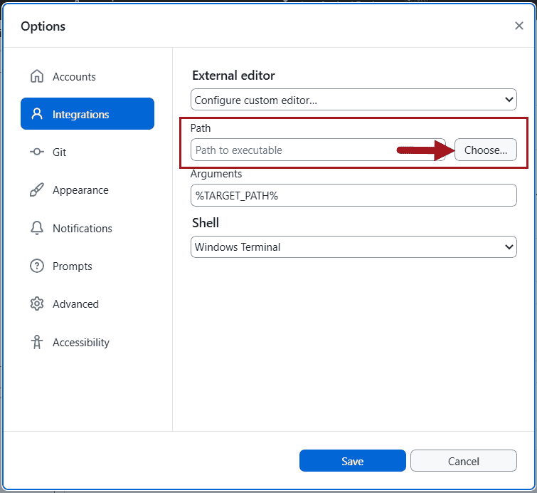
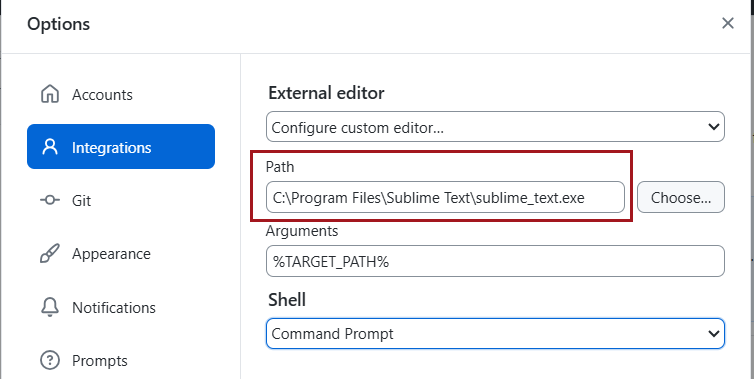
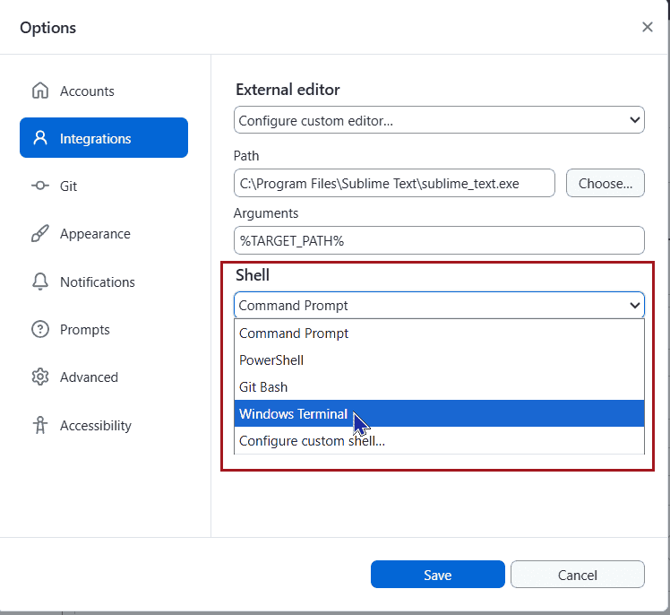

Github to idealne rozwiązanie do współpracy nad kodem. Jeśli więc chcesz mieć wygodne środowisko do pracy z Github na swoim komputerze, potrzebujesz dobrego edytora kodu. Ułatwisz sobie znacznie dodawanie swoich propozycji. Nie potrzebujesz edytora, jeśli zamierzasz pracować bezpośrednio na Github. 

[Lista edytorów kodu](https://docs.github.com/en/desktop/configuring-and-customizing-github-desktop/configuring-a-default-editor-in-github-desktop), które współpracują z Github Destkop jest długa. Polecamy szczególnie:
- [Microsoft Visual Studio](https://code.visualstudio.com/) dla Windows
- [Phoenix Code](https://phcode.dev/download/) dla Windows, MacOS i Linux
- [WebStorm](https://www.jetbrains.com/webstorm/) dla Windows, MacOS i Linux
- [Sublime Text](https://www.sublimetext.com/) dla Windows, MacOS i Linux
- [XCode](https://developer.apple.com/xcode/) (dla MacOS)

Github Destkop ropoznaje m.in., czy masz zainstalowany **Notepad++** lub **Microsoft Visual Studio**.   

Jeśli chcesz skonfigurować edytor, którego Github Destkop nie rozpoznał, musisz wskazać, w którym miejscu na Twoim komputerze znajduje się plik uruchamiający edytor.

1. W oknie poleceń wybierz łącza **<em lang="en">Options</em>** (Opcje):  
   
2. W oknie **<em lang="en">Options</em>** użyj przycisku **<em lang="en">Choose</em>** (wybierz), aby przejść do lokalizacji pliku uruchamiającego edytor:  
   
3. Wskaż w wybranej ścieżce plik uruchamiający edytor. W polu **<em lang="en">Path</em>** zostanie wpisana ścieżka do pliku  
   
4. Przy okazji - wybierz również ulubiony terminal
   

:::tip Wskazówka

Jeśli korzystasz z edytora **Notepad++**, musisz także skonfigurować opcję **Widok / Projekt**.  

:::

Gratulacje! Twoje środowisko jest w pełni gotowe.
