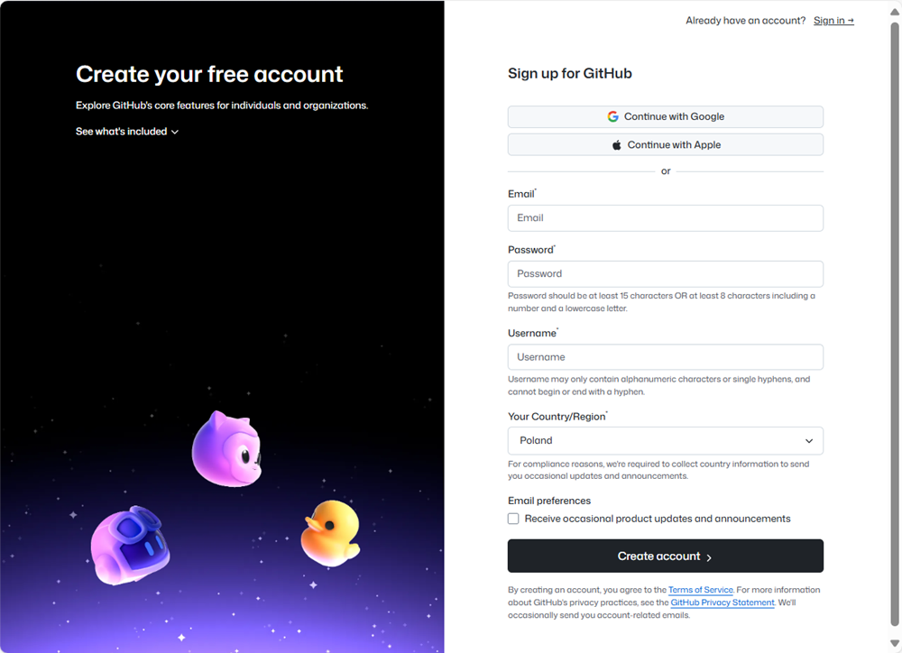

# Utwórz konto na platformie GitHub 

Aby współpracować z Siecią na Githubie, jest Ci potrzebne konto na Github, kopia repozytorium Sieci na swoim koncie i zaproszenia do zespołu SDC. Możesz także skonfigurować sobie [środowisko pracy z Github na swoim komputerze](srodowisko-pracy-z-gitgub). 

## Utworzenie konta

Aby założyć konto na GitHub:

1. [Wejdź na stronę github.com](https://github.com).
2. **Rozpocznij rejestrację**. Wybierz przycisk **<em lang="en">Sign up</em>** (Zarejestruj się):  
   
3. **Wypełnij formularz**. Podaj kolejno:
   - adres e-mail, który będzie powiązany z kontem, 
   - hasło (15 znaków lub 8 znaków w tym litery i cyfry, nazwę użytkownika (tylko znaki alfanumeryczne, nie może się ani zaczynać, ani kończyć myślnikiem). 
   - wybierz kraj (Polska)  
   
4. **Utwórz konto** - wybierz przycisk **<em lang="en">Create account</em>** (Utwórz konto).
5. **Zweryfikuj konto**: GitHub wyśle na Twoją skrzynkę pocztową prośbę o weryfikację adresu e-mail. Otwórz swoją skrzynkę pocztową, znajdź powiadomienie z Github i wybierz link weryfikujący.
6. **Uzupełnij profil**: Po aktywowaniu konta możesz dodać dodatkowe informacje do swojego profilu,takie jak dane kontaktowe, awatar (zdjęcie).
7. **Poproś o zaproszenie**. Aby uzyskać niezbędne uprawnienia, przekaż liderowi zespołu albo na kanale wspólnym Sieci w Microsoft Teams swoją nazwę użytkownika i nazwy zespołów, w których uczestniczysz. Wyślemy Ci zaproszenie. 
8. **Zaakceptuj zaproszenie**. Obserwuj swoją skrzynke. Wyślemy Ci zaproszenie do zespołów Sieci, z którymi współpracujesz. Gdy otrzymasz e-mail z zaproszeniem, zaakceptuj je.

## Uwierzytelnianie w Github

Aby uzyskać dostęp do swoich zasobów na Github, możesz używac różnych sposobów uwierzytelniania. Potrzebne informacje znajdziesz na stronach:
- [O uwierzytelnianiu w Github (w języku angielskim)](https://docs.github.com/en/authentication/keeping-your-account-and-data-secure/about-authentication-to-github)
- [Konfigurowanie uwierzytelniania dwuskładnikowego(w języku angielskim)](https://docs.github.com/en/authentication/securing-your-account-with-two-factor-authentication-2fa/configuring-two-factor-authentication)