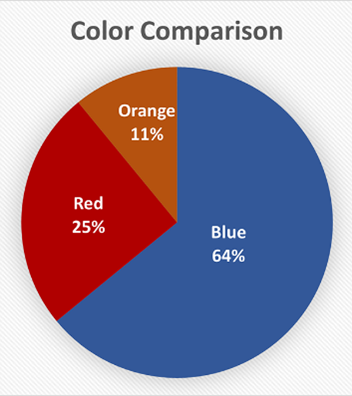

## Nagłówki

### Znaczenie nagłówków

Nagłówki nadają treściom strukturę, tytułują i wskazują części dokumentu. Pomagają czytelnikom orientować się w treści, ułatwiają znajdowanie informacji, przyspieszają nawigację po dokumencie.

Nagłówki zaczynają się od poziomu 1 i schodzą do poziomu 6. Każdy nagłówek podrzędny jest podtematem poprzedniego nagłówka nadrzędnego. Poziom 2 nagłówka oznacza podtemat części oznaczonej nagłówkiem poziomu 1. Poziom 3 nagłówka tytułuje podtemat części oznaczonej nagłówkiem poziomu 2. I tak dalej.

Poziomy nagłówków wskazują hierarchię treści. Hierarchia ta pozwala użytkownikom zrozumieć zarys i strukturę treści.

Na stronie internetowej Nagłówek 1 tytułuje treść główną i jest zwykle taki sam jak tytuł strony. Dwa nagłówki poziomu 2 rozpoczynają podtematy nagłówka poziomu 1. Trzy nagłówki poziomu 3 rozpoczynają podtematy poprzedzających je nagłówków poziomu 2. Jeden nagłówek poziomu 4 rozpoczyna podtemat poprzedniego nagłówka 3.

Ponadto, na stronach internetowych Nagłówki poziomu 2 stosowane są do oznaczenia pobocznych części strony.

 w częściach oznaczonych nagłówkami poziomu 1. Cztery nagłówki poziomu 3 rozpoczynają podtematy w podrozdziałach oznaczonych poprzedzającymi je nagłówkami poziomu 2. Jeden nagłówek poziomu 4 rozpoczyna podtemat w części oznaczonej poprzedzającym go nagłówkiem poziomu 3.

Aby nagłówki były dostępne w [treściach i technologiach cyfrowych](https://slownik.sdc.#tresci_technologie_cyfrowe), muszą być **odpowiednio sformatowane**, to znaczy:

- **muszą być oznakowane jako nagłówki** – w dokumentach elektronicznych do oznakowania stosuje się odpowiednie style nagłówków, a na stronach internetowych specjalne znaczniki HTML (od H1 do H6),
- **muszą odróżniać się wyglądem od tekstu podstawowego** – o wyglądzie nagłówków decydują cechy stylu nadane nagłówkom poszczególnych poziomów, np. wielkość, krój, kolor czcionki.

Programy i [technologie wspomagające](https://slownik.sdc.#technologie_wspomagajace) na podstawie oznaczenia mogą odpowiednio wyświetlić sformatowane nagłówki, aby czytający widzieli strukturę treści. Ponadto technologie wspomagające umożliwiają użytkownikom przeglądanie nagłówków, aby orientowali się w treści i mogli bezpośrednio nawigować do każdej części treści oznaczonej nagłówkiem.

### Typowe błędy

Te częste błędy utrudniają dostępność i użyteczność treści cyfrowych.

- Brak struktury nagłówków
- Brak nagłówka poziomu 1.
- Tekst wygląda jak nagłówek, ale nie jest sformatowany jako nagłówek, np. pogrubiony tekst umieszczony nad blokiem tekstu
- Tekst jest sformatowany jako nagłówek, choć nie jest tytułem części treści (styl nagłówka został użyty po to, aby wyróżnić fragment tekstu)
- Tekst nagłówka nie opisuje treści części, która po nim następuje.

### Najlepsze praktyki

Stosuj się do tych najlepszych praktyk, aby zwiększyć dostępność i użyteczność nagłówków w swoich treściach cyfrowych.

- Używaj [narzędzi formatowania w aplikacjach](https://slownik.sdc.#narzedzia_formatowania_w_aplikacjach), a na stronie internetowej znaczników HTML, aby poprawnie sformatować nagłówki
- Na stronie internetowej użyj tylko jednego nagłówka poziomu H1 dla treści głównej. W dokumentach biurowym używaj nagłówka poziomu 1 dla każdej głównej części, np. rozdziałów.
- **Stosuj hierarchiczną sekwencję nagłówków**. Nagłówki stanowią zarys treści. Pozwalają użytkownikom nawigować do poszukiwanych informacji poprzez skanowanie strony internetowej lub dokumentu cyfrowego albo pomagają przeglądać listę nagłówków za pomocą technologii wspomagającej i nawigować do nich.
- **Nie pomijaj poziomów nagłówków**. Gdy formatujesz tytuł części podrzędnej, zawsze używaj nagłówka o jeden poziom niższego niż tytuł części nadrzędnej.
- **Redaguj krótkie opisowe nagłówki**. Zwięzłe i opisowe nagłówki dostarczają użytkownikom wskazówek potrzebnych do orientowania się w treści i nawigacji do interesujących ich informacjach.
- **Unikaj ręcznego formatowania**, np. pogrubienia lub kursywy w tekście oznaczającym nagłówek.
- **Usuń puste nagłówki**. Osoby korzystające z technologii wspomagających zostaną powiadomione o pustych nagłówkach, co może być mylące.

### Sprawdzanie dostępności

Użyj tej listy kontrolnej jako przewodnika, aby upewnić się, że Twoje nagłówki mają dostępny format.

- Każdy nagłówek został stworzony za pomocą stylu odpowiedniego nagłówka lub – na stronie internetowej – za pomocą znacznika HTML
- Na stronie internetowej jest tylko jeden nagłówek poziomu 1.
- Na stronie i w dokumencie nie ma pustych nagłówków.
- Oprócz prostych stron i dokumentów istnieje struktura nagłówków.
- Struktura nagłówków jest hierarchiczna.
- Każdy zagnieżdżony nagłówek jest o jeden poziom niższy niż nagłówek nadrzędnej części.

## Łącza

### Znaczenie linków

Stosowanie łączy upraszcza i skraca dokumenty, a jednocześnie umożliwia przekazanie dodatkowego kontekstu, informacji, objaśnień. Dzięki łączom możesz się skupić na przedstawianiu istoty tematu, treści zasadniczych i oryginalnych. Czytelnicy dzięki **zauważalnym**, **treściwym** i **zwięzłym** łączom, mogą łatwo zdecydować, czy chcą odwiedzić łącze i zapoznać się z dodatkową treścią.

- Łącza powinny być **łatwo zauważalne i znajdowane**, odróżniać się od otaczającego je tekstu.
- Tekst łącza powinien **opisywać zrozumiale** **cel łącza**.
- Tekst łącza powinien być zwięzły.

Łącza powinny zapewniać szybkie i jasne zrozumienie [celu łącza](https://wsu.edu/digital-accessibility/get-started/glossary/link-destination/). Użytkownicy przeglądają treść w poszukiwaniu łączy niezależnie od tego, czy korzystają z [technologii wspomagających](https://wsu.edu/digital-accessibility/get-started/glossary/assistive-technology/), czy nie. Podanie łącza opisującego jego cel pozwala na zrozumienie łącza poza kontekstem, w oparciu o otaczający go tekst. Jest to szczególnie przydatne dla osób korzystających z technologii wspomagających do przeglądania listy łączy pobranych z treści strony lub poruszających się po niej za pomocą łączy.

Długie łącza tekstowe, łącza rozciągające się na wiele wierszy, łącza niejednoznaczne i niektóre adresy URL (adresy internetowe) utrudniają użytkownikom szybką i łatwą ocenę łączy w treści. Udostępnianie zwięzłych, treściwych, opisowych i łatwo rozpoznawalnych łączy pozwala użytkownikom szybko zrozumieć ich cel i podjąć decyzję o ich wyborze.

### Przykłady tekstu łączy

| **Zwięzły i treściwy tekst łącza** | **Niejednoznaczny lub długi tekst łącza** |
| --- | --- |
| [Kierunki i programy studiów](https://admission.wsu.edu/academics/fos/Public/index.castle) | https://admission.wsu.edu/academics/fos/Public/index.castle |
| [O Butch Cougar](https://visitor.wsu.edu/cougar-spirit/) | [Pierwszą maskotkę-pumę nazwano Butch na cześć Herberta „Butcha” Meekera ze Spokane, który był wówczas gwiazdą futbolu amerykańskiego WSU.](https://visitor.wsu.edu/cougar-spirit/) |
| [Dowiedz się więcej o WSU](https://wsu.edu/about/facts/) | [Więcej informacji](https://wsu.edu/about/facts/) |

### Typowe błędy

Te częste błędy utrudniają dostępność i użyteczność treści cyfrowych.

- Tekst łącza nie opisuje [celu łącza](https://wsu.edu/digital-accessibility/get-started/glossary/link-destination/).
- Łącza z takim samym tekstem kierują do różnych miejsc.
- Łącza z różnymi tekstami kierują do jednego miejsca.
- Obrazy w łączach graficznych nie mają tekstu alternatywnego lub zawierają tekst alternatywny opisujący obraz.
- Łącza do stron internetowych otwierają się bez ostrzeżenia w nowym oknie lub na nowej karcie.
- Łącza do plików i innych formatów cyfrowych nie wskazują formatu i rozmiaru pliku do pobrania.
- Łącza nie wyróżniają się na tle reszty tekstu ani kontrastem kolorów, ani podkreśleniem.
- Łącza na stronach internetowych i w aplikacjach mobilnych nie otrzymują widocznego wskaźnika fokusu.

### Najlepsze praktyki

Stosuj się do tych najlepszych praktyk, aby zwiększyć dostępność i użyteczność łączy w swoich treściach cyfrowych.

- Używaj w tekście łącza prostego i zwięzłego języka.
  - Staraj się pisać łącza liczące nie więcej niż kilka słów.
- Pisz unikalne znaczące teksty łączy, które opisują cel łącza i są zrozumiałe poza kontekstem.
  - Nie używaj takiego samego tekstu łącza dla łączy, które prowadzą do różnych miejsc.
  - Używaj takich samych tekstów dla łączy, które kierują do tego samego miejsca.
  - Nie używaj niejasnych niejednoznacznych tekstów łączy, np. „kliknij tutaj”, „więcej informacji”, „czytaj więcej”, a jeśli je stosujesz, zapewnij osobom, które nie widzą, opis celu łącza w części tekstu łącza niewidocznej na ekranie, przeznaczonej dla czytników ekranu.
- W łączu graficznym przedstawiaj w tekście alternatywnym obrazu cel łącza, a nie opis obrazu.
- Unikaj używania adresu URL (adresu internetowego) jako tekstu łącza. W dokumentach przeznaczonych do druku podaj adres URL w przypisie do łącza
- Podkreślenia tekstu stosuj wyłącznie w łączach, nie zaś w celu wyróżnienia tekstu.
- Unikaj otwierania łączy w nowej karcie, a gdy jest to konieczne, uprzedzaj o tym wyraźnie użytkowników w oznaczeniu graficznym lub w tekście łącza (dotyczy tylko stron internetowych i aplikacji mobilnych).
- W łączach do plików lub innych formatów cyfrowych wyraźnie wskazuj format zasobu, do którego kierują.  
    Przykład: [Arkusz kontrolny koncepcji podstawowej (PDF)](https://wsu.edu/digital-accessibility/documents/2023/10/core-concept-check-sheet.pdf/)
- Zapewnij wyraźnie odróżnienie wizualne łączy od otaczającej je treści tekstowej.
  - Dobierz kolor tekstu łącza o wystarczającym kontraście w stosunku do tła i otaczającego tekstu.
    - Kontrast koloru tekstu łącza w stosunku do koloru tła co najmniej: 4,5:1.
    - Kontrast koloru łącza a otaczającego zwykłego tekstu co najmniej: 3:1. Jeśli jest mniejszy, zapewnij podkreślenie, pogrubienie lub inny wskaźnik wizualny.
  - Zastosuj spójny sposób formatowania łączy aktywnych, wskazywanych, z fokusem klawiatury (dotyczy tylko stron internetowych i aplikacji mobilnych):
    - łącze aktywne i wskazywane, np.:
      - użyj podkreślenia, jeśli łącze nie było podkreślone albo
      - użyj innego koloru tła i koloru tekstu łącza albo
      - użyj innego wskaźnika graficznego
    - łącze z fokusem klawiatury, np.:
      - użyj konturu lub obramowania wokół łącza oraz
      - zapewnij współczynnik kontrastu koloru obrysu do tła co najmniej 3:1
    - zapewnij, że po zmianie stanu łącza kontrast zmieniających się elementów graficznych wskaźnika stanu wynosi co najmniej 3:1

### Sprawdzanie dostępności

Użyj tej listy kontrolnej jako przewodnika, aby upewnić się, że Twoje łącza mają dostępny format.

- Każde łącze wyraźnie odróżnia się od otaczającej go treści
- Każde aktywne oraz wskazywane lub wybrane łącze na stronie internetowej lub w aplikacji mobilnej ma widoczny wskaźnik aktywności lub fokusu
- Tekst łącza jest zwięzły, treściwy i opisuje [cel łącza](https://wsu.edu/digital-accessibility/get-started/glossary/link-destination/).
- Łącza do tego samego miejsca mają taki sam tekst.
- Łącza do różnych miejsc docelowych mają odróżniający je tekst łączy.
- Tekst alternatywny obrazu w łączu przedstawia cel łącza, a nie opis obrazu.
- Łącza na stronie internetowej sygnalizują, że otwierają nową kartę lub nowe okno przeglądarki.
- Wyróżnienie podkreśleniem jest stosowane wyłącznie do tekstu łączy, nie jest stosowane w innym celu.
- Podkreślenie, jeśli jest stosowane, służy wyłącznie do zaznaczania odnośników tekstowych.

## Listy

### Znaczenie list

Osoba z dysfunkcją wzroku nie dostrzegą sygnałów wizualnych, które pomagają osobie widzącej zrozumieć, że zestaw elementów wyświetlanych w treści cyfrowej należy traktować jako grupę. Gdy osoba korzystająca z [technologii wspomagającej](https://wsu.edu/digital-accessibility/get-started/glossary/assistive-technology/), takiej jak czytnik ekranu, natrafi na listę dostępną w treści cyfrowej, pierwszą rzeczą, którą rozpozna, będzie liczba elementów na liście. Pomaga jej to zorientować się, że wchodzi na listę i jak długa ona jest.

Jeśli lista jest nieprawidłowo sformatowana, może być trudno zrozumieć, dlaczego w środku dokumentu znajduje się losowy ciąg słów, taki jak „jabłko, pomarańcza, banan”.

Istnieją dwa główne typy list: nieuporządkowane (wypunktowane) i uporządkowane (numerowane lub literowe).

#### Lista nieuporządkowana

- Jabłka
- Pomarańcze
- Gruszki

#### Lista uporządkowana

1. Dodaj mąkę do miski.
2. Dodaj drożdże do mąki.
3. Dodaj ciepłej wody.

### Typowe błędy

Te częste błędy utrudniają dostępność i użyteczność treści cyfrowych.

- Nieprawidłowe formatowanie zawartości tak, aby wyglądała jak lista (oraz listy zagnieżdżone), w tym ręczne wstawianie wcięć, punktorów lub numerów.

### Najlepsze praktyki

Stosuj się do tych najlepszych praktyk, aby zwiększyć dostępność i użyteczność treści cyfrowych.

- Użyj [narzędzi formatowania aplikacji](https://slownik.sdc.#narzedzia_formatowania_w_aplikacjach), aby utworzyć listy uporządkowane lub nieuporządkowane albo zastosować znaczniki HTML.
- Prawidłowo zagnieżdżaj listy, aby [technologia wspomagająca](https://wsu.edu/digital-accessibility/get-started/glossary/assistive-technology/) mogła identyfikować podlisty.

#### Przykład

- Jabłka
  - Czerwone pyszne
  - Granny Smith
- Gruszki
  - Bartlett
  - Azjatycka

### Sprawdzanie dostępności

Użyj tej listy kontrolnej jako przewodnika, aby upewnić się, że Twoje listy mają dostępny format.

- Listy korzystają [z narzędzi formatowania aplikacji](https://slownik.sdc.#narzedzia_formatowania_w_aplikacjach) lub znaczników HTML.
- Listy są poprawnie zagnieżdżone.
- List nie tworzy się ręcznie.

## Obrazy

### Znaczenie obrazów

Obrazy mogą dodać treści wizualnej atrakcyjności, pomóc użytkownikom w orientacji w treści i dostarczyć informacji uzupełniających, ułatwiających zrozumienie treści. Jednak obrazy mogą tworzyć bariery, gdy są niedostępne. Obrazy, które nie są dostępne, mogą sprawić, że użytkownicy nie zrozumieją kontekstu zawartego w obrazach, a obrazy z ruchomymi obrazami mogą negatywnie wpłynąć na niektórych odbiorców.

### Tekst alternatywny

Aby poprawić dostępność obrazów, stosuje się tekst zastępczy, zwany tekstem alternatywnym (tekst „alt”), który w sensowny sposób przekazuje treść lub funkcję obrazu. Tekst alternatywny ma kilka zalet, w tym:

- [Technologia wspomagająca](https://wsu.edu/digital-accessibility/get-started/glossary/assistive-technology/) potrafi odczytywać tekst alternatywny zamiast obrazów, co ułatwia życie osobom z dysfunkcją wzroku lub funkcji poznawczych.
- Przeglądarki internetowe i inne aplikacje mogą wyświetlać tekst alternatywny, jeśli obrazy się nie ładują.
- Wyszukiwarki używają tekstu alternatywnego podczas indeksowania stron internetowych.

Tekst alternatywny można podać na dwa sposoby:

1. Korzystając z [narzędzi formatowania aplikacji](https://slownik.sdc.#narzedzia_formatowania_w_aplikacjach) (np. alternatywnego pola tekstowego lub znacznika alt HTML) lub
2. Poprzez umieszczenie widocznego tekstu w pobliżu obrazu (np. podpisu).

### Obrazy z tekstem

Do przekazywania informacji należy używać zwykłego tekstu, a nie obrazów przedstawiających tekst, chyba że:

- prezentacja tekstu jest istotna dla przekazywanych informacji, a
- prezentacji nie można odtworzyć za pomocą zastosowanej technologii (np. logo lub znaku drogowego).

Jeśli konieczny jest obraz z tekstem, cały tekst będący częścią obrazu musi zostać powielony jako tekst alternatywny, za pomocą [narzędzi formatowania aplikacji](https://slownik.sdc.#narzedzia_formatowania_w_aplikacjach) lub poprzez umieszczenie widocznego tekstu obok obrazu na stronie.

**Przykład:** Tekst alternatywny dla obrazka powyżej mógłby brzmieć: „Znak z logo Washington State University z napisem „Reserved parking cougars only” (miejsce parkingowe zarezerwowane tylko dla kobiet w wieku dojrzałym).

### Obrazy dekoracyjne

Obrazy dekoracyjne to takie, które nie przekazują istotnych treści, służą jedynie do celów układu lub estetyki albo nie pełnią żadnej funkcji (np. nie są łączami). Obrazy dekoracyjne muszą być implementowane w sposób umożliwiający ich zignorowanie przez technologie wspomagające. Poprawi to komfort korzystania z nich osobom korzystającym z technologii wspomagających.

**Przykład**: Separator utworzony przy użyciu wielu obrazów kropek.  
        

Gdyby każdy z obrazów zawierał słowo „kropka” jako tekst alternatywny, technologia wspomagająca uznałaby je za ważne i napisała: „Grafika kropka. Grafika kropka. Grafika kropka. Grafika kropka. Grafika kropka. Grafika kropka. Grafika kropka”. To prowadzi do kiepskiego doświadczenia.

### Podlinkowane obrazy

W przypadku obrazów podlinkowanych wymagany jest tekst alternatywny, który powinien opisywać działanie łącza, [miejsce docelowe](https://slownik.sdc.#miejsce_docelowe_linku) lub funkcję, a nie zawartość obrazu.

Jeśli jedyną zawartością łącza jest obraz bez tekstu alternatywnego, technologia wspomagająca może odczytać nazwę pliku obrazu lub adres URL, co nie pomoże użytkownikom zrozumieć działania, miejsca docelowego ani funkcji łącza.

Tekst alternatywny na podlinkowanych obrazach można umieścić za pomocą [narzędzi formatowania aplikacji](https://slownik.sdc.#narzedzia_formatowania_w_aplikacjach) lub jako widoczny tekst obok podlinkowanego obrazka.

### Złożone obrazy

Złożone obrazy, takie jak ulotki, wykresy, grafy, diagramy i mapy, mają na celu przekazanie wielu informacji. Jeśli nie można podać ekwiwalentnego tekstu zastępczego w postaci krótkiego tekstu alternatywnego, należy go umieścić w innym miejscu. Dostępne opcje to:

- Szczegółowy opis i/lub tabela danych obok obrazu na tej samej stronie.
- Łącze do osobnej strony ze szczegółowymi informacjami o obrazie. Łącze może znajdować się obok obrazu lub sam obraz może być podlinkowany.

Podczas korzystania z tych opcji w przypadku złożonych obrazów, tekst alternatywny jest nadal konieczny. Powinien on opisywać obraz w sposób ogólny lub, jeśli obraz jest podlinkowany, [miejsce docelowe linku](https://slownik.sdc.#miejsce_docelowe_linku).

### Obrazy z ruchem

U niektórych osób mogą wystąpić niepożądane reakcje na treści animowane (np. miganie, przewijanie, animowane tła).

Zapewnij możliwość wstrzymania, zatrzymania lub ukrycia wszelkich ruchów, które uruchamiają się automatycznie, trwają dłużej niż pięć sekund lub migają więcej niż trzy razy w ciągu jednej sekundy.

### Typowe błędy

Oto najczęstsze błędy utrudniające dostępność i użyteczność obrazów:

- W obrazach, które nie mają charakteru dekoracyjnego, brakuje tekstu alternatywnego.
- Tekst alternatywny nie opisuje w sposób sensowny zawartości ani funkcji obrazu.
- Obrazy zawierające tekst (np. obrazy ulotek wydarzeń) nie powielają w tekście alternatywnym tekstu widocznego na obrazie.
- Złożone obrazy nie są szczegółowo opisane.
- Obrazów zawierających ruch nie można zatrzymać, wstrzymać ani ukryć.

### Najlepsze praktyki

Stosuj się do tych najlepszych praktyk, aby zwiększyć dostępność i użyteczność obrazów w swoich treściach cyfrowych.

- Tekst alternatywny powinien być krótki (mniej niż 150 znaków) i zawierać odpowiednią interpunkcję.
- Dostosuj tekst alternatywny tak, aby był zrozumiały w kontekście treści, w której użyto obrazu.
- Upewnij się, że treść strony ma sens, gdy obrazy są ukryte i zastąpione tekstem alternatywnym.
- Duplikuj cały znaczący tekst będący częścią obrazka jako tekst alternatywny.
- Opisz szczegółowo złożone obrazy.
- Użyj widocznego tekstu, takiego jak podpis, w przypadku informacji przeznaczonych dla wszystkich, np. informacji o prawach autorskich do obrazu lub jego autorstwie.
- Nie rozpoczynaj tekstu alternatywnego frazami takimi jak „obraz”, „zdjęcie” lub „grafika”, ponieważ [technologia wspomagająca](https://slownik.sdc.#technologie_wspomagajace) automatycznie sygnalizuje obecność obrazów.
- Udostępnij możliwość wstrzymania obrazów z automatycznym odtwarzaniem ruchu.

### Sprawdzanie dostępności

Użyj tej listy kontrolnej jako przewodnika, aby upewnić się, że Twoje obrazy są w dostępnym formacie.

- Treść lub funkcja obrazu opisana jest tekstem alternatywnym.
- Obrazy dekoracyjne są stosowane w sposób, który umożliwia ich zignorowanie przez [technologie wspomagające](https://slownik.sdc.#technologie_wspomagajace).
- Złożone obrazy opisano szczegółowo.
- Tekst będący częścią obrazu jest powielany jako tekst alternatywny.
- Ruchome obrazy mogą zostać zatrzymane przez widza.

## Kolor i kontrast kolorów

### Znaczenie koloru i kontrastu kolorów

Na postrzeganie kolorów w treściach cyfrowych mogą wpływać różne zdolności wzrokowe (np. daltonizm, niedowidzenie, problemy ze wzrokiem związane z wiekiem) oraz warunki oświetleniowe otoczenia (np. zbyt jasne lub zbyt ciemne oświetlenie itp.). Rodzaj technologii (np. monitory z różnymi wyświetlaczami kolorów) używanej do dostępu do treści cyfrowych również może wpływać na postrzeganie kolorów.

W sytuacji, gdy kolor stanowi istotny element przekazywania informacji, osoby, które nie widzą lub nie rozróżniają niektórych kolorów, mogą mieć trudności z odbiorem treści cyfrowych i dostępem do nich.

Kolor jest zazwyczaj określany wizualnie poprzez pomiar odcienia, nasycenia i jasności odbitego światła. Kontrast kolorów mierzy się stosunkiem jasności do ciemności, który często wynosi między kolorami pierwszego planu a kolorami tła. Wysoki kontrast (np. ciemny odcień w porównaniu z jasnym) zapewniłby optymalny współczynnik kontrastu kolorów. Zawartość cyfrowa tekstu i obrazów o niewystarczającym kontraście kolorów może utrudniać odbiór.

### Przykłady wystarczającego i niewystarczającego kontrastu kolorów tekstu i tła

| **Wystarczający kontrast 1** | **Wystarczający kontrast 2** | **Niewystarczający kontrast 1** | **Niewystarczający kontrast 2** |
| --- | --- | --- | --- |
| czarny tekst na białym tle | biały tekst na czarnym tle | jasnoszary tekst na białym tle | ciemnoszary tekst na czarnym tle |

Ponadto, aby zapewnić dostępność treści cyfrowych, kolor nie może być stosowany wyłącznie do przekazywania ważnych informacji lub podkreślania czegoś.

### Typowe błędy

Te częste błędy utrudniają dostępność i użyteczność treści cyfrowych.

- Kolor sam w sobie jest narzędziem przekazywania znaczenia.
- Niewystarczający kontrast kolorów pomiędzy tekstem na pierwszym planie i kolorem tła.
- Niewystarczający kontrast kolorów w przypadku umieszczania tekstu na obrazach.

### Najlepsze praktyki

Stosuj się do tych najlepszych praktyk, aby zwiększyć dostępność i użyteczność kolorów oraz kontrastu kolorów w swoich treściach cyfrowych.

### Kontrast kolorów

- Kolor tekstu na pierwszym planie i kolor tła mają wystarczający kontrast.
  - Tekst ma odpowiedni kontrast kolorów z tłem i spełnia wymagania współczynnika kontrastu (WCAG 2, AA).
    - W przypadku tekstu o normalnej wielkości (np. 12 punktów) i obrazów tekstu stosunek wynosi 4,5:1.
    - W przypadku tekstu dużych rozmiarów (powyżej 18 punktów lub pogrubionego 14 punktów) stosunek ten wynosi co najmniej 3:1.
  - Podlinkowany tekst ma odpowiedni kontrast kolorów: Kolor łącza powinien mieć odpowiedni kontrast i spełniać wymagania dotyczące współczynnika kontrastu kolorów.
    - Kontrast kolorów tekstu łącza w stosunku do koloru tła wynosi 4,5:1.
    - Kontrast kolorów 3:1 pomiędzy kolorem tekstu łącza a kolorem otaczającego go tekstu.
- Komponenty interfejsu inne niż tekstowe (np. kontury formularzy lub łączy, przyciski itd.) mają kontrast kolorów wynoszący co najmniej 3:1 z kolorami sąsiednimi i domyślnymi kolorami stanu.
- Umieszczając tekst na obrazach, należy stosować odpowiedni kontrast kolorów, aby tekst był czytelny i łatwo odróżniał się od tła obrazu.
- W przypadku wykresów, grafów i diagramów należy stosować odpowiedni kontrast kolorów, gdy pola kolorów sąsiadują ze sobą i służą do porównywania informacji.
- Wymagania dotyczące kontrastu kolorów nie są konieczne w przypadku tekstu stanowiącego część logo lub używanego w celach estetycznych.

### Wykorzystanie koloru i sygnału wizualnego do przekazywania informacji

- Kolor używany do przekazywania znaczenia, zwracania uwagi lub podkreślania czegoś powinien być połączony z innym sygnałem wizualnym (np. pogrubieniem, symbolem itp.), aby odbiorcy mogli rozpoznać znaczenie, nie polegając wyłącznie na kolorze.  
    Przykłady:
  - Połącz kolorowy tekst z pogrubieniem (np. **podkreślenie**)
    - Połączenie to powinno być spójne i stosowane oszczędnie, aby oddać ten sam rodzaj nacisku.
    - Połącz podświetlenie/kontur pola formularza z wiadomością tekstową.  
            Nazwisko: \_**\_**\_**\_**\____    Brakuje nazwiska
    - Połącz kolorowy tekst z symbolem/ikoną (np. Wymagane\* , $ - Pieniądze).
    - W przypadku wykresów, diagramów i tabel połącz pola kolorów z tekstem i wartościami danych.  
            

### Sprawdzanie dostępności

Użyj tej listy kontrolnej jako przewodnika, aby upewnić się, że kolory i kontrast kolorów są dostępne w przystępnym formacie.

- Kolor nie jest jedynym narzędziem służącym do przekazywania informacji.
- Kolor używany do przekazywania znaczenia, ostrzegania użytkownika lub podkreślania czegoś jest łączony z inną wskazówką wizualną (np. tekstem, symbolem, pogrubieniem itp.).
- Wystarczający jest kontrast kolorów między tekstem na pierwszym planie, tekstem powiązanym i kolorami tła.
- Tekst umieszczony na obrazach jest łatwy do odróżnienia i odczytania wizualnie oraz za pomocą [technologii wspomagającej](https://slownik.sdc.#technologie_wspomagajace).

## Tabele

### Znaczenie tabel

Dostępne tabele służą do porównywania informacji lub danych, a nie do ich układu. Użycie tabeli do przechowywania danych, oznaczenie jej nagłówków oraz dodanie podsumowania lub opisu tabeli poprawia zarówno dostępność, jak i użyteczność dla wszystkich. Jest to szczególnie ważne dla osób korzystających z [technologii wspomagających][technologii wspomagającej](https://slownik.sdc.#technologie_wspomagajace) w celu uzyskania dostępu do informacji zawartych w tabeli.

Tabele można podzielić na dwie kategorie: tabele danych i tabele układu.

### Tabele danych

Tabele danych umożliwiają porównywanie informacji w komórkach, jeśli są używane z odpowiednio sformatowanymi wierszami lub kolumnami nagłówków. Nagłówki tabeli umożliwiają użytkownikom nawigację po tabeli i zrozumienie relacji między danymi. Technologie wspomagające odczytują nagłówki podczas przekazywania zawartości komórki.

### Przykładowa tabela danych

| **Czas** | **Wydarzenie** | **Prezenter** |
| --- | --- | --- |
| 8:00 | Okulary: Najlepszy kamuflaż | Nadczłowiek |
| 9:00 | Poligraf 101: Łapanie prawdy na lasso | Wonder Woman |
| 10:00 | 10 sposobów na wykorzystanie ciemności na swoją korzyść | Ordynans |

**W tabeli danych technologie wspomagające wykorzystują nagłówki tabeli (np. Godzina, Zdarzenie i Prezenter) jako punkty odniesienia ułatwiające nawigację po tabeli.**  
Przykład: Technologie wspomagające odczytałyby tę tabelę danych dla wiersza 2 jako „Wiersz 3, **Godzina**, kolumna 1, 9:00. **Zdarzenie**, kolumna 2, Poligraf 101: Łapanie prawdy na lasso. **Prezenter**, Kolumna 3, Wonder Woman”.

### Proste i złożone tabele danych

#### Proste tabele

Proste tabele mogą mieć maksymalnie jeden wiersz nagłówka i jedną kolumnę nagłówków wierszy. Nie mają scalonych ani podzielonych komórek. Korzystając z technologii wspomagających w prostych tabelach, łatwiej jest zrozumieć relacje między informacjami i poruszać się po tabeli.

Większość [narzędzi do formatowania aplikacji](https://slownik.sdc.#narzedzia_formatowania_w_aplikacjach) potrafi poprawnie oznaczyć jedynie proste tabele. Podczas konwersji z jednego formatu cyfrowego na inny, proste tabele powodują mniej problemów z dostępnością i skracają czas ich naprawiania.

#### Złożone tabele danych

Złożone tabele mają wiele wierszy i kolumn z nagłówkami, a także scalone i podzielone komórki. Chociaż technologie wspomagające umożliwiają poruszanie się po złożonych tabelach, jeśli są poprawnie sformatowane, złożone tabele mogą nadal utrudniać użytkownikowi zrozumienie relacji między informacjami. W niektórych przypadkach muszą oni zapamiętać mentalny schemat złożonych informacji zawartych w tabeli.

Złożone tabele wymagają dodatkowych znaczników, aby były dostępne. Te dodatkowe znaczniki mogą nie być dostępne w standardowych narzędziach do formatowania tabel w aplikacjach, które obsługują złożone tabele. Podczas konwersji z jednego formatu cyfrowego na inny, złożone tabele stwarzają więcej problemów z dostępnością i wydłużają czas potrzebny na ich rozwiązanie.

### Tabele układu

Odradza się korzystanie z tabel układu. Tabele układu nie służą do porównywania informacji i nie mają nagłówków. Służą one zazwyczaj do wizualnego wyrównywania treści w określonych miejscach. Wymaga to dodatkowego wysiłku od osób korzystających z technologii wspomagających, aby zrozumieć i poruszać się po zawartości tabeli układu. Ponadto, na małych ekranach, tabele układu mogą utrudniać wyrównywanie treści.

#### Przykładowa tabela układu

|   Batman |   Superman |   Wonder Woman |
| --- | --- | --- |
| 10:00 | 8:00 rano | 9:00 rano |
| 10 sposobów na wykorzystanie ciemności na swoją korzyść | Okulary: Najlepszy design | Poligraf 101: Łapanie prawdy na lasso |

**Komórki tabeli układu są odczytywane od lewej do prawej, od góry do dołu.**  
Przykład: Technologie wspomagające odczytałyby tę tabelę układu jako „Wiersz 1 Kolumna 1 Grafika Batman, Kolumna 2 Grafika Superman, Kolumna 3 Grafika Wonder Woman. Wiersz 2 Kolumna 1 10:00, Kolumna 2 8:00, Kolumna 3 9:00, Wiersz 3 Kolumna 1 10 sposobów na wykorzystanie ciemności na swoją korzyść, Kolumna 2 Okulary: Najlepszy design, Kolumna 3 Poligraf 101: Łapanie prawdy na lasso”.

### Typowe błędy

Tego typu sytuacje często utrudniają dostępność i użyteczność treści zawartych w tabelach.

- Korzystanie z tabeli układu w celu wizualnego wyrównania lub zaprojektowania treści.
- Korzystanie z tabeli danych bez nagłówków tabeli.
- Posiadanie pustej komórki w wierszu lub kolumnie nagłówka.
- Stosowanie poziomów nagłówków, np. Nagłówek 2 (h2), zamiast nagłówków tabeli.

### Najlepsze praktyki

Stosuj się do tych najlepszych praktyk, aby zwiększyć dostępność i użyteczność tabel.

- Użyj tabel do porównywania danych.
- Utwórz odpowiednie nagłówki tabeli (wiersze i/lub kolumny) za pomocą [narzędzi formatowania aplikacji](https://slownik.sdc.#narzedzia_formatowania_w_aplikacjach) lub znaczników HTML.
- Używaj prostych tabel (maksymalnie jeden wiersz nagłówka i jedna kolumna nagłówków wierszy) zamiast złożonych tabel (wiele wierszy nagłówka i kolumn nagłówków, obejmujących połączone i podzielone komórki).
- Zamiast pustych komórek nagłówka użyj wartości „0”, „brak wartości”, „nie dotyczy”, „puste” lub innego odpowiedniego tekstu, aby uniknąć pomyłek.
- Opisując tożsamość lub cel tabeli, użyj unikalnego podpisu tabeli (HTML) lub tytułu/opisu (dokument cyfrowy).

### Sprawdzanie dostępności

Użyj tej listy kontrolnej jako przewodnika, aby upewnić się, że Twoje tabele są w formacie dostępnym.

- Tabele nie są tabelami układu.
- Tabele zawierają nagłówki.
- Komórki nagłówka tabeli nie są puste.
- Podpis lub tytuł/opis identyfikuje nazwę lub przeznaczenie tabeli.
- Podpis lub tytuł/opis jest unikalny dla każdej tabeli.

## Audio i wideo

### Znaczenie transkrypcji i napisów rozszerzonych

Materiały audio i wideo są często wykorzystywane do dostarczania treści cyfrowych na stronach internetowych, w prezentacjach, mediach społecznościowych, podręcznikach online, kursach online, reklamach, wirtualnych wydarzeniach na żywo itp. Opcje dostarczania materiałów audio i wideo obejmują:

- **Tylko dźwięk:** na przykład podcasty, komunikaty mówione, audycje radiowe itp.
- **Materiały wideo zsynchronizowane z dźwiękiem (np. multimedia):** Na przykład reklamy, filmy, programy telewizyjne, transmisja na żywo z uroczystości ukończenia szkoły, konferencja wirtualna, wykład w programie PowerPoint z komentarzem itp.

Media audio i wideo potrzebują alternatyw, które umożliwią osobom o różnych możliwościach równy dostęp do informacji.

Treści audio wymagają transkrypcji. Filmy z dźwiękiem (nagrane wcześniej i na żywo) wymagają napisów rozszerzonych. W przypadku filmów, które zawierają istotne informacje, prezentowane wyłącznie wizualnie i nieopisane/wsparte treścią audio, potrzebne są również audiodeskrypcje. Dodatkowo, elementy sterujące odtwarzaczem multimedialnym audio lub wideo muszą być dostępne.

### Alternatywy audio i wideo

- **Transkrypcja:** Oddzielna, niezsynchronizowana, dosłowna, tekstowa wersja mówionej treści audio danego medium. Wersje tekstowe dźwięków innych niż mowa (np. dźwięk alarmu) są również uwzględniane, gdy przekazują informacje istotne dla zrozumienia kontekstu.  
    _Przykłady_:
  - Dokument tekstowy jest udostępniany jako transkrypt obok filmu na stronie internetowej.
  - Łącze do przykładowego zapisu podcastu: [Trudny rok dla pszenicy jarej z podcastem dr. Mike’a Pumphreya (przewiń w dół, aby uzyskać dostęp do zapisu)](https://smallgrains.wsu.edu/wsu-wheat-beat-episode-119/)
- **Napisy rozszerzone:** Zsynchronizowane, dosłowne i i czasowe wyświetlanie tekstu z mówioną treścią dźwiękową filmu. Wersje tekstowe dźwięków innych niż mowa (np. dźwięk alarmu) są również opatrzone napisami, jeśli przekazują istotne informacje.  
     _Przykład_: napisy wyświetlane na filmie.  
    
- **Audiodeskrypcja:** Mówiona ścieżka dźwiękowa/narracja, która opisuje wizualnie to, co dzieje się pomiędzy dialogami w nagranym wcześniej filmie. Jest to alternatywny opis, który pomaga osobom, które nie widzą treści wizualnej.  
     _Przykłady_:
  - [**W3C WAI** : Perspektywy dostępności sieci Web: Napisy do filmów – wersja z audiodeskrypcją](https://www.youtube.com/watch?v=4qIordU8vT8)
  - [**W3C WAI** : Perspektywy dostępności sieci: Zrozumiała treść – wersja z audiodeskrypcją](https://www.youtube.com/watch?v=MNlT1Qy3pvQ)
- **Język migowy:** System komunikacji wykorzystujący wizualne znaki rękoma, ruchy ciała i mimikę twarzy w celu przekazywania znaczeń.

### Korzyści z transkrypcji i napisów rozszerzonych

- Udostępniają treści audio i wideo różnym grupom osób (np. głuchym, niedosłyszącym, niewidomym, uczącym się języka angielskiego itp.).
- Zapewnia alternatywną i uzupełniającą opcję dostępu do zawartości zawierającej wyłącznie wideo i audio.
- Poprawiają optymalizację pod kątem wyszukiwarek dzięki dostępności napisów rozszerzonych i tekstu transkrypcji.
- Pomagają w zrozumieniu i przetworzeniu treści multimedialnych.
- Umożliwiają dostęp do dźwięku i oglądanie filmów w cichym otoczeniu lub w miejscu, w którym dźwięk jest słabo słyszalny.
- Sprawiają, że ​​filmy są łatwiejsze do przeszukiwania, bardziej interaktywne i angażujące.
- Pomagają w tłumaczeniu i tworzeniu wielojęzycznych napisów i transkrypcji.

### Typowe błędy

Te częste błędy utrudniają dostępność i użyteczność treści cyfrowych.

- Transkrypcja nie jest dostępna w przypadku treści zawierających wyłącznie dźwięk.
- Napisy rozszezone nie są uwzględniane w filmach z dźwiękiem.
- Audiodeskrypcje nie są istnieją w przypadku filmów, które zawierają istotne informacje przedstawione wyłącznie w formie wizualnej.
- Treści audio i wideo, które uruchamiają się automatycznie, nie mogą zostać łatwo wstrzymane/zatrzymane.
- Sterowanie odtwarzaczem multimedialnym audio i wideo nie jest możliwe lub nie można do niego uzyskać dostępu za pomocą klawiatury i [technologii wspomagającej](https://slownik.sdc.#technologie_wspomagajace).

### Najlepsze praktyki

Stosuj się do tych najlepszych praktyk, aby zwiększyć dostępność i użyteczność materiałów audio i wideo w Twoich treściach cyfrowych.

####  Transkrypcje

- Transkrypcje są zapewniane wyłącznie w przypadku treści multimedialnych w formie audio.
- Zidentyfikowano zmiany mówców.
- Transkrypcje muszą być zgodne z treścią audio.
- Transkrypcje powinny być dokładne i zachować tę samą kolejność, co treść audio.
- Transkrypcje sporządzane są w tym samym języku, w którym sporządzono wersję mówioną.
- Transkrypcje należy udostępnić wraz z treścią zawierającą wyłącznie dźwięk.
- Warto rozważyć dołączenie transkrypcji jako źródła uzupełniającego, wraz z filmami z napisami rozszerzonymi.

#### Napisy

- Napisy rozszerzone są zapewniane zarówno w przypadku nagrań wideo, jak i transmisji na żywo z dźwiękiem.
- Zidentyfikowano zmiany mówców.
- Napisy rozszerzone powinny być zsynchronizowane z treścią dźwiękową, z niewielkim opóźnieniem lub bez opóźnienia.
- Napisy rozszerzone są zapewniane w tym samym języku, w którym jest nagrana treść mówiona.
- Napisy rozszerzone muszą być zgodne z treścią audio.
- Napisy rozszerzone powinny być dokładne i zawierać tę samą kolejność, co treść dźwiękowa.

#### Audiodeskrypcje

- Audiodeskrypcje są zapewniane w przypadku wcześniej nagranych filmów, które zawierają istotne informacje przedstawione wyłącznie w formie wizualnej i nie są opisane/wsparte treścią audio (np. dźwięki mowy i inne dźwięki).
- Audiodeskrypcję są zapewniane pomiędzy dialogami mówionymi dostępne.
- Należy zmodyfikować filmy tak, aby umożliwić dodanie audiodeskrypcji w przypadkach, gdy nie występują naturalne pauzy lub są one zbyt krótkie.

#### Odtwarzacz multimedialny

- Sterowanie odtwarzaczem wideo lub audio musi być możliwe za pomocą klawiatury i [technologii wspomagającej](https://slownik.sdc.#technologie_wspomagajace).
- Unikaj automatycznego uruchamiania treści multimedialnych, ponieważ może to zakłócać zdolność słyszenia użytkowników korzystających z technologii wspomagających. Jeśli jednak odtwarzanie ma się odbywać automatycznie, musi być możliwe jego łatwe wstrzymanie lub zatrzymanie.

#### Język migowy

- W przypadku, gdy napisy i transkrypcje nie spełniają potrzeb komunikacyjnych danej osoby, można zapewnić język migowy.

### Sprawdzanie dostępności

Użyj tej listy kontrolnej jako przewodnika, aby upewnić się, że Twoje materiały audio i wideo są w dostępnym formacie.

- Napisy rozszerzone znajdują się zarówno w materiałach wcześniej nagranych, jak i w transmisjach na żywo.
- Treści audio zawierają transkrypcje.
- Transkrypcje i napisy rozszerzone są dosłowne i zgodne z treścią audio.
- Zmiany mówców są widoczne w napisach rozszerzonych i transkrypcjach.
- Opisy tekstowe lub dźwiękowe (audiodeskrypcję) służą do przedstawienia treści wizualnych w nagranych wcześniej filmach, które nie są opisane/wspierane dźwiękiem.
- Można wstrzymać odtwarzanie automatycznie uruchamianej treści audio lub wideo.
- Sterowanie odtwarzaczem multimedialnym audio i wideo jest możliwe za pomocą klawiatury i [technologii wspomagającej](https://slownik.sdc.#technologie_wspomagajace).

## Słowniczek

### A11y

A11y to [numeronim](https://en.wikipedia.org/wiki/Numeronym) słowa „accessibility”. „11” reprezentuje 11 znaków pominiętych między „a” i „y” słowa „accessibility”. Chociaż słowo to wygląda na wymawiane jako „Ally”, wymawia się je jako „accessibility”.

Dodatkowe informacje na temat [A11y można znaleźć na stronie The A11y Project](https://www.a11yproject.com/posts/a11y-and-other-numeronyms/) .

### Cel łącza

Miejsce docelowe linku to adres URL lub adres internetowy, pod którym znajduje się powiązany tekst lub obraz.

### Dokument elektroniczny

Dokument elektroniczny to dowolna treść multimedialna w jej elektronicznej formie cyfrowej, obejmująca między innymi wiadomość e-mail, stronę internetową, plik PDF, dokument programu Word, dokument programu Excel i prezentację.

### Narzędzia formatowania w aplikacjach

Narzędzia formatowania w aplikacjach pomagają nadać strukturę nagłówkom, listom, linkom i tabelom. Aplikacje to programy komputerowe takie jak Word, Writer, PowerPoint, Canvas, a także edytory tekstu w Drupalu, Joomla, WordPressie i innych programach do tworzenia treści internetowych.

### Sekwencja hierarchiczna

Sekwencja hierarchiczna odnosi się do tematu najważniejszego lub głównego i układa go w hierarchię od tematu najmniej ważnego lub podtematów.

Informacje dodatkowe: Projekt A11y: [Co oznacza słowo hierarchiczny?](https://www.a11yproject.com/posts/how-to-accessible-heading-structure/#what-does-hierarchical-mean%3F)

### Technologia wspomagająca

Technologia wspomagająca oznacza każde narzędzie, urządzenie, sprzęt lub system używany do utrzymania lub zwiększenia zdolności funkcjonalnych osób z niepełnosprawnościami.

Technologia wspomagająca są np. specjalne klawiatury, przełączniki, koty (trackball), urządzenie wskazujące, urządzenie śledzące ruchy gałek ocznych i głowy, systemy mocowania, system pozycjonowania, wózek inwalidzki, odświeżalny wyświetlacz brajlowski, aparaty słuchowe, lupy, oprogramowanie do rozpoznawania mowy i czytnik ekranu.

### Treści cyfrowe i technologia

Treścią cyfrową jest każda treść w formacie elektronicznym.

Technologia cyfrowa to dowolny program, oprogramowanie lub narzędzie służące do tworzenia, przechowywania i uzyskiwania dostępu do treści cyfrowych. Technologiami cyfrowymi są między innymi:

- technologia akademicka
- materiały dydaktyczne
- usługi edukacyjne online
- dokumenty online
- media
- obrazy
- wideo
- podcasty
- audio
- strony internetowe
- strony intranetowe
- systemy oprogramowania
- aplikacje internetowe
- aplikacje mobilne